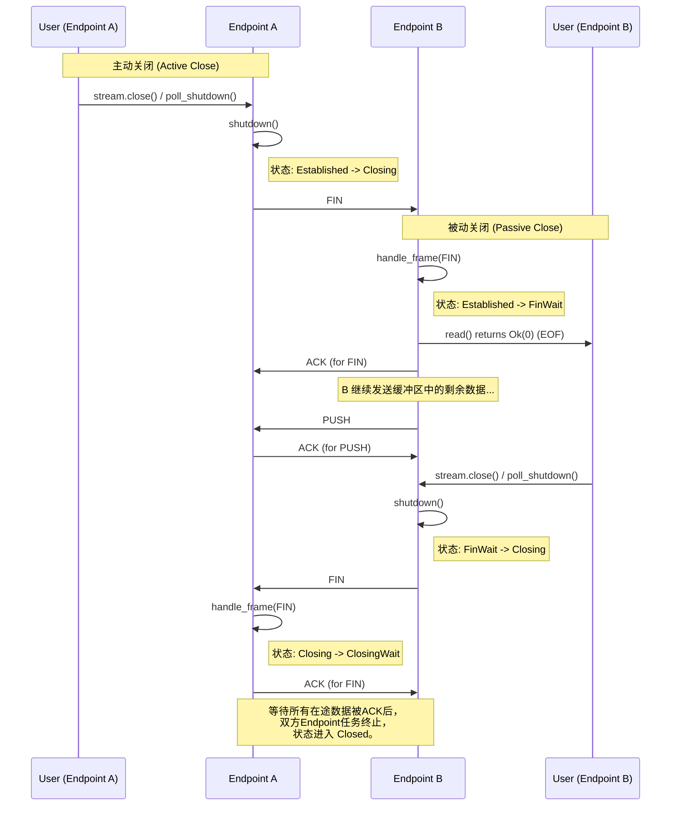

# 2: 深入解析：连接关闭 (四次挥手)

**功能描述:**

协议实现了标准的四次挥手关闭机制，确保双方的数据流都能被完整发送和确认，从而优雅、可靠地终止连接，防止数据丢失。这个过程由 `Endpoint` 的内部状态机精确驱动。

**实现位置:**

- **用户 API**: `src/core/stream.rs` (`poll_shutdown`)
- **核心逻辑**: `src/core/endpoint/logic.rs`。关键实现分散在以下部分：
    - `shutdown()`: 启动关闭流程的入口。
    - `handle_stream_command()`: 处理来自 `Stream` 的 `Close` 命令。
    - `handle_frame_*` 系列函数 (如 `handle_frame_established`, `handle_frame_closing`, `handle_frame_fin_wait`): 根据当前状态处理 `FIN` 和 `ACK` 帧。
    - `should_close()`: 判断何时可以安全地终止 `Endpoint` 任务。
- **状态机**: `src/core/endpoint/state.rs`

---

### 四次挥手时序图

以下是标准的关闭流程，由一方 (A) 主动发起关闭。

### 详解关闭流程

#### 1. 主动关闭方 (Initiator - Endpoint A)

1.  **触发**: 用户代码调用 `Stream` 的 `close()` 或 `shutdown()` 方法。在 `AsyncWrite` 的实现中，这对应于 `poll_shutdown` 被调用。
2.  **命令发送**: `poll_shutdown` 方法向关联的 `Endpoint` 任务发送一个 `StreamCommand::Close` 命令。
3.  **状态转换与FIN发送**:
    - `Endpoint` 的主事件循环接收到 `Close` 命令后，调用内部的 `shutdown()` 方法。
    - `shutdown()` 将 `Endpoint` 的状态从 `Established` 切换到 `Closing`。
    - 状态切换后，事件循环会立即尝试打包并发送数据。由于状态是 `Closing`，`ReliabilityLayer` 会生成一个 `FIN` 帧。
    - 这个 `FIN` 帧被发送给对端 (Endpoint B)，标志着四次挥手的开始。

#### 2. 被动关闭方 (Responder - Endpoint B)

1.  **接收FIN**: `Endpoint` B 从网络上接收到 `FIN` 帧。
2.  **处理FIN与状态转换**:
    - `Endpoint` 处于 `Established` 状态，因此 `handle_frame_established` 方法会处理该 `FIN` 帧。
    - 它立即将 `Endpoint` B 的状态从 `Established` 切换到 `FinWait`。
    - **立即回复ACK**：作为响应，它向 `Endpoint` A 发送一个 `ACK` 帧，确认收到了 `FIN`。这是挥手的第二步。
    - **不直接通知应用层**：`Endpoint` B 此时**不会**做任何操作来通知用户 `Stream`。`FIN` 信号已被 `ReliabilityLayer` 接收并记录在其序列化的位置上。

3.  **发送剩余数据**: `Endpoint` B 仍然可以发送其发送缓冲区中尚未发送完毕的数据。这是 `FinWait` 状态的关键职责。

#### 3. 将FIN作为一等公民：优雅关闭的最终实现

为了从根本上解决数据（`PUSH`）和流关闭信号（`FIN`）之间的竞态条件，协议将 `FIN` 视为一种与数据截然不同的一等信号。

- **问题**: 如果 `FIN` 被当作一个普通的“空数据包”，那么接收方无法区分是合法的零字节数据还是流结束信号，从而导致错误的 `EOF` 处理。
- **解决方案**:
    1.  **信号类型化**: 在协议的最低层，即 `ReceiveBuffer`，数据包被存储为 `enum PacketOrFin { Push(Bytes), Fin }`。这从源头上就区分了两种信号。
    2.  **有序重组与FIN检测**: `Endpoint` 的主事件循环会持续调用 `reliability.reassemble()`。这个方法会按序列号顺序处理接收缓冲区：
        - 它收集所有连续的数据包（`Push`），并将其返回。
        - 当它按顺序遇到一个 `Fin` 时，它会停止收集，并向 `Endpoint` 返回一个特殊的 `fin_seen = true` 标志。
    3.  **延迟的EOF**:
        - `Endpoint` 在调用 `reassemble` 时，一旦收到 `fin_seen = true` 的信号，它才知道流的逻辑终点已经到达。此时，它会设置内部的 `fin_pending_eof = true` 标志。
        - 然后，`Endpoint` 继续检查：**`fin_pending_eof` 是否为 `true` 且接收缓冲区是否已完全清空？** 只有当这两个条件都满足时，它才会关闭通往 `Stream` 的通道，以发送 `EOF` 信号。

这个机制保证了 `FIN` 的 `EOF` 效应只有在它之前的所有数据包都已经被应用层消费后才会触发，完全解决了时序问题。

#### 4. 完成关闭

1.  **被动方发起关闭**: 当 `User B` 的应用逻辑调用 `read()` 并最终收到 `Ok(0)` (EOF) 后，它知道了对端已经发完所有数据。当它也准备好关闭时，会调用 `stream.close()`。
    - `Endpoint` B 接收到 `Close` 命令，调用 `shutdown()`。
    - 此时状态从 `FinWait` 变为 `Closing`。
    - `Endpoint` B 发送它自己的 `FIN` 帧给 `Endpoint` A。这是挥手的第三步。
2.  **主动方确认**: `Endpoint` A 接收到 `Endpoint` B 的 `FIN` 帧。
    - 此时 `Endpoint` A 处于 `Closing` 状态，因此 `handle_frame_closing` 方法会处理这个 `FIN`。
    - `Endpoint` A 的状态从 `Closing` 变为 `ClosingWait`。
    - **立即回复ACK**: `Endpoint` A 发送最后一个 `ACK` 给 `Endpoint` B。这是挥手的第四步。
3.  **最终关闭**:
    - 此时，双方都处于 `Closing` 或 `ClosingWait` 状态。
    - `Endpoint` 的事件循环会持续运行，直到其 `ReliabilityLayer` 确认所有在途的数据（包括 `FIN` 包）都已经被对端 `ACK`。
    - 一旦在途数据为空 (`is_in_flight_empty()` 返回 `true`)，`Endpoint` 的状态最终切换到 `Closed`，任务随之终止，连接被完全拆除。

### 同时关闭 (Simultaneous Close)

如果双方几乎同时调用 `close()`，它们都会从 `Established` 进入 `Closing` 状态并发送 `FIN`。当一方收到对端的 `FIN` 时，它会从 `Closing` 转换到 `ClosingWait`，然后回复 `ACK`。后续流程与标准关闭类似，协议的状态机设计能够正确处理这种情况。 