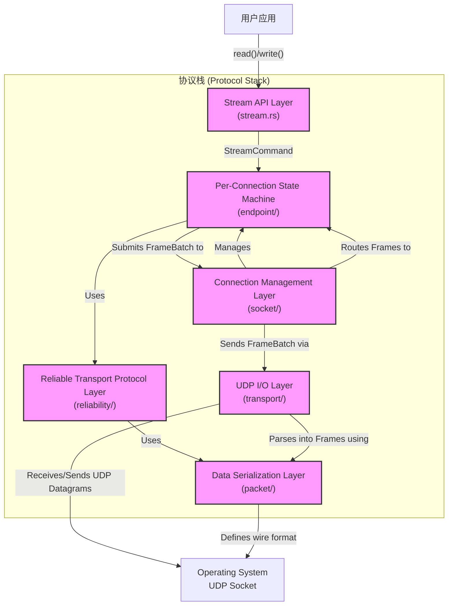

# 协议栈核心组件架构概览

本文档旨在为开发者提供一个关于本可靠UDP协议栈核心组件的全局视角。我们将自顶向下地剖析协议栈的每一层，阐明其设计理念、核心职责以及各层之间的交互关系。

## 分层架构模型

本协议栈采用了一个清晰、解耦的六层架构模型。每一层都专注于一个特定的领域，并通过明确定义的接口与相邻层进行通信。这种设计不仅降低了系统的复杂性，也极大地增强了代码的可维护性、可测试性和可扩展性。

---

## 各层详细解析

### 1. 用户接口层 (`Stream`)
- **文档**: [**用户接口 (`Stream`)**](./stream.md)
- **核心职责**: 提供面向用户的、符合人体工程学的API。
- **实现**: `Stream`结构体实现了标准的`tokio::io::AsyncRead`和`AsyncWrite` trait，使得开发者可以像使用`TcpStream`一样轻松地进行字节流读写。它将所有I/O操作转换为`StreamCommand`消息，通过异步通道与底层的`Endpoint`任务解耦。

### 2. 连接管理层 (`Socket`)
- **文档**: [**Socket层架构设计**](./socket-layer.md)
- **核心职责**: 协议栈的“大脑”和“事件中枢”，管理所有连接的生命周期。
- **实现**: `Socket`层采用Actor模型，在`SocketEventLoop`中统一处理所有外部事件（新连接请求、网络数据包）。其核心是`FrameRouter`，它维护着`ConnectionId -> Endpoint`和`SocketAddr -> ConnectionId`的双重映射，能够智能地将网络帧分派给正确的`Endpoint`实例，并原生支持连接迁移（NAT穿透）。

### 3. 端点状态机层 (`Endpoint`)
- **文档**: [**Endpoint层架构设计**](./endpoint/README.md)
- **核心职责**: 单个连接的“微观世界”，是协议核心逻辑的执行单元。
- **实现**: 每个`Endpoint`都在一个独立的Tokio任务中运行，拥有自己完整的状态机、缓冲区以及一个`ReliabilityLayer`实例。这种设计实现了连接间的完全隔离（无锁化），确保任何单个连接的故障或延迟都不会影响到其他连接。它负责驱动连接状态的转换，并协调`ReliabilityLayer`完成具体的数据收发。

### 4. 可靠传输协议层 (`Reliability`)
- **文档**: [**可靠性层 (`reliability`)**](./reliability.md)
- **核心职责**: 协议栈的“可靠性引擎”，负责将不可靠的UDP数据包转变为可靠的、有序的数据流。
- **实现**: `ReliabilityLayer`是本协议ARQ（自动重传请求）和拥塞控制的核心。它聚合了多个关键组件：
    - **`SackManager`**: 实现基于选择性确认（SACK）的高效重传逻辑和快速重传。
    - **`CongestionControl` Trait (Vegas实现)**: 实现基于延迟的拥塞控制算法，主动避免网络拥塞。
    - **`SendBuffer` / `ReceiveBuffer`**: 管理数据的发送缓冲和接收时的乱序重组。
    - **`Packetizer`**: 将发送字节流分割成符合MTU的`PUSH`帧。

### 5. 传输抽象层 (`Transport`)
- **文档**: [**传输层架构设计**](./transport-layer.md)
- **核心职责**: 抽象底层I/O操作，提供高性能的UDP数据包收发能力。
- **实现**: `Transport`层通过`trait`定义了一套标准的UDP操作接口，并将发送和接收逻辑解耦到独立的异步任务中。它包含一个专用的**批量发送任务 (`transport_sender_task`)**，能自动聚合多个待发送的数据包，在一次系统调用中完成发送，显著提升高吞吐量场景下的性能。同时，它使用`ArcSwap`原子地管理底层`UdpSocket`，实现了无锁、安全、运行时的地址重绑定。

### 6. 数据序列化层 (`Packet`)
- **文档**: [**数据包层 (`packet`)**](./packet.md)
- **核心职责**: 定义协议的“二进制语言”，负责数据在网络线路上的最终表示。
- **实现**: `packet`模块定义了统一的`Frame`枚举，它是协议中所有数据单元（如`PUSH`, `ACK`, `SYN`）的抽象。该模块提供了：
    - **长短头分离**: `LongHeader`用于连接管理，`ShortHeader`用于数据传输，优化头部开销。
    - **安全的编解码**: 提供`Frame::encode`和`Frame::decode`作为唯一的序列化/反序列化入口，内部自动处理大小端、长度计算等细节，保证了协议实现的健壮性。

## 核心数据流（端到端）

理解数据如何在这些层次间流动，是掌握整个协议栈的关键。

#### **数据发送路径 (用户 -> 网络)**
1.  **`Stream`层**: 用户调用 `stream.write()`。
2.  **`Endpoint`层**: `Stream`将数据封装为`StreamCommand`发送给`Endpoint`任务。`Endpoint`将数据存入`ReliabilityLayer`的`SendBuffer`。
3.  **`Reliability`层**: `Packetizer`根据拥塞和流量窗口的许可，从`SendBuffer`中拉取数据，创建`PUSH`帧。
4.  **`Endpoint`层**: `Endpoint`收集`ReliabilityLayer`生成的`PUSH`帧和`ACK`帧，聚合成一个`FrameBatch`。
5.  **`Socket`层**: `Endpoint`将`FrameBatch`提交给`Socket`任务。
6.  **`Transport`层**: `Socket`将`FrameBatch`转发给`transport_sender_task`进行批量发送。
7.  **`Packet`层**: 在`transport_sender_task`内部，每个`Frame`通过`Frame::encode`被序列化成字节流。
8.  **网络**: `Transport`层通过`UdpSocket`将最终的字节流作为UDP数据报发送出去。

#### **数据接收路径 (网络 -> 用户)**
1.  **`Transport`层**: `UdpSocket`收到UDP数据报。
2.  **`Packet`层**: `Transport`层的接收任务调用`Frame::decode`，将字节流反序列化成一个或多个`Frame`。
3.  **`Socket`层**: `Transport`层将解码后的`ReceivedDatagram`发送给`SocketEventLoop`。`FrameRouter`根据帧头部的连接ID，将`Frame`路由到正确的`Endpoint`任务。
4.  **`Endpoint`层**: `Endpoint`任务收到`Frame`。
5.  **`Reliability`层**:
    - 如果是`PUSH`帧，数据被送入`ReceiveBuffer`进行去重和排序。
    - 如果是`ACK`帧，`SackManager`会更新在途包列表、计算RTT，并通知`Vegas`模块调整拥塞窗口。
6.  **`Endpoint`层**: `Endpoint`调用`ReliabilityLayer`的`reassemble`方法，从`ReceiveBuffer`中提取出连续有序的字节流。
7.  **`Stream`层**: `Endpoint`将重组好的字节流通过通道发送给`Stream`。
8.  **用户**: 用户的`stream.read()`调用完成，获得数据。

## 总结
本协议栈通过这种高度模块化、职责明确的分层架构，成功地将一个复杂的可靠传输协议分解为一系列易于理解、开发和维护的组件。每一层都专注于解决特定的问题，同时通过现代化的异步编程范式（Actor模型、无锁化、批量处理）实现了高性能和高可靠性的统一，为构建健壮的网络应用提供了坚实的基础。
