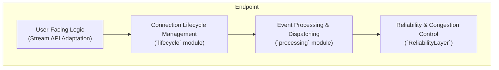
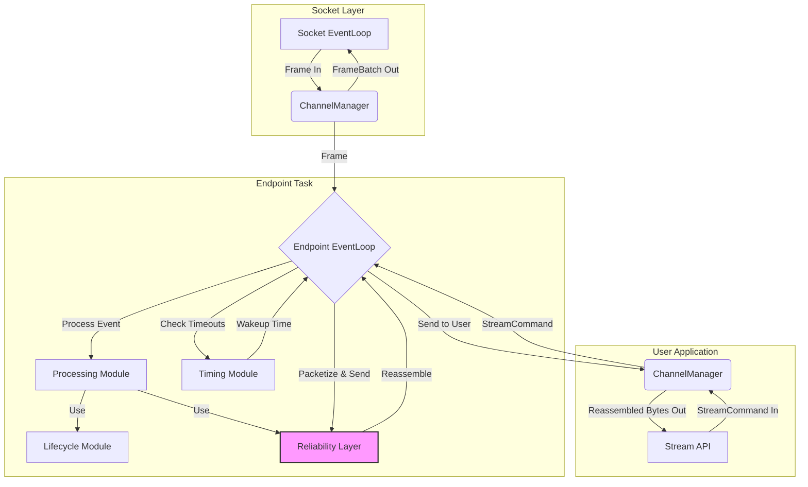

# Endpoint层架构设计 - 单个连接的微观宇宙

## 概述

`Endpoint`层是协议栈中负责处理单个、独立、可靠连接的核心引擎。如果说`Socket`层是管理所有连接的“机场塔台”，那么每个`Endpoint`实例就是一个正在执行飞行任务的“独立飞机”。它在一个专属的异步任务(`tokio::task`)中运行，拥有自己完整的状态机、可靠性机制和拥塞控制算法，从而实现了连接之间的完全隔离。

**核心使命:**
- **连接隔离**: 在独立的异步任务中管理单个连接，确保任何一个连接的失败或延迟都不会影响其他连接。
- **协议逻辑实现**: 完整实现协议的状态机（连接建立、关闭、迁移）、可靠性传输（ARQ、SACK）和拥塞控制。
- **数据流管理**: 负责将用户`Stream`的字节流分割成数据包（`PUSH`帧）发送，并将接收到的数据包重组为有序的字节流，供用户读取。
- **与`Socket`层协作**: 作为`Socket`层的“工作单元”，接收`Socket`层分派的网络帧，并将待发送的数据包提交给`Socket`层。

**架构实现:**
- **主结构体**: `src/core/endpoint.rs` - `Endpoint`的顶层结构体，整合了所有子模块。
- **核心逻辑**: `src/core/endpoint/core/` - 实现了事件驱动的主循环和数据发送逻辑。
- **生命周期**: `src/core/endpoint/lifecycle/` - 管理连接状态机的创建、转换和验证。
- **事件处理**: `src/core/endpoint/processing/` - 高性能的模块化事件处理引擎，将网络帧分派给专门的处理器。
- **时间管理**: `src/core/endpoint/timing.rs` - 统一管理所有超时和定时事件。
- **类型定义**: `src/core/endpoint/types/` - 定义了`Endpoint`内部使用的所有核心数据结构。

## 设计原则

`Endpoint`的设计围绕着**“单一所有权下的Actor模型”**构建，确保了其在高并发场景下的健壮性和高性能。

### 1. 单一所有权的Actor模型
- **无锁化**: `Endpoint`的所有状态，包括`ReliabilityLayer`、`CongestionControl`、连接状态、缓冲区等，都由一个独立的Tokio任务拥有和管理。
- **消息驱动**: `Endpoint`通过异步通道(`mpsc`)接收来自`Socket`层（网络帧）和用户`Stream`（`StreamCommand`）的消息。所有外部交互都是通过消息传递完成的，避免了直接方法调用和状态共享。
- **状态隔离**: 每个`Endpoint`实例都是一个自包含的、隔离的“微服务”。这种设计从根本上消除了连接之间的状态竞争，简化了并发管理。

### 2. 精细化的模块职责划分
- **高内聚**: `Endpoint`的内部逻辑被清晰地划分为`core`, `lifecycle`, `processing`, `timing`, `types`等模块。每个模块都聚焦于一个特定的领域（如`lifecycle`只关心状态机，`processing`只关心事件处理）。
- **低耦合**: 模块间通过明确的API或`trait`进行交互，降低了耦合度。例如，`processing`模块通过`ProcessorOperations` trait与`Endpoint`的主体逻辑解耦，使其可以独立测试和演进。

### 3. 分层协议栈的实现
`Endpoint`内部实现了一个小型的、分层的协议栈，清晰地分离了不同层次的职责。

- **应用层逻辑**: 负责将`Stream`的字节流接口与`ReliabilityLayer`的面向数据包的接口进行适配。
- **生命周期层**: 管理连接的宏观状态（建立、关闭等）。
- **事件处理层**: 负责根据当前状态处理具体的网络事件。
- **可靠传输层**: 负责数据的可靠性（ARQ）、排序、流量控制和拥塞控制。

## 整体架构与数据流

`Endpoint`作为`Socket`层和`ReliabilityLayer`之间的关键桥梁，其内部数据流清晰而高效。

**数据流解读:**
- **入站数据流 (网络 -> 用户)**:
    1. `Socket`层将收到的UDP包解析成`Frame`，通过`ChannelManager`发送给对应的`Endpoint`任务。
    2. `Endpoint`的`EventLoop`收到`Frame`，交由`Processing`模块处理。
    3. `PushProcessor`将数据载荷交给`ReliabilityLayer`的`ReceiveBuffer`进行排序、去重和缓存。
    4. `EventLoop`在事件处理后，调用`ReliabilityLayer`的`reassemble`方法，从`ReceiveBuffer`中提取出有序的字节流。
    5. 这些有序的字节流通过`ChannelManager`发送给用户`Stream`，完成`read()`操作。

- **出站数据流 (用户 -> 网络)**:
    1. 用户调用`Stream`的`write()`方法，`Stream`将其封装成一个`StreamCommand::SendData`消息，通过`ChannelManager`发送给`Endpoint`任务。
    2. `EventLoop`收到该命令，将数据块写入`ReliabilityLayer`的`SendBuffer`。
    3. 在事件处理后，`EventLoop`调用`packetize_and_send`方法。
    4. 该方法从`SendBuffer`中取出数据，将其分割成`PUSH`帧，并与可能存在的`ACK`等控制帧一起，通过`core`模块的`PacketBuilder`聚合成符合MTU的数据包。
    5. 最终的数据包(`FrameBatch`)通过`ChannelManager`发送给`Socket`层，由其统一发送到网络。

## 与其他层的交互

- **与`Socket`层的关系**:
    - **父子关系**: `Socket`层是`Endpoint`的创建者和管理者。它负责监听网络端口、解析入站数据包，并将`Frame`路由到正确的`Endpoint`实例。
    - **通信**: 两者之间完全通过`mpsc`通道进行异步通信。`Endpoint`对`Socket`层是“盲”的，它只知道通过通道发送和接收消息，实现了完全的解耦。

- **与`ReliabilityLayer`的关系**:
    - **引擎与策略**: `Endpoint`是执行引擎，而`ReliabilityLayer`是核心的可靠性策略实现。
    - **调用关系**: `Endpoint`的`Processing`模块在处理网络帧时，会调用`ReliabilityLayer`的方法来更新其内部状态（例如，收到`ACK`时更新RTT和拥塞窗口）。同时，`Endpoint`的`EventLoop`也会调用`ReliabilityLayer`来获取待发送的数据和检查RTO。
    - **所有权**: 每个`Endpoint`实例拥有一个独立的`ReliabilityLayer`实例，确保了不同连接的可靠性计算（RTT、拥塞窗口等）互不干扰。

## 总结

`Endpoint`是本协议栈实现并发连接的核心所在。通过将每个连接封装为一个独立的、自包含的、由消息驱动的Actor，项目成功地构建了一个无需显式锁、易于推理且高度可扩展的并发模型。其内部精细的模块划分，将复杂的状态机、事件处理和时间管理逻辑分解为简单、内聚的组件，共同构成了一个健壮而高效的单连接处理引擎。
