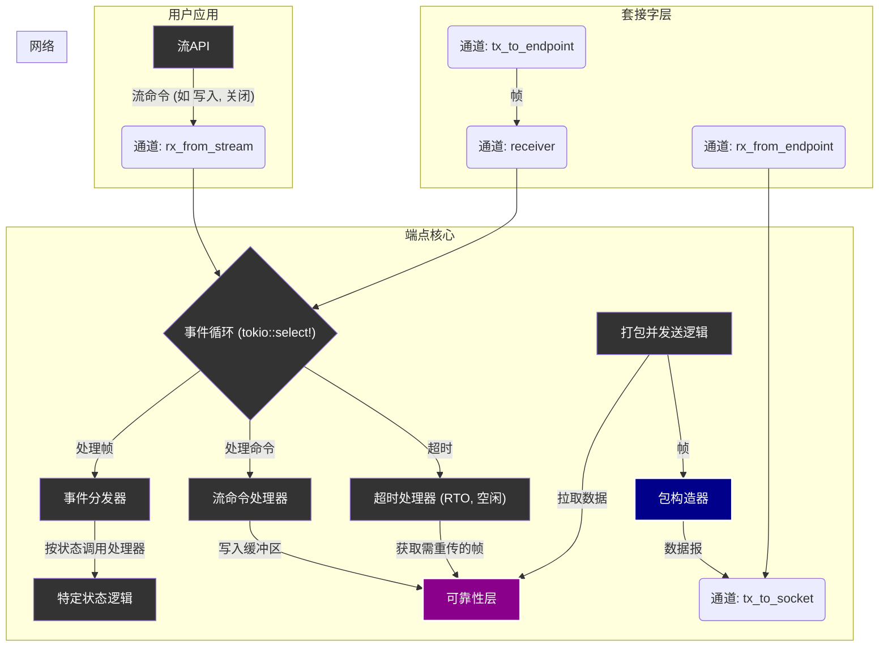

# Endpoint核心 (`core`) - 事件驱动的连接心脏

## 概述

`Endpoint`的`core`模块是单个网络连接的执行核心与控制中枢。它实现了一个事件驱动的异步循环，负责处理所有与该连接相关的事件，包括网络数据、用户API调用和内部定时器。这个模块是连接生命周期得以顺利进行、数据得以可靠传输的根本保障。

**核心使命:**
- **事件统一处理**: 作为连接的唯一事件处理中心，响应所有外部和内部信号。
- **状态驱动执行**: 严格根据连接的当前状态（如`Established`, `Closing`）执行正确的行为。
- **高效数据路径**: 管理数据的收发、打包和解包，连接`ReliabilityLayer`和底层网络。
- **异步任务调度**: 驱动超时重传、心跳等所有与时间相关的协议行为。

**架构实现:**
- **事件循环**: `src/core/endpoint/core/event_loop.rs` - `Endpoint`的主`run`循环，事件处理的心脏。
- **发送逻辑**: `src/core/endpoint/core/sender.rs` - 负责将帧打包成UDP数据包并发送。
- **帧定义**: `src/core/endpoint/core/frame.rs` - 协议内部控制帧的创建工厂。
- **事件处理器**: `src/core/endpoint/core/handlers.rs` - （旧）按状态处理网络帧的逻辑，现由`EventDispatcher`统一调度。

## 设计原则

`core`模块的设计遵循了确保连接稳定性和高性能的核心原则：

### 1. 单一所有权事件循环
- **无锁化设计**: `Endpoint`的所有状态（包括`ReliabilityLayer`和`CongestionControl`）都由其主事件循环这个单一的异步任务拥有。
- **顺序一致性**: 所有状态变更都在`select!`循环的单线程上下文中发生，彻底避免了数据竞争和锁的需要。
- **明确的事件源**: 事件只来源于三个地方：网络、用户`Stream`和定时器，使得逻辑清晰可控。

### 2. 状态驱动的逻辑分派
- **行为与状态绑定**: `Endpoint`的行为由其当前所处的`ConnectionState`严格决定。
- **逻辑隔离**: `EventDispatcher`将收到的`Frame`或`StreamCommand`根据当前状态分派给最合适的处理函数，使代码职责更清晰。

### 3. I/O批处理与聚合
- **批量读取**: 事件循环在收到一个网络包或用户命令后，会尝试用`try_recv`无阻塞地处理该通道中所有积压的事件，将多次小的IO操作合并为一次大的处理流程。
- **发包聚合 (`Coalescing`)*: `PacketBuilder`在发送数据时，会将多个小的协议帧（如`ACK`和`PUSH`）打包进一个UDP数据包，减少网络开销，提高传输效率。

## 整体架构

`Endpoint`的`core`模块以`event_loop`为中心，协调数据在不同层级间的流动。



**架构解读:**
1.  **事件入口**: `Event Loop`是所有事件的汇集点，通过`tokio::select!`监听三个通道：网络帧、用户命令和定时器。
2.  **事件分发**: `EventDispatcher`（在`processing`模块中）根据连接状态将事件分派给具体的处理逻辑。
3.  **可靠性交互**: 处理器调用`ReliabilityLayer`（图中的`G`）来处理数据的发送（写入缓冲区）、接收（处理ACK、SACK）和重传。
4.  **数据出口**: `packetize_and_send`方法从`ReliabilityLayer`中提取待发送的数据和控制信息，通过`PacketBuilder`（图中的`J`）组装成UDP数据包，最后通过通道发往`Socket`层。

## 核心组件解析

### `EventLoop` - 事件循环

`Endpoint`的`run`方法是其生命周期的体现。这个循环是协议状态机运转的引擎。

```rust
// In src/core/endpoint/core/event_loop.rs
pub async fn run(&mut self) -> Result<()> {
    loop {
        let next_wakeup = self.calculate_next_wakeup_time();

        tokio::select! {
            biased; 

            // 1. 处理网络传入的帧
            Some((frame, src_addr)) = self.channels.receiver.recv() => {
                EventDispatcher::dispatch_frame(...).await?;
                // ... try_recv() for batching ...
            }

            // 2. 处理来自用户Stream的命令
            Some(cmd) = self.channels.rx_from_stream.recv() => {
                EventDispatcher::dispatch_stream_command(...).await?;
                // ... try_recv() for batching ...
            }

            // 3. 处理所有类型的超时
            _ = sleep_until(next_wakeup) => {
                self.check_all_timeouts(Instant::now()).await?;
            }

            // 4. 所有通道关闭，退出循环
            else => break,
        }

        // ... 执行后续动作，如重组数据、发送数据包 ...
    }
    Ok(())
}
```

**关键特性**:
- **`biased`**: 优先处理已经就绪的事件，特别是网络和用户命令，保证了对外部输入的低延迟响应。
- **统一超时管理**: `calculate_next_wakeup_time`方法会计算出下一个最近需要唤醒的时间点（可能是RTO、心跳或空闲超时），`select!`循环只需一个`sleep_until`即可高效管理所有定时事件。
- **批处理**: 在处理完一个事件后，会立即尝试`try_recv`来清空通道中的积压事件，有效地将多个小操作合并，降低了循环调度的开销。

### `PacketBuilder` - 智能数据包构造器

`PacketBuilder`是发送路径上的一个关键优化组件。它的职责是将多个离散的`Frame`聚合成一个符合MTU（最大传输单元）限制的UDP数据包。

```rust
// In src/core/endpoint/core/sender.rs
struct PacketBuilder<F> {
    frames: Vec<Frame>,
    current_size: usize,
    max_size: usize,
    // ...
}

impl<F, Fut> PacketBuilder<F> {
    async fn add_frame(&mut self, frame: Frame) -> Result<()> {
        let frame_size = frame.encoded_size();
        if !self.frames.is_empty() && self.current_size + frame_size > self.max_size {
            self.flush().await?; // 如果装不下，先发送已有的
        }
        self.frames.push(frame); // 再添加新的
        self.current_size += frame_size;
        Ok(())
    }

    async fn flush(&mut self) -> Result<()> {
        // ... send self.frames via the sender closure ...
    }
}
```
**优势**:
- **减少网络开销**: 将多个控制帧（如`ACK`）和数据帧（`PUSH`）合并发送，显著降低了UDP和IP头部的相对开销。
- **提升网络效率**: 减少了发送的网络包数量，有助于避免网络拥塞和处理开销。
- **自动化MTU管理**: 调用者（如`packetize_and_send`）无需关心MTU细节，只需将所有待发送的帧交给`PacketBuilder`即可。

## 与其他层的交互

- **与`Socket`层的交互**:
    - **接收**: `Socket`层通过`mpsc`通道将属于此`Endpoint`的`Frame`发送过来。
    - **发送**: `Endpoint`将组装好的数据包通过`mpsc`通道发送给`Socket`层，由后者统一通过底层UDP套接字发出。
    - **控制**: `Endpoint`通过一个命令通道向`Socket`层报告状态变化，如连接关闭、地址迁移。

- **与`ReliabilityLayer`的交互**:
    - `Endpoint`的事件处理器是`ReliabilityLayer`和`CongestionControl`的主要调用者。
    - **发送路径**: 用户数据首先被写入`ReliabilityLayer`的发送缓冲区。`Endpoint`的`packetize_and_send`逻辑再从缓冲区中取出数据，交由`Packetizer`分片成`PUSH`帧。
    - **接收路径**: 收到的`PUSH`帧被送入`ReliabilityLayer`的接收缓冲区进行排序和去重。收到的`ACK`帧则用于更新`ReliabilityLayer`中的重传计时器和拥塞窗口。

`Endpoint`的`core`模块通过其精巧的事件驱动设计，成功地将复杂的协议逻辑（可靠性、拥塞控制、连接状态）与异步的I/O操作解耦，构成了整个协议栈中单个连接的稳定、高效的“执行引擎”。
