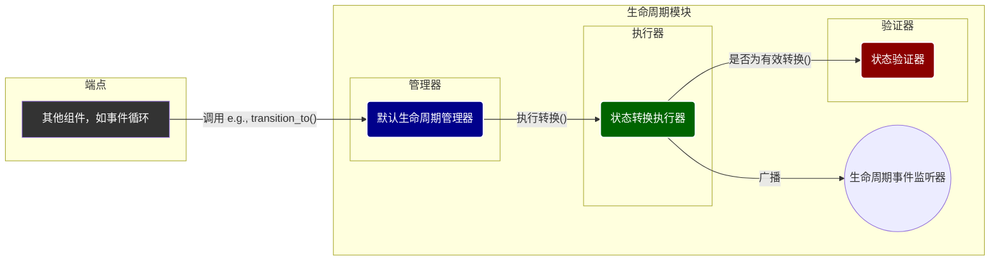

# Endpoint生命周期 (`lifecycle`) - 可靠的状态机引擎

## 概述

`lifecycle`模块是`Endpoint`内部的状态机核心，负责精确管理连接从建立到关闭的全过程。它通过将状态管理的职责清晰地划分为“管理器”、“转换器”和“验证器”三个部分，构建了一个健壮、可预测且易于维护的生命周期控制系统。

**核心使命:**
- **状态跟踪**: 精确维护连接的当前状态（`Connecting`, `Established`, `Closing`, etc.）。
- **规则强制**: 确保所有状态转换都遵循预定义的合法路径。
- **行为控制**: 根据当前状态，授权或禁止特定操作（如发送数据、接收数据）。
- **事件通知**: 在关键生命周期事件发生时（如状态变更、连接关闭），向上层或外部系统发出通知。

**架构实现:**
- **管理器**: `src/core/endpoint/lifecycle/manager.rs` - 提供统一接口`ConnectionLifecycleManager`，是生命周期管理的入口。
- **转换器**: `src/core/endpoint/lifecycle/transitions.rs` - `StateTransitionExecutor`，封装了状态转换的具体执行逻辑和事件广播机制。
- **验证器**: `src/core/endpoint/lifecycle/validation.rs` - `StateValidator`，一个无状态的规则集，用于判断状态转换的合法性。

## 设计原则

`lifecycle`模块遵循高内聚、低耦合的设计原则，确保了状态机的可靠性和灵活性。

### 1. 职责分离 (Separation of Concerns)
- **“What” vs “How” vs “If”**:
    - **管理器 (`manager`)**: 决定 **“做什么”** (What) - "我要开始关闭连接"。
    - **转换器 (`transitions`)**: 负责 **“怎么做”** (How) - "执行从`Established`到`Closing`的转换，并广播`ConnectionClosing`事件"。
    - **验证器 (`validation`)**: 判断 **“可不可以”** (If) - "检查从`Established`到`Closing`的转换是否合法"。
- **可测试性**: 每个组件职责单一，可以独立进行单元测试，保证了逻辑的正确性。

### 2. 状态驱动与不可变性
- **单一事实来源**: `DefaultLifecycleManager`持有的`current_state`是整个`Endpoint`连接状态的唯一事实来源。
- **受控变更**: 状态的任何改变都必须通过`transition_to`方法发起，该方法内部强制执行验证逻辑，杜绝了非法的状态跳变。

### 3. 事件驱动的可扩展性
- **观察者模式**: `StateTransitionExecutor`实现了事件监听器模式。外部模块（如用于监控或日志记录的模块）可以注册监听器来接收`LifecycleEvent`，而无需修改核心逻辑。
- **解耦通信**: `Endpoint`的其他部分与生命周期模块的交互是单向的（调用方法），而生命周期模块通过事件回调与外部通信，降低了耦合度。

## 整体架构

`lifecycle`模块内部形成了一个清晰的三层协作模型，由`DefaultLifecycleManager`统一对外提供服务。



**协作流程 (以`transition_to`为例):**
1.  **请求发起**: `Endpoint`的其他部分调用`DefaultLifecycleManager`的`transition_to(new_state)`方法。
2.  **执行委托**: `Manager`将请求委托给`StateTransitionExecutor`的`execute_transition`方法。
3.  **合法性验证**: `Executor`首先调用`StateValidator`的`is_valid_transition`来检查从当前状态到目标状态是否被规则允许。如果非法，则立即返回错误。
4.  **状态变更**: 验证通过后，`Executor`更新状态。
5.  **事件广播**: `Executor`创建一个`LifecycleEvent::StateTransition`事件，并通知所有已注册的`EventListener`。
6.  **完成**: `Manager`更新其内部的`current_state`为新的状态，并向调用者返回成功。

## 核心组件解析

### `DefaultLifecycleManager` - 生命周期协调者

这是`lifecycle`模块的主要入口。它封装了状态机的所有复杂性，为`Endpoint`提供了一套简洁、意图明确的API。

```rust
// In src/core/endpoint/lifecycle/manager.rs
pub struct DefaultLifecycleManager {
    current_state: ConnectionState,
    cid: u32,
    // ...
    transition_executor: StateTransitionExecutor,
}

impl ConnectionLifecycleManager for DefaultLifecycleManager {
    fn transition_to(&mut self, new_state: ConnectionState) -> Result<()> {
        // ...
        // 使用状态转换执行器执行转换
        match self.transition_executor.execute_transition(&self.current_state, new_state) {
            Ok(resulting_state) => {
                self.current_state = resulting_state;
                Ok(())
            }
            Err(e) => Err(e),
        }
    }
    // ... other methods like begin_graceful_shutdown, start_path_validation ...
}
```

### `StateTransitionExecutor` - 状态转换执行引擎

`Executor`是状态转换的“动力室”。它不仅实际执行状态变更，还负责在转换前后触发相应的事件。

```rust
// In src/core/endpoint/lifecycle/transitions.rs
pub struct StateTransitionExecutor {
    cid: u32,
    event_listeners: Vec<EventListener>,
}

impl StateTransitionExecutor {
    pub fn execute_transition(
        &self,
        current_state: &ConnectionState,
        new_state: ConnectionState,
    ) -> Result<ConnectionState> {
        // 1. 验证转换
        if !StateValidator::is_valid_transition(current_state, &new_state) {
            return Err(Error::InvalidPacket);
        }

        // 2. 触发状态转换事件
        self.trigger_event(LifecycleEvent::StateTransition { ... });
        
        // 3. 根据新状态触发特定生命周期事件
        self.trigger_lifecycle_event(&new_state);

        Ok(new_state)
    }
}
```

### `StateValidator` - 状态机规则手册

`Validator`是一个无状态的工具类，它像一本规则手册，定义了状态机的所有合法路径。它的所有方法都是纯函数，输入当前状态和目标状态，输出一个布尔值。

```rust
// In src/core/endpoint/lifecycle/validation.rs
pub struct StateValidator;

impl StateValidator {
    pub fn is_valid_transition(current_state: &ConnectionState, new_state: &ConnectionState) -> bool {
        use ConnectionState::*;
        match (current_state, new_state) {
            // e.g., 从Connecting可以转换到Established
            (Connecting, Established) => true,
            // e.g., 从Closed不能转换到任何其他状态（除了自身）
            (Closed, _) => new_state == &Closed,
            // ... all other rules ...
            _ => false,
        }
    }

    pub fn can_send_data(state: &ConnectionState) -> bool {
        matches!(state, ConnectionState::Established | ConnectionState::FinWait)
    }
}
```

## 总结

`Endpoint`的`lifecycle`模块通过其清晰的三层职责分离设计，成功地将一个复杂的状态机分解为多个简单、可独立验证的组件。这种架构不仅保证了连接生命周期管理的健壮性和正确性，还通过事件机制提供了良好的可扩展性，是整个`Endpoint`稳定运行的基石。
