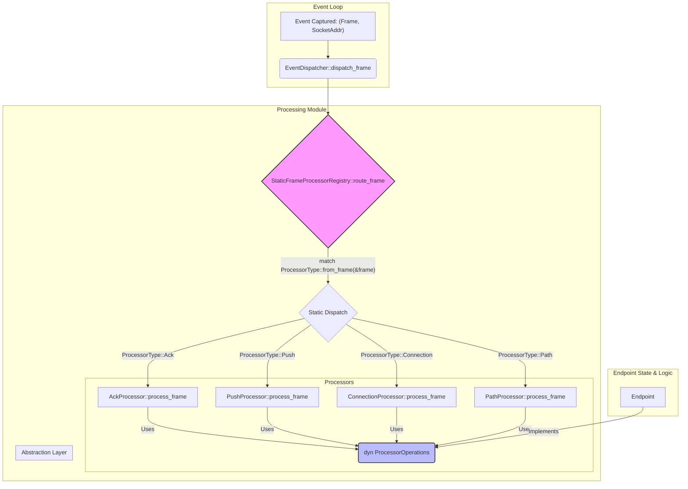

# Endpoint处理 (`processing`) - 高性能的模块化事件处理器

## 概述

`processing`模块是`Endpoint`的事件处理引擎。它负责接收由`EventLoop`捕获的原始事件（主要是网络帧），并将其精确地路由到专门的处理器进行逻辑运算。该模块采用了一种高性能、高内聚的架构，将不同类型的帧处理逻辑完全解耦，是`Endpoint`能够清晰、高效处理复杂协议交互的关键。

**核心使命:**
- **事件路由**: 将传入的网络帧精确、高效地分发给对应的处理器。
- **逻辑解耦**: 将`ACK`、`PUSH`、`FIN`等不同帧的处理逻辑隔离到独立的、可测试的模块中。
- **性能优化**: 采用静态分派机制，消除动态分派的运行时开销，实现零成本抽象。
- **接口抽象**: 通过`trait`定义清晰的边界，使处理器逻辑与`Endpoint`的具体实现解耦。

**架构实现:**
- **分发器**: `src/core/endpoint/processing/dispatcher.rs` - 事件分发的入口，调用静态注册表。
- **静态注册表**: `src/core/endpoint/processing/processors.rs` - `StaticFrameProcessorRegistry`，实现高性能静态路由的核心。
- **处理器集合**: `src/core/endpoint/processing/processors/` - 包含`ack.rs`, `data.rs`, `connection.rs`, `path.rs`等，每个文件都是一个专用的帧处理器。
- **抽象接口**: `src/core/endpoint/processing/traits.rs` - 定义了`ProcessorOperations`等`trait`，构成了处理器与`Endpoint`之间的契约。

## 设计原则

`processing`模块的设计完美体现了Rust的几个核心优势：零成本抽象、类型安全和模块化。

### 1. 静态分派与零成本抽象
- **无动态开销**: 模块的核心`StaticFrameProcessorRegistry`使用`match`语句代替`dyn Trait`的虚表调用。编译器在编译时就能确定具体的函数调用，可以进行完全内联，消除了所有运行时分派开销。
- **枚举驱动**: `ProcessorType`枚举清晰地定义了所有可处理的帧类别。`from_frame`函数提供了一个O(1)的快速类型识别方法，为`match`分派提供了基础。
- **性能最大化**: 这种设计缓存友好、无堆分配、无间接调用，是实现高性能网络协议栈的理想模式。

### 2. 处理器的高度模块化
- **单一职责**: 每个处理器文件（如`ack.rs`）只负责一类帧。`AckProcessor`只关心ACK逻辑，`PushProcessor`只关心数据接收逻辑。
- **独立可测**: 由于职责单一且依赖于抽象接口，每个处理器都可以被独立地进行单元测试，极大地提高了代码质量和可维护性。

### 3. 基于Trait的依赖倒置
- **抽象而非具体**: 所有的处理器都不直接依赖于`Endpoint<T>`的具体类型，而是依赖于`&mut dyn ProcessorOperations`这一抽象接口。
- **解耦**: `Endpoint`是操作的提供者，而处理器是消费者。这种依赖倒置使得`processing`模块可以独立于`Endpoint`的其他部分进行开发、测试和修改。

## 整体架构

`processing`模块的核心是一个从分发到处理的静态流水线。



**处理流程:**
1.  **入口**: `EventDispatcher`接收到帧后，立即调用`StaticFrameProcessorRegistry::route_frame`。
2.  **类型识别**: `route_frame`内部首先调用`ProcessorType::from_frame()`，通过一次`match`快速确定帧的类型（`Ack`, `Push`等）。
3.  **静态分派**: `route_frame`中的外层`match`语句根据`ProcessorType`将帧和`&mut dyn ProcessorOperations`（即`Endpoint`的抽象）传递给对应的静态处理函数，例如`AckProcessor::process_frame`。
4.  **逻辑处理**: 具体的处理器（如`AckProcessor`）执行其特定逻辑。它通过`dyn ProcessorOperations`接口与`Endpoint`的其他部分（如`ReliabilityLayer`）交互，例如调用`reliability_mut().handle_ack()`。
5.  **完成**: 处理完成后，结果返回给`EventLoop`。

## 核心组件解析

### `StaticFrameProcessorRegistry` - 零成本路由核心

这是本模块最具特色的组件。它通过一个`match`表达式，将不同的帧类型映射到具体的、静态的处理器函数调用。

```rust
// In src/core/endpoint/processing/processors.rs
pub struct StaticFrameProcessorRegistry;

impl StaticFrameProcessorRegistry {
    pub async fn route_frame<T: Transport>(
        endpoint: &mut dyn ProcessorOperations,
        frame: Frame,
        // ...
    ) -> Result<()> {
        match ProcessorType::from_frame(&frame) {
            Some(ProcessorType::Push) => {
                // 直接调用具体类型的静态方法，无运行时开销
                <PushProcessor as UnifiedFrameProcessor<T>>::process_frame(endpoint, frame, ...).await
            }
            Some(ProcessorType::Ack) => {
                <AckProcessor as UnifiedFrameProcessor<T>>::process_frame(endpoint, frame, ...).await
            }
            // ... other processors ...
            _ => { /* ... handle unknown frame ... */ }
        }
    }
}
```

### `UnifiedFrameProcessor` Trait - 处理器契约

每个具体的处理器都实现了这个`trait`，它定义了处理器的基本能力。

```rust
// In src/core/endpoint/processing/processors.rs
#[async_trait]
pub trait UnifiedFrameProcessor<T: Transport> {
    // 检查该处理器是否能处理此帧
    fn can_handle(frame: &Frame) -> bool;
    // 处理器名称
    fn name() -> &'static str;
    // 处理帧的核心逻辑
    async fn process_frame(
        endpoint: &mut dyn ProcessorOperations, // 依赖于抽象而非具体实现
        frame: Frame,
        // ...
    ) -> Result<()>;
}
```

### `ProcessorOperations` Trait - 端点能力抽象

这个`trait`是实现解耦的关键。它定义了处理器在工作时需要`Endpoint`提供的所有能力，如访问`ReliabilityLayer`、改变状态、发送数据等。

```rust
// In src/core/endpoint/processing/traits.rs
#[async_trait]
pub trait ProcessorOperations: Send {
    // 获取和设置状态
    fn current_state(&self) -> &ConnectionState;
    fn transition_state(&mut self, new_state: ConnectionState) -> Result<()>;

    // 访问可靠性层
    fn reliability(&self) -> &ReliabilityLayer;
    fn reliability_mut(&mut self) -> &mut ReliabilityLayer;
    
    // 发送操作
    async fn send_standalone_ack_frame(&mut self) -> Result<()>;
    // ... and many more ...
}
```

`Endpoint`自身会实现这个`trait`，从而将自己的能力“注入”到各个处理器中。这种设计使得处理器无需知道任何关于`Endpoint`的内部细节。

## 总结

`Endpoint`的`processing`模块是一个将高性能和优秀软件工程实践相结合的典范。它通过静态分派保证了极致的运行时性能，同时利用`trait`和依赖倒置原则构建了一个模块化、可测试、易于扩展的事件处理系统。这种架构使得添加新的帧类型或修改现有处理逻辑变得简单而安全。
