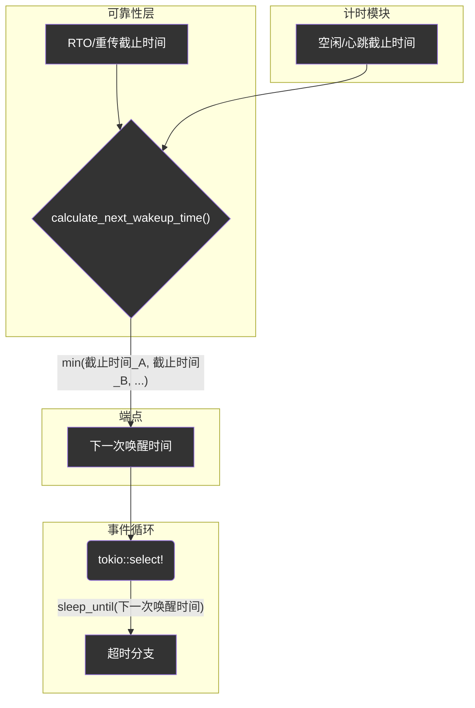

# Endpoint时间管理 (`timing`) - 统一的节拍器

## 概述

`timing`模块是`Endpoint`的内部节拍器和时钟。它将所有与时间相关的状态和计算逻辑（如超时、心跳、RTT等）封装到一个统一的管理器中。这个模块通过提供一个清晰、集中的时间管理接口，极大地简化了`Endpoint`主事件循环的复杂性，并确保了协议所有定时行为的精确和高效。

**核心使命:**
- **时间状态封装**: 集中管理`start_time`、`last_recv_time`等所有时间戳。
- **超时逻辑计算**: 提供统一的方法来检查各种超时事件，如连接空闲、路径验证超时等。
- **统一调度唤醒**: 计算出`Endpoint`下一次需要处理定时事件的最早时间点，供事件循环使用。
- **简化主循环**: 让主事件循环从复杂的、多源的时间计算中解脱出来，只需关注一个统一的“下一次唤醒”时间。

**架构实现:**
- **时间管理器**: `src/core/endpoint/timing.rs` - 包含`TimingManager`结构体，是本模块的核心。
- **超时事件**: `src/core/endpoint/timing.rs` - `TimeoutEvent`枚举，定义了所有可能的超时事件类型。

## 设计原则

### 1. 状态集中化
- **单一时间源**: 所有与连接时间相关的状态都集中在`TimingManager`中，避免了时间状态分散在代码库各处导致的不一致和维护困难。
- **易于快照与调试**: 由于状态集中，可以轻易地获取连接的时间快照（如`stats_string`方法），方便调试和监控。

### 2. 计算与逻辑分离
- **计算的归一化**: `TimingManager`负责所有时间差的计算（如`time_since_last_recv`），而将配置（如`idle_timeout`的具体值）作为参数传入。这使得核心逻辑与具体配置解耦。
- **意图明确的API**: 接口名称直接反映其业务意图，如`is_idle_timeout`，调用者无需关心其内部是“当前时间减去最后接收时间”的实现细节。

### 3. 唤醒时间统一调度
- **“Pull”模式**: `Endpoint`的主循环通过调用`calculate_next_wakeup`方法，主动从`TimingManager`和`ReliabilityLayer`“拉取”下一个需要唤醒的时间点。
- **高效`select!`**: 这种模式使得主循环中的`tokio::select!`只需要一个`sleep_until`分支就能管理所有类型的定时器（RTO、心跳、空闲等），避免了维护多个`Interval`或`Sleep`实例的复杂性和开销。

## 核心组件与逻辑

### `TimingManager` - 时间状态中心

`TimingManager`是本模块的核心结构体，它像一个专职会计，记录着连接的所有关键时间点。

```rust
// In src/core/endpoint/timing.rs
pub struct TimingManager {
    /// 连接开始时间
    start_time: Instant,
    /// 最后接收数据的时间
    last_recv_time: Instant,
    /// FIN挂起EOF标志
    fin_pending_eof: bool,
}
```

### 统一超时检查

`TimingManager`提供了一套检查超时的方法，这些方法都遵循“当前时间与历史时间戳比较”的模式。

```rust
// In src/core/endpoint/timing.rs
impl TimingManager {
    /// 检查是否发生了空闲超时
    pub fn check_idle_timeout(&self, config: &Config, now: Instant) -> bool {
        now.saturating_duration_since(self.last_recv_time) > config.connection.idle_timeout
    }

    /// 检查所有连接级的超时情况
    pub fn check_connection_timeouts(&self, config: &Config, now: Instant) -> Vec<TimeoutEvent> {
        let mut events = Vec::new();
        if self.check_idle_timeout(config, now) {
            events.push(TimeoutEvent::IdleTimeout);
        }
        // ... check other timeouts ...
        events
    }
}
```
`Endpoint`的主循环在每次超时唤醒后，会调用`check_all_timeouts`（该方法内部会使用`TimingManager`的检查函数），来确定具体是哪一种或哪几种超时事件发生了。

### `calculate_next_wakeup` - 统一唤醒调度器

这是`timing`模块与`Endpoint`主循环交互的最重要接口之一（实际由`Endpoint`的`calculate_next_wakeup_time`方法调用）。


**工作流程**:
1. `Endpoint`的`calculate_next_wakeup_time`方法被调用。
2. 它会分别从`ReliabilityLayer`获取下一个重传超时（RTO）的唤醒时间，以及从`TimingManager`获取下一个空闲/心跳超时（Keep-Alive）的唤醒时间。
3. 它取所有这些时间点中的 **最小值**（即最早到期的那个）。
4. 这个最早的时间点被返回给主循环的`tokio::select!`。
5. `select!`中的`sleep_until`分支会精确地在那个时间点被触发。

这种机制优雅地将多个独立的定时器需求统一到了一个调度点，极大地提升了代码的简洁性和效率。

## 总结

`timing`模块虽然代码量不大，但它通过将时间相关的状态和计算逻辑进行高度封装和抽象，成功地扮演了`Endpoint`“节拍器”的角色。它不仅为协议的各种超时机制提供了精确的计算基础，更重要的是通过统一的唤醒调度机制，极大地简化了核心事件循环的设计，是实现一个高性能、低开销异步系统的关键一环。
