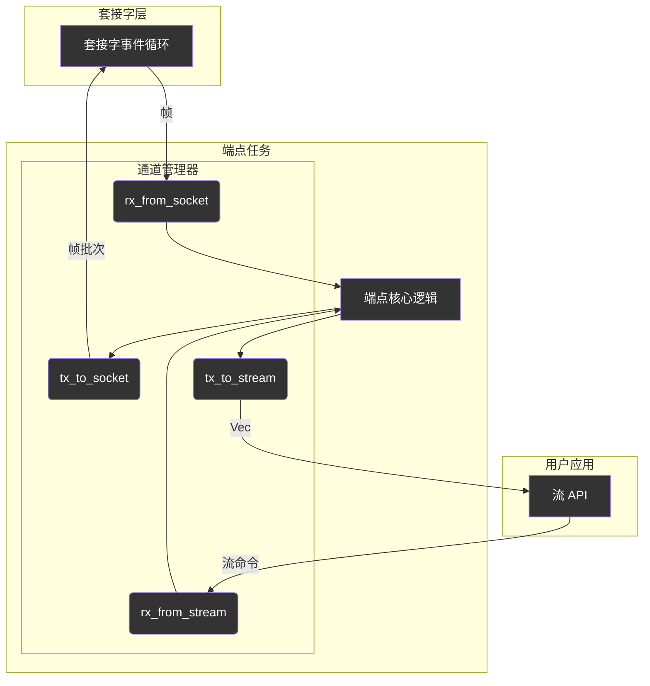

# Endpoint类型定义 (`types`) - 结构化的数据骨架

## 概述

`types`模块是`Endpoint`的数据和通信契约中心。它定义了构成`Endpoint`核心状态、身份标识以及通信协议的所有关键数据结构和枚举。通过将这些类型组织到独立的、职责明确的子模块中，`types`为整个`Endpoint`提供了一个清晰、内聚且易于理解的数据骨架。

**核心使命:**
- **状态定义**: 提供`ConnectionState`枚举，作为`Endpoint`状态机的核心基础。
- **身份封装**: 使用`ConnectionIdentity`结构体集中管理连接的唯一标识。
- **通信协议**: 定义`StreamCommand`枚举，作为用户`Stream`与`Endpoint`任务之间的通信语言。
- **通道管理**: 通过`ChannelManager`封装所有`mpsc`通道，简化`Endpoint`的通信逻辑。
- **传输层抽象**: 利用`TransportManager`聚合`ReliabilityLayer`和相关状态，为`Endpoint`提供统一的传输接口。

**架构实现:**
- **状态**: `src/core/endpoint/types/state.rs` - 定义`ConnectionState`枚举。
- **身份**: `src/core/endpoint/types/identity.rs` - 定义`ConnectionIdentity`结构体。
- **命令**: `src/core/endpoint/types/command.rs` - 定义`StreamCommand`枚举。
- **通道**: `src/core/endpoint/types/channels.rs` - 定义`ChannelManager`结构体。
- **传输**: `src/core/endpoint/types/transport.rs` - 定义`TransportManager`结构体。

## 设计原则

### 1. 内聚与封装
- **职责集中**: 每个子模块和结构体都围绕一个明确的职责构建。例如，`identity.rs`只关心连接身份，`channels.rs`只关心通信通道。
- **隐藏复杂性**: `ChannelManager`和`TransportManager`这样的“管理器”结构体，将多个相关字段封装起来，向`Endpoint`主结构体提供更简洁、更高层次的接口，避免了主结构体字段的膨胀。

### 2. 清晰的通信契约
- **命令模式**: `StreamCommand`枚举是用户`Stream`和`Endpoint`任务之间解耦的关键。`Stream`的调用者（如`write()`）被转换成一个清晰的`SendData`命令，发送到`Endpoint`的事件循环中异步处理。这种模式使得API调用和实际执行完全分离。

### 3. 类型安全
- **强类型定义**: 使用枚举和结构体代替基本类型（如整数或元组），使得代码意图更加明确，并能在编译时捕捉到更多潜在错误。例如，使用`ConnectionState`枚举比使用一个整数来表示状态要安全得多。

## 核心组件解析

### `ConnectionState` - 状态机核心

这是`Endpoint`状态机的枚举定义，是`lifecycle`和`processing`模块所有逻辑判断的基础。

```rust
// In src/core/endpoint/types/state.rs
pub enum ConnectionState {
    Connecting,
    SynReceived,
    Established,
    ValidatingPath { /* ... */ },
    Closing,
    ClosingWait,
    FinWait,
    Closed,
}
```

### `StreamCommand` - 用户->端点通信协议

这个枚举定义了用户`Stream`可以向`Endpoint`发送的所有命令。

```rust
// In src/core/endpoint/types/command.rs
#[derive(Debug)]
pub enum StreamCommand {
    /// 发送数据
    SendData(Bytes),
    /// 关闭流（触发FIN）
    Close,
    /// 主动迁移地址
    Migrate {
        new_addr: SocketAddr,
        notifier: oneshot::Sender<Result<()>>,
    },
}
```

### `ChannelManager` - 通信管道枢纽

这个结构体封装了`Endpoint`与外界交互的所有`mpsc`通道，是`Endpoint`解耦的关键组件之一。


**`ChannelManager`的职责**:
- `receiver`: 从`Socket`层接收属于该`Endpoint`的网络帧。
- `sender`: 将打包好的数据帧发送给`Socket`层。
- `command_tx`: 将内部命令（如连接关闭、地址更新）发送给`Socket`层。
- `rx_from_stream`: 从用户`Stream`接收`StreamCommand`。
- `tx_to_stream`: 将从网络接收并重组好的数据发送给用户`Stream`。

通过将这些通道封装，`Endpoint`的主结构体变得更加简洁，只需持有一个`ChannelManager`实例即可。

### `ConnectionIdentity` & `TransportManager` - 状态封装器

这两个结构体遵循了相似的设计模式：将一组相关的状态字段封装成一个独立的、职责单一的结构体。

- **`ConnectionIdentity`**:
    - **职责**: 管理连接的“身份名片”。
    - **字段**: `local_cid`, `peer_cid`, `remote_addr`。
    - **优势**: 将连接标识与连接状态、计时器等其他逻辑分离。

- **`TransportManager`**:
    - **职责**: 充当`Endpoint`与`ReliabilityLayer`之间的适配器和状态管理器。
    - **字段**: `reliability` (可靠性层实例), `peer_recv_window`。
    - **优势**: 使得`Endpoint`在处理传输逻辑时有了一个更高级的接口，而不必直接与`ReliabilityLayer`的所有细节交互。

## 总结

`Endpoint`的`types`模块是其清晰架构的基础。通过精心设计的数据结构，它将`Endpoint`的复杂状态分解为多个内聚的、易于管理的部分。这些类型定义不仅是数据的容器，更体现了模块间的通信协议和职责边界，是整个`Endpoint`能够稳定、高效工作的静态骨架。
