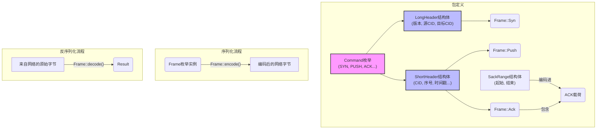

# 数据包层 (`packet`) - 协议的基石

## 概述

`packet`模块是整个协议栈最底层的核心，负责定义协议在网络线路上（on-the-wire）传输的数据单元的精确格式。它将所有网络通信抽象成一个统一的`Frame`枚举，并提供了对这些`Frame`进行序列化（编码）和反序列化（解码）的全部逻辑。此模块是协议栈中所有其他上层组件（如`ReliabilityLayer`, `Endpoint`）与之交互的基础。

**核心使命:**
- **定义协议语言**: 精确规定每一种数据包的二进制结构，包括命令、头部和载荷。
- **长短头分离**: 借鉴QUIC的设计，实现`LongHeader`用于连接管理，`ShortHeader`用于常规数据传输，以优化不同场景下的头部开销。
- **统一编解码**: 提供一个唯一的、安全的入口点 (`Frame::encode`/`Frame::decode`)来处理所有类型数据包的序列化与反序列化，防止格式错误。
- **抽象化帧类型**: 将不同功能的数据包（数据、确认、控制信令）统一封装在`Frame`枚举中，便于上层逻辑进行模式匹配和处理。

**架构实现:**
- **帧定义与逻辑**: `src/packet/frame.rs` - 模块的核心，定义了`Frame`枚举及主要编解码逻辑。
- **头部定义**: `src/packet/header.rs` - 定义了`LongHeader`和`ShortHeader`结构体及其编解码。
- **命令定义**: `src/packet/command.rs` - 定义了所有包类型的`Command`枚举。
- **SACK结构**: `src/packet/sack.rs` - 定义了`SackRange`结构及其在`ACK`包载荷中的编解码方式。

## 设计原则

### 1. 结构清晰与类型安全
- **枚举驱动设计**: 模块的核心是`Frame`枚举。这种设计利用了Rust强大的类型系统和模式匹配，使得上层代码在处理不同类型的包时非常直观和安全，几乎不可能遗漏某种包类型。
- **职责明确**: `command.rs`, `header.rs`, `sack.rs`各自负责协议的一个特定部分，而`frame.rs`则将它们有机地组合起来。这种分离使得每个文件的职责都非常单一和明确。

### 2. 效率与开销优化
- **长短头分离**:
    - **`LongHeader`**: 用于`SYN`和`SYN-ACK`。它包含协议版本和完整的源/目标连接ID，专用于连接建立和版本协商。
    - **`ShortHeader`**: 用于`PUSH`, `ACK`, `FIN`等绝大多数常规包。它的字段更少，体积更小，从而在连接建立后降低了每个包的固定开销，提升了传输效率。
- **零拷贝与`Bytes`**: 模块广泛使用`bytes`库。在编码时，直接写入`BytesMut`；在解码`PUSH`和`ACK`的载荷时，通过`Bytes::copy_from_slice`创建零拷贝的切片视图，避免了不必要的内存分配和复制。

### 3. 安全性与健壮性
- **智能构造函数 (Smart Constructors)**: `Frame`提供了一系列`new_...`方法（如`new_push`, `new_ack`）。这些方法在内部自动计算并填充头部的`payload_length`字段。这避免了开发者手动计算长度可能引入的错误，确保了编码出的数据包头部与载荷的一致性。
- **统一编解码入口**: 所有编解码操作都通过`Frame::encode`和`Frame::decode`进行。`decode`函数内部会先探测第一个字节来判断是长头还是短头，然后再调用相应的解析器。这种封装确保了解码逻辑的正确性和一致性，降低了上层代码直接操作头部的风险。

## 整体架构与核心结构

`packet`模块的结构是层层递进的：`Command`定义类型 -> `Header`定义元数据 -> `Frame`组合成最终数据单元。

**核心结构解析:**

- **`Command`**: 一个简单的`#[repr(u8)]`枚举，是每个数据包在线路上的第一个字节，用于标识包的类型。
- **`ShortHeader`**: 包含了常规数据传输所需的全部元数据：
    - `connection_id`: 标识这条连接。
    - `sequence_number`: 包序号，用于ARQ。
    - `recv_next_sequence`: 累积确认号，告知对端我方已连续收到的位置。
    - `recv_window_size`: 流量控制，告知对端我方还有多少接收空间。
    - `timestamp`: 用于计算RTT。
    - `payload_length`: 载荷长度，用于解码时确定载荷边界，是实现包粘连（Coalescing）的关键。
- **`LongHeader`**: 仅用于连接建立，包含：
    - `protocol_version`: 用于版本协商。
    - `destination_cid` & `source_cid`: 完整的双向连接ID，用于在连接建立过程中唯一标识双方。
- **`Frame`**: 整个模块的中心。它是一个枚举，其每个变体都代表一种具体的数据包类型，并持有对应的头部和载荷。例如：
    - `Frame::Push { header: ShortHeader, payload: Bytes }`
    - `Frame::Syn { header: LongHeader }`
- **`SackRange`**: `ACK`包的载荷不是一个简单的数字，而是由一系列`SackRange { start: u32, end: u32 }`编码而成。这使得一个`ACK`包可以精确地描述接收窗口中所有非连续的数据块，极大地提高了确认信息的效率。`sack.rs`中的`encode_sack_ranges`和`decode_sack_ranges`负责处理这种`[u32, u32]`数组和字节流之间的转换。

## 编解码流程

### 编码 (`Frame::encode`)
1.  调用`encode`时，会`match self`来确定是哪种`Frame`变体。
2.  根据变体类型，调用对应的`header.encode(buf)`方法，将头部字段按网络字节序（大端）写入缓冲区。
3.  如果`Frame`带有载荷（如`Push`, `Ack`, `PathChallenge`），则将载荷的字节流追加到头部之后。

### 解码 (`Frame::decode`)
1.  **探测**: 首先，函数“窥视”（peek）缓冲区的第一个字节，通过`Command::from_u8()`将其转换为一个`Command`。
2.  **分发**:
    - 如果`command.is_long_header()`为`true`，则调用`LongHeader::decode()`来解析长头。
    - 否则，调用`ShortHeader::decode()`来解析短头。
3.  **解析载荷**:
    - 对于短头包，解析完头部后，会从`header.payload_length`字段得知载荷的长度。
    - 根据这个长度，从缓冲区中切出相应长度的字节作为载荷。
    - 根据`header.command`，将头部和载荷组装成相应的`Frame`变体（如`Frame::Push`）。
4.  **推进光标**: 解码成功后，函数会修改传入的`&mut &[u8]`切片，使其指向剩余未解码的数据。这使得上层调用者可以循环调用`decode`来处理被粘连在一起的多个数据包。

## 总结

`packet`模块通过其严谨、类型安全且高效的设计，为整个协议栈定义了一套清晰、可扩展的“通信语言”。它不仅是数据在网络上传输的最终形态，其内部的`Frame`枚举和统一编解码接口也极大地简化了上层模块的逻辑，是整个项目稳定运行的基石。
