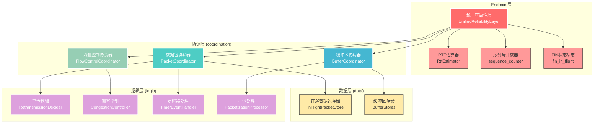
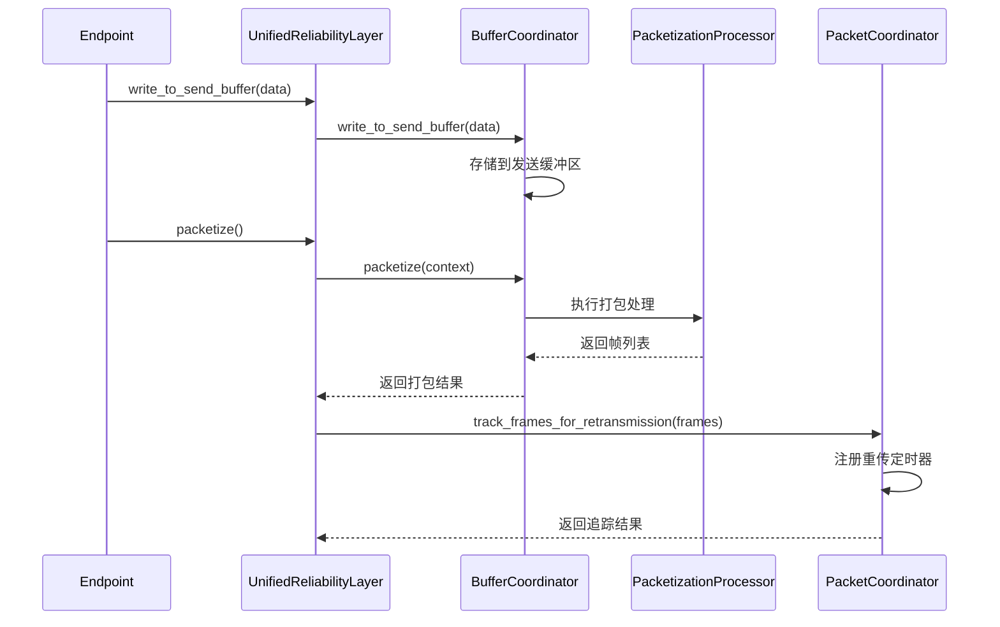
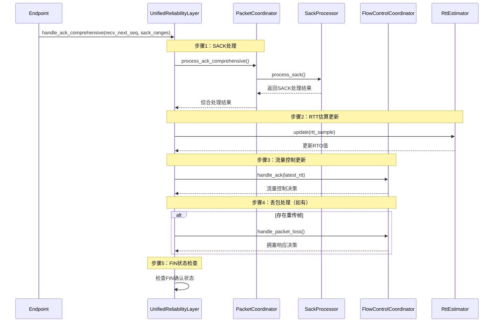

# 可靠性模块 (`reliability`) - 协议栈的可靠性保障核心

## 概述

可靠性模块是整个协议栈的可靠性保障核心，由**统一可靠性层(`UnifiedReliabilityLayer`)**对外提供统一接口，内部采用分层架构设计，将复杂的可靠性管理功能分解为清晰、可维护的组件，实现了高性能、可扩展的可靠性解决方案。

**核心使命:**
- **统一管理接口**: 提供统一的可靠性管理接口，替换原有的双重管理系统。
- **集成分层架构**: 集成协调层、数据层、逻辑层的所有组件，形成完整的可靠性体系。
- **精确RTT估算**: 集成RTT估算和精确重传定时器管理，优化网络适应性。
- **向后兼容性**: 保持与原有接口的兼容性，确保系统平滑升级。

## 架构设计

### 分层架构概览

可靠性模块采用三层分层架构，每层专注于不同的职责：



### 设计原则

1. **职责分离**: 每层专注于特定的职责，避免跨层耦合。
2. **向上统一**: 上层为下层提供统一的接口，屏蔽内部复杂性。
3. **向下组合**: 下层提供基础能力，上层通过组合实现复杂功能。
4. **水平协调**: 同层组件通过协调器进行交互，保持模块边界清晰。

## 核心组件

### 统一可靠性层 (`UnifiedReliabilityLayer<C>`)

统一可靠性层是整个可靠性模块的对外统一接口，它集成了所有内部组件，为上层`Endpoint`提供简洁、一致的可靠性管理API。

**核心结构:**
```rust
pub struct UnifiedReliabilityLayer<C: CongestionController> {
    /// 数据包协调器 - 处理重传和定时器
    packet_coordinator: PacketCoordinator,
    
    /// 缓冲区协调器 - 处理发送和接收缓冲区
    buffer_coordinator: BufferCoordinator,
    
    /// 流量控制协调器 - 处理拥塞控制和流量控制
    flow_control_coordinator: FlowControlCoordinator<C>,
    
    /// RTT估算器 - 计算准确的RTO用于重传定时器
    rtt_estimator: RttEstimator,
    
    /// 序列号计数器
    sequence_counter: u32,
    
    /// FIN帧在途标志
    fin_in_flight: bool,
}
```

**关键功能:**
- **综合ACK处理**: `handle_ack_comprehensive()` - 集成SACK处理、RTT更新、拥塞控制
- **智能重传管理**: `add_in_flight_packet()` - 使用RTT估算器的动态RTO值
- **流量感知打包**: `packetize()` - 结合拥塞窗口和接收窗口的智能打包
- **状态一致性验证**: `validate_consistency()` - 用于调试的状态一致性检查

### 1. 协调层 (`coordination/`)

协调层是可靠性模块的统一协调中枢，负责协调各个组件之间的复杂交互。

**主要组件:**
- **[数据包协调器](coordination.md#packetcoordinator--数据包协调器)**: 统一管理在途数据包的生命周期，协调重传、定时器和ACK处理。
- **[缓冲区协调器](coordination.md#buffercoordinator--缓冲区协调器)**: 统一管理发送和接收缓冲区，提供数据流的端到端管理。
- **[流量控制协调器](coordination.md#flowcontrolcoordinator--流量控制协调器)**: 整合拥塞控制和流量控制，提供统一的速率管理。

**关键特性:**
- 事务性操作保证
- 跨组件状态同步
- 批处理性能优化

### 2. 数据层 (`data/`)

数据层是可靠性系统的数据存储基石，专注于纯数据管理和状态维护。

**主要组件:**
- **[在途数据包存储](data.md#inflightpacketstore--在途数据包存储)**: 管理已发送但未确认的数据包状态，支持多维度高效查询。
- **[缓冲区存储](data.md#bufferstores--缓冲区存储)**: 管理发送和接收数据的缓冲，支持流式数据的高效处理。

**关键特性:**
- 零业务逻辑的纯数据管理
- 高性能数据结构设计
- 线程安全与并发优化

### 3. 逻辑层 (`logic/`)

逻辑层是可靠性系统的智能决策引擎，专门负责具体的业务逻辑处理和算法实现。

**主要组件:**
- **[拥塞控制](logic/congestion.md)**: Vegas算法和RTT估算的专业实现，提供智能网络适应能力。
- **[重传逻辑](logic/retransmission.md)**: SACK处理和重传决策算法，确保数据的可靠传输。
- **定时器处理**: 定时器事件的专业处理逻辑，支持精确的超时管理。
- **打包处理**: 数据打包和流量控制集成，优化网络传输效率。

**关键特性:**
- 专业化算法实现
- 策略可扩展设计
- 性能导向优化

## 核心流程

### 数据发送流程



### ACK处理流程

统一可靠性层的ACK处理是一个五步综合处理流程：



**ACK处理结果结构:**
```rust
pub struct AckProcessingResult {
    /// 需要重传的帧
    pub frames_to_retransmit: Vec<Frame>,
    
    /// 新确认的序列号
    pub newly_acked_sequences: Vec<u32>,
    
    /// RTT样本
    pub rtt_samples: Vec<Duration>,
}
```

### 重传触发机制

统一可靠性层支持两种重传触发类型：

```rust
pub enum RetransmissionTrigger {
    /// 快速重传 - 基于SACK的重传
    FastRetransmit,
    /// RTO超时重传 - 基于定时器的重传
    RtoTimeout,
}
```

**重传处理策略:**

1. **事件驱动重传**: `handle_packet_timer_timeout()` - 单个数据包超时的精确处理
2. **轮询备用重传**: `check_rto_retransmission()` - 批量超时检查的备用机制
3. **RTO动态调整**: 使用RTT估算器的动态RTO值，避免硬编码超时时间
4. **智能退避策略**: 重传时执行RTO指数退避，并通知拥塞控制

## 关键API接口

### 核心数据操作

```rust
// 数据写入和打包
pub fn write_to_send_buffer(&mut self, data: Bytes) -> usize
pub fn packetize(&mut self, peer_cid: u32, timestamp: u32, prepend_frame: Option<Frame>) -> Vec<Frame>
pub fn packetize_zero_rtt(&mut self, peer_cid: u32, timestamp: u32, syn_ack_frame: Frame) -> Vec<Vec<Frame>>

// 数据接收和重组
pub fn receive_packet(&mut self, sequence_number: u32, payload: Bytes) -> bool
pub fn receive_fin(&mut self, sequence_number: u32) -> bool
pub fn reassemble_data(&mut self) -> ReassemblyResult
```

### 重传和定时器管理

```rust
// 重传管理
pub async fn add_in_flight_packet(&mut self, frame: &Frame, now: Instant) -> bool
pub async fn track_frames_for_retransmission(&mut self, frames: &[Frame]) -> usize
pub async fn handle_packet_timer_timeout(&mut self, timer_id: ActorTimerId, context: &RetransmissionContext) -> Option<Frame>

// ACK处理
pub async fn handle_ack_comprehensive(&mut self, recv_next_seq: u32, sack_ranges: Vec<SackRange>, now: Instant, context: &RetransmissionContext) -> AckProcessingResult
```

### 状态查询和管理

```rust
// 状态查询
pub fn in_flight_count(&self) -> usize
pub fn is_in_flight_empty(&self) -> bool
pub fn is_send_buffer_empty(&self) -> bool
pub fn send_buffer_available_space(&self) -> usize

// RTT和RTO查询
pub fn current_rto(&self) -> Duration
pub fn smoothed_rtt(&self) -> Option<Duration>
pub fn rtt_var(&self) -> Option<Duration>

// 统计和调试
pub fn get_statistics(&self) -> UnifiedReliabilityStats<C::Stats>
pub fn validate_consistency(&self) -> bool
```

## 性能特性

### 关键性能指标

| 指标 | 目标值 | 实现方式 |
|------|--------|----------|
| ACK处理延迟 | < 1ms | 批处理优化 + 高效数据结构 |
| 重传检测时间 | < 5ms | 智能SACK分析 + 快速重传 |
| 内存使用效率 | > 90% | 零拷贝设计 + 内存复用 |
| 拥塞响应时间 | < 1 RTT | 基于RTT的主动检测 |

### 优化策略

1. **数据结构优化**
   - 使用`BTreeMap`保证有序访问
   - 使用`HashMap`提供常数时间查询
   - 使用`VecDeque`优化队列操作

2. **算法优化**
   - Vegas拥塞控制的主动检测
   - SACK的智能丢包检测
   - RTT的精确估算和RTO计算

3. **系统优化**
   - 批处理减少函数调用开销
   - 零拷贝减少内存分配
   - 事件驱动减少轮询开销

## 配置与调优

### 核心配置参数

```rust
pub struct ReliabilityConfig {
    /// 初始RTO（重传超时）
    pub initial_rto: Duration,
    
    /// 最小RTO
    pub min_rto: Duration,
    
    /// 快速重传阈值
    pub fast_retx_threshold: u32,
    
    /// 最大重传次数
    pub max_retries: u8,
    
    /// Vegas算法参数
    pub vegas: VegasConfig,
    
    /// 缓冲区配置
    pub buffer: BufferConfig,
}
```

### 性能调优建议

1. **网络环境优化**
   - 低延迟网络：降低`initial_rto`，增加`fast_retx_threshold`
   - 高丢包网络：增加`max_retries`，调整Vegas参数
   - 高带宽网络：增大缓冲区大小，优化拥塞窗口

2. **应用场景优化**
   - 实时应用：优先快速重传，降低重传次数
   - 批量传输：增大拥塞窗口，优化吞吐量
   - 移动网络：启用更保守的重传策略

## 监控与调试

### 统计信息

```rust
pub struct UnifiedReliabilityStats<S: CongestionStats> {
    /// 总在途数据包数
    pub total_in_flight: usize,
    
    /// 需要重传的数据包数
    pub needs_retx_count: usize,
    
    /// 快速重传候选数
    pub fast_retx_candidates: usize,
    
    /// 活跃定时器数
    pub active_timers: usize,
    
    /// 发送缓冲区利用率
    pub send_buffer_utilization: f64,
    
    /// 接收缓冲区利用率
    pub receive_buffer_utilization: f64,
    
    /// 拥塞控制统计信息（泛型）
    pub congestion_stats: S,
    
    /// 发送许可
    pub send_permit: u32,
    
    /// 当前序列号计数器
    pub sequence_counter: u32,
}
```

**统计信息的显示格式:**
```rust
impl<S: CongestionStats> std::fmt::Display for UnifiedReliabilityStats<S> {
    fn fmt(&self, f: &mut std::fmt::Formatter<'_>) -> std::fmt::Result {
        write!(f, 
            "UnifiedReliability[in_flight:{}, needs_retx:{}, fast_retx:{}, timers:{}, send_buf:{:.1}%, recv_buf:{:.1}%, congestion:{}, permit:{}, seq:{}]",
            self.total_in_flight, self.needs_retx_count, self.fast_retx_candidates,
            self.active_timers, self.send_buffer_utilization, self.receive_buffer_utilization,
            self.congestion_stats, self.send_permit, self.sequence_counter
        )
    }
}
```

### 调试工具

1. **状态一致性验证**
   ```rust
   reliability_layer.validate_consistency()
   ```

2. **详细统计信息**
   ```rust
   let stats = reliability_layer.get_statistics();
   println!("可靠性统计: {}", stats);
   ```

3. **实时监控**
   - 在途数据包数量监控
   - 重传率和丢包率统计
   - RTT和RTO趋势分析

## 文档导航

- **[协调层详细文档](coordination.md)** - 了解组件协调和事务管理
- **[数据层详细文档](data.md)** - 了解数据存储和状态管理
- **[逻辑层详细文档](logic.md)** - 了解算法实现和决策逻辑
  - **[拥塞控制文档](logic/congestion.md)** - Vegas算法和RTT估算
  - **[重传逻辑文档](logic/retransmission.md)** - SACK处理和重传决策

可靠性模块通过其精心设计的分层架构和优化实现，为整个协议栈提供了强大的可靠性保障，确保在各种网络环境下都能实现高效、稳定的数据传输。
