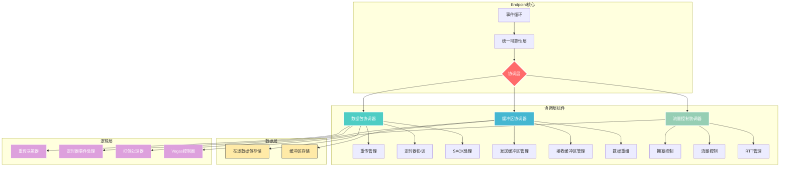

# 协调层 (`coordination`) - 可靠性管理的统一协调中枢

## 概述

`coordination`层是可靠性模块的统一协调中枢，负责协调数据存储、业务逻辑和外部交互之间的复杂关系。它实现了分层架构的核心思想，将不同职责的组件有机结合，形成高效、可扩展的可靠性管理系统。

**核心使命:**
- **组件协调**: 作为数据层(`data`)和逻辑层(`logic`)之间的桥梁，管理组件间的数据流和状态同步。
- **统一接口**: 为上层`Endpoint`提供简洁、一致的可靠性管理API，屏蔽内部复杂性。
- **事务管理**: 确保跨组件操作的原子性和一致性，维护系统状态的完整性。
- **性能优化**: 通过智能调度和批处理操作，最大化系统的吞吐量和响应速度。

**架构实现:**
- **数据包协调器**: `src/core/reliability/coordination/packet_coordinator.rs` - 统一管理在途数据包的生命周期。
- **缓冲区协调器**: `src/core/reliability/coordination/buffer_coordinator.rs` - 协调发送和接收缓冲区操作。
- **流量控制协调器**: `src/core/reliability/coordination/flow_control_coordinator.rs` - 统一管理拥塞控制和流量控制。
- **协调器特性**: `src/core/reliability/coordination/traits.rs` - 定义通用协调器接口和抽象。

## 设计原则

`coordination`层的设计遵循了确保系统稳定性和可扩展性的核心原则：

### 1. 分层协调架构
- **职责分离**: 每个协调器专注于特定领域的协调工作，避免职责混杂。
- **统一抽象**: 通过`traits`模块定义统一的协调器接口，支持多种实现策略。
- **松耦合设计**: 协调器之间通过明确的接口交互，降低系统复杂度。

### 2. 事务性操作保证
- **原子性**: 跨组件的复合操作要么全部成功，要么全部回滚，确保状态一致性。
- **状态同步**: 协调器负责维护相关组件间的状态同步，防止数据不一致。
- **错误恢复**: 提供完善的错误处理和恢复机制，确保系统稳定性。

### 3. 性能导向的设计
- **批处理优化**: 协调器支持批量操作，减少函数调用开销和锁竞争。
- **智能调度**: 根据系统状态和网络条件，智能调度各种操作的执行时机。
- **内存优化**: 合理管理内存使用，避免不必要的数据拷贝和内存分配。

## 整体架构

`coordination`层以三个核心协调器为中心，形成完整的可靠性管理体系。



**架构解读:**
1. **协调层中枢**: `coordination`层作为中枢，接收来自`Endpoint`的请求，协调下层组件完成复杂操作。
2. **三足鼎立**: 三个协调器分别负责数据包管理、缓冲区管理和流量控制，形成稳定的架构基础。
3. **向下整合**: 协调器将数据层的存储能力和逻辑层的处理能力有机结合。
4. **向上统一**: 为上层提供简洁一致的接口，屏蔽底层复杂性。

## 核心组件解析

### `PacketCoordinator` - 数据包协调器

数据包协调器是在途数据包管理的核心，负责协调重传、定时器和ACK处理等复杂操作。

```rust
// In src/core/reliability/coordination/packet_coordinator.rs
impl PacketCoordinator {
    /// 综合处理ACK，包含SACK处理和重传决策
    pub async fn process_ack_comprehensive(
        &mut self,
        recv_next_seq: u32,
        sack_ranges: Vec<SackRange>,
        now: Instant,
        context: &RetransmissionContext,
    ) -> ComprehensiveResult {
        // 1. 使用SACK处理器分析接收状态
        let sack_result = self.sack_processor.process_sack(
            recv_next_seq,
            &sack_ranges,
            &self.in_flight_store,
        );
        
        // 2. 更新在途数据包状态
        self.update_in_flight_packets(&sack_result, now).await;
        
        // 3. 应用重传决策
        let retx_frames = self.apply_retransmission_decisions(context).await;
        
        ComprehensiveResult {
            frames_to_retransmit: retx_frames,
            newly_acked_sequences: sack_result.newly_acked,
            rtt_samples: sack_result.rtt_samples,
        }
    }
}
```

**关键特性**:
- **事务性ACK处理**: 将SACK分析、状态更新和重传决策组合为原子操作。
- **智能重传调度**: 基于网络状态和RTT信息，智能决策重传时机和策略。
- **精确定时器管理**: 协调`TimerActor`实现精确的重传定时器管理。

### `BufferCoordinator` - 缓冲区协调器

缓冲区协调器统一管理发送和接收缓冲区，提供数据流的端到端管理。

```rust
// In src/core/reliability/coordination/buffer_coordinator.rs
impl BufferCoordinator {
    /// 执行打包操作，协调多个组件
    pub fn packetize(
        &mut self,
        context: &PacketizationContext,
        sequence_counter: &mut u32,
        prepend_frame: Option<Frame>,
    ) -> PacketizationResult {
        // 1. 检查发送缓冲区状态
        let available_data = self.send_buffer.available_data_size();
        
        // 2. 计算可发送的数据量
        let sendable_bytes = self.calculate_sendable_bytes(
            context.congestion_window,
            context.in_flight_count,
            available_data,
        );
        
        // 3. 使用打包处理器执行实际打包
        self.packetization_processor.packetize_with_flow_control(
            &mut self.send_buffer,
            context,
            sequence_counter,
            sendable_bytes,
            prepend_frame,
        )
    }
}
```

**关键特性**:
- **统一缓冲区管理**: 将发送和接收缓冲区的操作统一在一个协调器中。
- **智能数据重组**: 提供高效的数据重组算法，支持乱序数据包的正确处理。
- **流量感知打包**: 结合流量控制信息，智能决策数据包的大小和数量。

### `FlowControlCoordinator` - 流量控制协调器

流量控制协调器整合拥塞控制和流量控制，提供统一的速率管理。

```rust
// In src/core/reliability/coordination/flow_control_coordinator.rs
impl<C: CongestionController> FlowControlCoordinator<C> {
    /// 处理ACK并更新流量控制状态
    pub fn handle_ack(&mut self, rtt: Duration, now: Instant) -> FlowControlDecision {
        // 1. 更新拥塞控制器状态
        let congestion_decision = self.congestion_controller.on_ack(rtt, now);
        
        // 2. 应用拥塞控制决策
        self.apply_congestion_decision(&congestion_decision);
        
        // 3. 计算发送许可
        let send_permit = self.calculate_send_permit();
        
        FlowControlDecision {
            congestion_decision,
            send_permit,
            should_delay_send: self.should_delay_send(now),
        }
    }
}
```

**关键特性**:
- **多算法支持**: 通过泛型设计支持多种拥塞控制算法（Vegas、Reno等）。
- **自适应调整**: 根据网络状况自动调整发送速率和窗口大小。
- **延迟控制**: 实现发送延迟控制，避免网络拥塞。

## 与其他层的交互

- **与`UnifiedReliabilityLayer`的交互**:
    - **上行接口**: 接收来自统一可靠性层的协调请求，如ACK处理、数据发送等。
    - **状态同步**: 主动向统一可靠性层报告关键状态变化，如拥塞窗口调整。
    - **事务协调**: 协调跨多个协调器的复合操作，确保原子性。

- **与`data`层的交互**:
    - **数据存储**: 协调器管理数据层组件的生命周期和状态变化。
    - **查询优化**: 智能缓存和批量查询，减少对数据层的访问开销。
    - **一致性维护**: 确保跨存储组件的数据一致性。

- **与`logic`层的交互**:
    - **逻辑调用**: 协调器负责调用逻辑层组件执行具体的业务处理。
    - **参数传递**: 智能管理调用参数和上下文，避免重复计算。
    - **结果整合**: 将多个逻辑组件的处理结果整合为统一的协调结果。

`coordination`层通过其精心设计的协调机制，成功地将复杂的可靠性管理需求分解为清晰、可管理的组件协作，构成了整个协议栈中可靠性保证的"指挥中枢"。
