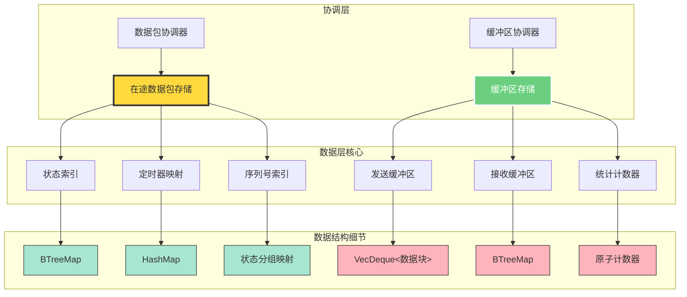

# 数据层 (`data`) - 可靠性系统的数据存储基石

## 概述

`data`层是可靠性模块的数据存储基石，专注于纯数据管理和状态维护，不涉及业务逻辑处理。它提供高效、线程安全的数据结构，支撑整个可靠性系统的核心数据需求，确保数据的完整性、一致性和高性能访问。

**核心使命:**
- **纯数据管理**: 专注于数据的存储、查询和状态维护，与业务逻辑完全分离。
- **高性能存储**: 提供优化的数据结构和算法，支持高频的读写操作。
- **状态一致性**: 维护数据的完整性和一致性，为上层提供可靠的数据基础。
- **内存优化**: 通过智能的内存管理和数据结构设计，最小化内存使用和GC压力。

**架构实现:**
- **在途数据包存储**: `src/core/reliability/data/in_flight_store.rs` - 管理已发送但未确认的数据包状态。
- **缓冲区存储**: `src/core/reliability/data/buffer_stores.rs` - 管理发送和接收缓冲区的数据存储。
- **测试套件**: `src/core/reliability/data/tests/` - 确保数据层组件的正确性和性能。

## 设计原则

`data`层的设计严格遵循数据管理的最佳实践：

### 1. 纯数据管理原则
- **零业务逻辑**: 数据层组件只负责数据的CRUD操作，不包含任何业务决策逻辑。
- **接口纯净**: 所有接口都是纯函数式的，便于测试和推理。
- **状态透明**: 数据状态变化完全可预测，支持精确的状态查询和调试。

### 2. 高性能设计
- **数据结构优化**: 选择最适合的数据结构（如`BTreeMap`、`HashMap`、`VecDeque`），优化查询和更新性能。
- **内存局部性**: 设计考虑CPU缓存友好的内存布局，提高访问效率。
- **批量操作**: 支持批量数据操作，减少函数调用开销。

### 3. 线程安全与并发
- **无锁设计**: 在可能的情况下使用无锁数据结构，减少锁竞争。
- **原子操作**: 关键状态更新使用原子操作，确保线程安全。
- **数据隔离**: 通过数据分片和隔离设计，减少并发冲突。

## 整体架构

`data`层由两个核心存储组件构成，分别负责不同类型的数据管理。



**架构解读:**
1. **双核心设计**: 在途数据包存储和缓冲区存储形成数据层的双核心，分工明确。
2. **多级索引**: 每个存储组件都维护多种索引结构，支持不同维度的高效查询。
3. **数据结构选择**: 根据访问模式选择最优的数据结构，平衡查询和更新性能。
4. **状态管理**: 提供细粒度的状态管理和统计功能，支持性能监控和调试。

## 核心组件解析

### `InFlightPacketStore` - 在途数据包存储

在途数据包存储是重传管理的数据基础，负责跟踪所有已发送但未确认的数据包。

```rust
// In src/core/reliability/data/in_flight_store.rs
pub struct InFlightPacketStore {
    /// 主要存储：序列号 -> 数据包信息
    /// Primary storage: sequence number -> packet info
    packets: BTreeMap<u32, InFlightPacket>,
    
    /// 定时器映射：定时器ID -> 序列号
    /// Timer mapping: timer ID -> sequence number
    timer_to_sequence: HashMap<ActorTimerId, u32>,
    
    /// 状态分组：不同状态的数据包集合
    /// State grouping: packets grouped by state
    state_groups: HashMap<PacketState, HashSet<u32>>,
}

impl InFlightPacketStore {
    /// 添加新的在途数据包
    pub fn add_packet(&mut self, sequence_number: u32, packet: InFlightPacket) {
        // 1. 添加到主存储
        self.packets.insert(sequence_number, packet.clone());
        
        // 2. 更新状态分组
        self.state_groups
            .entry(packet.state)
            .or_insert_with(HashSet::new)
            .insert(sequence_number);
        
        // 3. 添加定时器映射（如果有）
        if let Some(timer_id) = packet.timer_id {
            self.timer_to_sequence.insert(timer_id, sequence_number);
        }
    }
    
    /// 高效的状态查询
    pub fn get_packets_by_state(&self, state: PacketState) -> Vec<u32> {
        self.state_groups
            .get(&state)
            .map(|set| set.iter().cloned().collect())
            .unwrap_or_default()
    }
}
```

**关键特性**:
- **多维索引**: 支持按序列号、定时器ID、状态等多种维度快速查询。
- **状态一致性**: 确保状态变更时所有相关索引的同步更新。
- **内存优化**: 使用`BTreeMap`保证有序访问，`HashMap`提供常数时间查询。

### `BufferStores` - 缓冲区存储

缓冲区存储管理发送和接收数据的缓冲，支持流式数据的高效处理。

```rust
// In src/core/reliability/data/buffer_stores.rs
pub struct SendBufferStore {
    /// 数据缓冲区：存储待发送的数据
    /// Data buffer: stores data to be sent
    buffer: VecDeque<Bytes>,
    
    /// 当前偏移量：已发送但未确认的数据量
    /// Current offset: amount of data sent but not acknowledged
    current_offset: usize,
    
    /// 容量限制
    /// Capacity limit
    capacity: usize,
    
    /// 统计信息
    /// Statistics
    stats: SendBufferStats,
}

impl SendBufferStore {
    /// 写入数据到缓冲区
    pub fn write_data(&mut self, data: Bytes) -> usize {
        let data_len = data.len();
        
        // 检查容量限制
        if self.used_bytes() + data_len > self.capacity {
            return 0; // 缓冲区已满
        }
        
        // 添加数据并更新统计
        self.buffer.push_back(data);
        self.stats.total_bytes_written += data_len;
        
        data_len
    }
    
    /// 消费指定数量的数据
    pub fn consume_data(&mut self, bytes_to_consume: usize) -> Vec<Bytes> {
        let mut consumed = Vec::new();
        let mut remaining = bytes_to_consume;
        
        while remaining > 0 && !self.buffer.is_empty() {
            if let Some(chunk) = self.buffer.front() {
                if chunk.len() <= remaining {
                    // 整个数据块都可以消费
                    remaining -= chunk.len();
                    consumed.push(self.buffer.pop_front().unwrap());
                } else {
                    // 只消费数据块的一部分
                    let partial = chunk.slice(0..remaining);
                    let remaining_chunk = chunk.slice(remaining..);
                    self.buffer[0] = remaining_chunk;
                    consumed.push(partial);
                    remaining = 0;
                }
            }
        }
        
        consumed
    }
}
```

**关键特性**:
- **零拷贝设计**: 使用`Bytes`类型支持零拷贝的数据共享。
- **流式处理**: 支持流式数据的写入和消费，适应网络协议的特点。
- **容量管理**: 提供灵活的容量限制和反压机制。

### 数据结构选择的考量

| 数据结构 | 使用场景 | 优势 | 权衡 |
|---------|---------|------|------|
| `BTreeMap` | 在途数据包主存储 | 有序访问，范围查询 | 插入/删除开销较大 |
| `HashMap` | 定时器映射，状态分组 | 常数时间查询 | 无序，内存开销较大 |
| `VecDeque` | 发送缓冲区 | 高效的头尾操作 | 随机访问性能差 |
| `HashSet` | 状态分组值 | 快速成员检查 | 额外内存开销 |

## 性能优化策略

### 1. 内存布局优化
```rust
// 使用紧凑的数据布局
#[repr(C)]
pub struct InFlightPacket {
    pub frame_info: RetransmissionFrameInfo,
    pub last_sent_at: Instant,
    pub retx_count: u8,  // 8位就足够
    pub state: PacketState, // 枚举，占用少量内存
    pub timer_id: Option<ActorTimerId>,
}
```

### 2. 批量操作支持
```rust
impl InFlightPacketStore {
    /// 批量更新数据包状态
    pub fn batch_update_state(&mut self, updates: &[(u32, PacketState)]) {
        for (seq, new_state) in updates {
            if let Some(packet) = self.packets.get_mut(seq) {
                let old_state = packet.state;
                packet.state = *new_state;
                
                // 批量更新状态分组
                self.move_packet_between_states(*seq, old_state, *new_state);
            }
        }
    }
}
```

### 3. 缓存友好的访问模式
```rust
impl BufferStore {
    /// 顺序访问优化
    pub fn sequential_read(&self, start: usize, len: usize) -> Vec<u8> {
        // 利用CPU缓存行，优化连续内存访问
        self.data[start..start + len].to_vec()
    }
}
```

## 与其他层的交互

- **与`coordination`层的交互**:
    - **纯数据接口**: 只提供数据CRUD操作，不涉及业务逻辑。
    - **状态查询**: 支持复杂的状态查询和统计信息获取。
    - **批量操作**: 为协调层提供高效的批量数据操作接口。

- **与系统其他部分的隔离**:
    - **接口边界**: 通过清晰的接口边界，确保数据层的职责单一性。
    - **测试友好**: 纯数据操作易于单元测试和性能测试。
    - **可替换性**: 标准化的接口使得底层实现可以灵活替换。

`data`层通过其精心设计的数据结构和算法，为整个可靠性系统提供了坚实的数据基础，确保了系统的高性能、高可靠性和良好的可扩展性。
