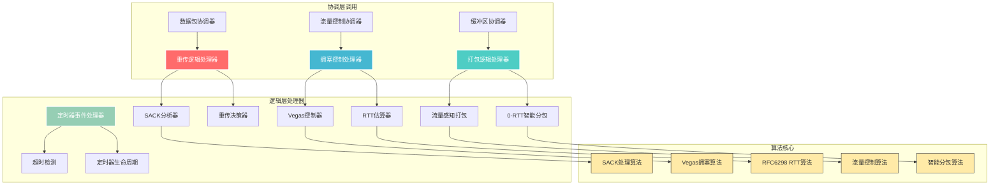

# 逻辑层 (`logic`) - 可靠性系统的智能决策引擎

## 概述

`logic`层是可靠性模块的智能决策引擎，专门负责具体的业务逻辑处理和算法实现。它将复杂的协议逻辑从数据管理和系统协调中分离出来，提供高度专业化、可测试、可扩展的业务处理能力。

**核心使命:**
- **算法实现**: 实现协议核心算法，如重传决策、拥塞控制、RTT估算等。
- **策略决策**: 根据网络状态和系统参数，做出智能的协议决策。
- **逻辑封装**: 将复杂的业务逻辑封装为独立、可复用的处理器。
- **性能优化**: 通过算法优化和智能策略，最大化协议性能。

**架构实现:**
- **拥塞控制**: `src/core/reliability/logic/congestion/` - Vegas算法和RTT估算的专业实现。
- **重传逻辑**: `src/core/reliability/logic/retransmission/` - SACK处理和重传决策算法。
- **定时器处理**: `src/core/reliability/logic/timer_event_handler.rs` - 定时器事件的专业处理逻辑。
- **打包处理**: `src/core/reliability/logic/packetization_processor.rs` - 数据打包和流量控制集成。

## 设计原则

`logic`层的设计遵循算法设计和软件工程的最佳实践：

### 1. 单一职责原则
- **专业化处理**: 每个处理器专注于特定的业务逻辑领域，确保专业性和深度。
- **功能内聚**: 相关的算法和逻辑被组织在同一个处理器中，提高内聚性。
- **接口简洁**: 对外提供简洁明确的接口，隐藏内部复杂性。

### 2. 算法可扩展性
- **策略模式**: 使用trait和泛型支持多种算法实现（如不同的拥塞控制算法）。
- **参数化设计**: 关键算法参数可配置，支持不同场景的优化。
- **插件化架构**: 新的算法可以通过实现trait轻松集成到系统中。

### 3. 性能导向设计
- **算法优化**: 针对网络协议的特点优化算法复杂度和实现效率。
- **状态机优化**: 使用高效的状态机实现，减少分支预测失败。
- **数值计算优化**: 优化RTT计算、拥塞窗口更新等数值算法。

## 整体架构

`logic`层由四个核心处理器域构成，分别负责不同的业务逻辑。



**架构解读:**
1. **处理器分层**: 四个主要处理器领域分别处理重传、打包、拥塞控制和定时器逻辑。
2. **算法封装**: 每个处理器内部封装了专业的算法实现，对外提供统一接口。
3. **标准化实现**: 关键算法遵循RFC标准实现，确保协议兼容性。
4. **智能优化**: 在标准基础上增加智能优化，提升性能和适应性。

## 核心组件解析

### 拥塞控制处理器 (`congestion/`)

拥塞控制是网络协议性能的关键，Vegas控制器提供先进的拥塞控制算法。

```rust
// In src/core/reliability/logic/congestion/vegas_controller.rs
impl VegasController {
    /// 处理ACK，更新拥塞窗口
    pub fn on_ack(&mut self, rtt: Duration, _timestamp: Instant) -> CongestionDecision {
        // 1. 更新RTT统计
        if rtt < self.min_rtt {
            self.min_rtt = rtt;
        }
        self.last_rtt = rtt;
        
        // 2. Vegas算法核心：计算预期和实际发送速率差异
        let expected_rate = self.congestion_window as f64 / self.min_rtt.as_secs_f64();
        let actual_rate = self.congestion_window as f64 / rtt.as_secs_f64();
        let diff = (expected_rate - actual_rate) * self.min_rtt.as_secs_f64();
        
        // 3. 根据差异调整拥塞窗口
        let new_window = match self.state {
            CongestionState::SlowStart => {
                if diff > self.config.vegas.gamma {
                    // 退出慢启动
                    self.state = CongestionState::CongestionAvoidance;
                    self.slow_start_threshold = self.congestion_window;
                    self.congestion_window
                } else {
                    // 继续慢启动
                    self.congestion_window + 1
                }
            },
            CongestionState::CongestionAvoidance => {
                if diff < self.config.vegas.alpha {
                    // 网络空闲，增加窗口
                    self.congestion_window + 1
                } else if diff > self.config.vegas.beta {
                    // 网络拥塞，减少窗口
                    self.congestion_window.saturating_sub(1).max(1)
                } else {
                    // 网络状态良好，保持窗口
                    self.congestion_window
                }
            },
        };
        
        CongestionDecision {
            new_congestion_window: new_window,
            new_state: self.state,
            should_send_immediately: new_window > self.congestion_window,
        }
    }
}
```

**关键特性**:
- **Vegas算法**: 实现基于RTT的拥塞检测，避免传统算法的丢包依赖。
- **状态管理**: 精确管理慢启动和拥塞避免状态的转换。
- **性能优化**: 通过浮点运算优化和状态缓存提高计算效率。

### RTT估算器 (`congestion/rtt.rs`)

RTT估算器实现RFC 6298标准的RTT测量和RTO计算算法。

```rust
// In src/core/reliability/logic/congestion/rtt.rs
impl RttEstimator {
    /// 更新RTT样本，使用RFC 6298算法
    pub fn update(&mut self, rtt_sample: Duration, min_rto: Duration) {
        let rtt_ms = rtt_sample.as_millis() as f64;
        
        if self.srtt.is_none() {
            // 首次测量
            self.srtt = Some(rtt_ms);
            self.rttvar = Some(rtt_ms / 2.0);
        } else {
            // 后续测量，使用RFC 6298公式
            let srtt = self.srtt.unwrap();
            let rttvar = self.rttvar.unwrap();
            
            // RTTVAR = (1 - beta) * RTTVAR + beta * |SRTT - R'|
            let new_rttvar = (1.0 - self.beta) * rttvar + 
                           self.beta * (srtt - rtt_ms).abs();
            
            // SRTT = (1 - alpha) * SRTT + alpha * R'
            let new_srtt = (1.0 - self.alpha) * srtt + 
                          self.alpha * rtt_ms;
            
            self.srtt = Some(new_srtt);
            self.rttvar = Some(new_rttvar);
        }
        
        // 计算RTO = SRTT + max(G, K * RTTVAR)
        self.update_rto(min_rto);
    }
    
    /// RTO退避，发生超时时调用
    pub fn backoff(&mut self) {
        self.rto = self.rto * 2;
        self.rto = self.rto.min(Duration::from_secs(60)); // 最大60秒
    }
}
```

**关键特性**:
- **RFC标准实现**: 严格按照RFC 6298实现RTT测量和RTO计算。
- **自适应调整**: 根据网络抖动自动调整RTO值。
- **退避策略**: 实现指数退避，处理持续丢包场景。

### 重传逻辑处理器 (`retransmission/`)

重传逻辑处理器集成SACK分析和重传决策，提供智能的数据包恢复机制。

```rust
// In src/core/reliability/logic/retransmission/sack_processor.rs
impl SackProcessor {
    /// 处理SACK信息，分析数据包接收状态
    pub fn process_sack(
        &mut self,
        recv_next_seq: u32,
        sack_ranges: &[SackRange],
        in_flight_store: &InFlightPacketStore,
    ) -> SackProcessResult {
        let mut result = SackProcessResult::new();
        
        // 1. 处理累积确认
        result.newly_acked.extend(
            in_flight_store.get_sequences_before(recv_next_seq)
        );
        
        // 2. 处理选择性确认
        for range in sack_ranges {
            result.newly_acked.extend(
                in_flight_store.get_sequences_in_range(range.start, range.end)
            );
        }
        
        // 3. 检测丢包（使用快速重传阈值）
        let lost_packets = self.detect_lost_packets(
            recv_next_seq,
            sack_ranges,
            in_flight_store,
        );
        
        // 4. 标记需要快速重传的数据包
        for seq in lost_packets {
            if let Some(packet) = in_flight_store.get_packet(seq) {
                if packet.retx_count < self.max_retries {
                    result.fast_retx_candidates.push(seq);
                } else {
                    result.dropped_packets.push(seq);
                }
            }
        }
        
        result
    }
}
```

**关键特性**:
- **智能丢包检测**: 基于SACK信息和快速重传阈值检测丢包。
- **RTT采样**: 从ACK中提取RTT样本，支持精确的RTT估算。
- **重传策略**: 区分快速重传和超时重传，优化恢复性能。

### 打包逻辑处理器 (`packetization_processor.rs`)

打包处理器将缓冲区数据智能转换为网络帧，集成流量控制和MTU管理。

```rust
// In src/core/reliability/logic/packetization_processor.rs
impl PacketizationProcessor {
    /// 流量控制感知的打包
    pub fn packetize_with_flow_control(
        &mut self,
        send_buffer: &mut SendBufferStore,
        context: &PacketizationContext,
        sequence_counter: &mut u32,
        max_sendable_bytes: usize,
        prepend_frame: Option<Frame>,
    ) -> PacketizationResult {
        let mut frames = Vec::new();
        let mut bytes_consumed = 0;
        
        // 1. 添加前置帧（如ACK）
        if let Some(frame) = prepend_frame {
            frames.push(frame);
        }
        
        // 2. 检查流量控制限制
        let effective_window = self.calculate_effective_window(
            context.congestion_window,
            context.peer_recv_window,
            context.in_flight_count,
        );
        
        if effective_window == 0 {
            return PacketizationResult {
                frames,
                consumed_bytes: bytes_consumed,
                limitation: PacketizationLimitation::WindowLimited,
            };
        }
        
        // 3. 基于MTU的智能分包
        let max_frame_payload = context.max_payload_size;
        let available_bytes = max_sendable_bytes.min(effective_window as usize);
        
        while bytes_consumed < available_bytes {
            let remaining = available_bytes - bytes_consumed;
            let chunk_size = remaining.min(max_frame_payload);
            
            if let Some(data) = send_buffer.peek_data(chunk_size) {
                *sequence_counter += 1;
                
                let frame = Frame::Push {
                    header: ShortHeader {
                        dest_cid: context.peer_cid,
                        sequence_number: *sequence_counter,
                        timestamp: context.timestamp,
                    },
                    payload: data.clone(),
                };
                
                frames.push(frame);
                send_buffer.consume_data(data.len());
                bytes_consumed += data.len();
                
                if data.len() < chunk_size {
                    // 没有更多数据
                    break;
                }
            } else {
                break;
            }
        }
        
        PacketizationResult {
            frames,
            consumed_bytes: bytes_consumed,
            limitation: if bytes_consumed == 0 {
                PacketizationLimitation::NoData
            } else {
                PacketizationLimitation::None
            },
        }
    }
}
```

**关键特性**:
- **流量感知**: 综合考虑拥塞窗口和接收窗口限制。
- **智能分包**: 基于MTU和流量控制进行最优分包。
- **零拷贝优化**: 使用引用和切片避免不必要的数据拷贝。

## 算法特性对比

| 处理器 | 主要算法 | 时间复杂度 | 空间复杂度 | 特色优化 |
|--------|----------|-----------|-----------|----------|
| Vegas控制器 | Vegas拥塞控制 | O(1) | O(1) | 基于RTT的智能检测 |
| RTT估算器 | RFC 6298 | O(1) | O(1) | 自适应退避策略 |
| SACK处理器 | 快速重传检测 | O(n log n) | O(n) | 批量状态更新 |
| 打包处理器 | 流量感知分包 | O(k) | O(k) | 零拷贝优化 |

## 与其他层的交互

- **与`coordination`层的交互**:
    - **算法调用**: 协调器调用逻辑层的算法执行具体的决策计算。
    - **参数传递**: 接收协调器传递的上下文信息和配置参数。
    - **结果返回**: 将算法结果以结构化数据返回给协调器。

- **独立性保证**:
    - **无状态设计**: 大部分处理器是无状态的，便于测试和并发使用。
    - **纯函数实现**: 关键算法实现为纯函数，提高可预测性和可测试性。
    - **模块化设计**: 各处理器间相互独立，支持独立的测试和优化。

`logic`层通过其专业化的算法实现和智能决策机制，为整个可靠性系统提供了强大的"智能大脑"，确保协议在各种网络环境下都能表现出最优的性能和可靠性。
