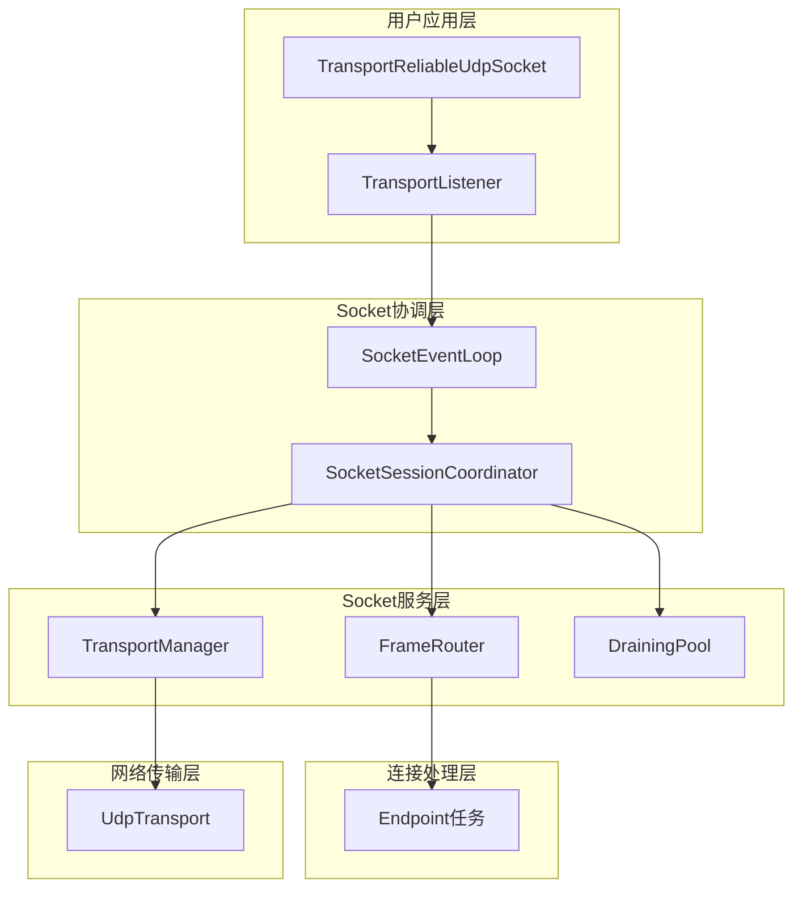

# Socket层架构设计

## 概述

Socket层是可靠UDP协议栈的连接管理核心，承担着从底层网络传输到上层应用接口的关键桥梁作用。它通过精心设计的Actor模式架构，实现了高并发、高可靠的连接生命周期管理，是整个协议栈的控制中枢。

**核心使命:**
- 连接生命周期的完整管理
- 智能帧路由和分发
- 用户API的统一抽象
- 连接迁移和故障恢复
- 多连接并发协调

**架构实现:**
- **Socket核心**: `src/socket.rs` - 公共接口和模块组织
- **命令系统**: `src/socket/command.rs` - Actor命令协议定义
- **用户接口**: `src/socket/handle.rs` - 面向用户的API封装
- **事件中枢**: `src/socket/event_loop.rs` - 核心事件循环处理器
- **会话协调**: `src/socket/event_loop/session_coordinator.rs` - 跨层协调的控制中心
- **智能路由**: `src/socket/event_loop/routing.rs` - 帧路由和连接映射管理  
- **状态管理**: `src/socket/event_loop/draining.rs` - 连接ID排水状态管理

## 设计原则

Socket层架构遵循四项核心设计原则，确保在复杂网络环境和高并发场景下的可靠运行：

### 1. 统一Actor模式  
- **单一控制点**: 通过`SocketEventLoop`统一处理所有事件，避免状态竞争
- **消息驱动协调**: 组件间通过结构化命令和消息进行交互，保证操作原子性
- **状态封装隔离**: 每个组件拥有独立的状态管理，避免全局状态共享

### 2. 智能分层协调
- **职责明确分离**: 每个组件专注于特定领域，避免功能重叠
- **协调器模式**: `SocketSessionCoordinator`作为中央协调器统一管理各层交互
- **接口标准化**: 组件间通过明确定义的接口进行通信

### 3. 弹性连接管理
- **全生命周期跟踪**: 从连接建立到清理的完整状态管理
- **智能故障恢复**: 单个连接失败不影响其他连接的正常运行
- **连接迁移支持**: 原生支持运行时地址变更和路径切换

### 4. 高性能并发处理
- **异步事件处理**: 所有I/O操作完全异步，最大化并发能力
- **智能帧路由**: 基于CID和地址的双重路由机制，支持连接迁移
- **资源高效利用**: 通过排水池机制避免资源冲突和泄漏

## 整体架构

Socket层采用以协调器为中心的分层架构，实现各组件间的有序协作：



**架构层次说明:**
- **Socket协调层**: 统一事件处理和组件协调
- **Socket服务层**: 专业化的功能服务组件
- **连接处理层**: 独立的连接端点任务
- **网络传输层**: 底层网络传输抽象

## 核心组件架构

Socket层采用精密的组件协调架构，每个组件专注于特定功能领域，通过统一的协调机制实现高效协作。

### SocketEventLoop - 事件处理中枢

`SocketEventLoop`是Socket层的控制核心，实现了统一的事件驱动架构：

```rust
pub(crate) struct SocketEventLoop<T: BindableTransport> {
    /// 会话协调器 - 所有操作的统一协调中心
    session_coordinator: SocketSessionCoordinator<T>,
    /// 来自用户API的命令通道
    command_rx: mpsc::Receiver<SocketActorCommand>,
}
```

**核心事件循环:**
```rust
pub(crate) async fn run(&mut self) {
    let mut cleanup_interval = tokio::time::interval(Duration::from_secs(2));
    
    loop {
        let transport = self.session_coordinator.transport_manager().transport();
        
        tokio::select! {
            // 处理用户API命令
            Some(command) = self.command_rx.recv() => {
                self.handle_actor_command(command).await;
            }
            // 处理传输层接收的帧
            Ok(datagram) = transport.recv_frames() => {
                match &datagram.frames[0] {
                    Frame::Syn { .. } => {
                        self.session_coordinator
                            .handle_new_connection(datagram.frames, datagram.remote_addr)
                            .await;
                    }
                    _ => {
                        for frame in datagram.frames {
                            self.session_coordinator
                                .dispatch_frame(frame, datagram.remote_addr)
                                .await;
                        }
                    }
                }
            }
            // 定期清理排水池
            _ = cleanup_interval.tick() => {
                self.session_coordinator.frame_router_mut().cleanup_draining_pool();
            }
        }
    }
}
```

**事件处理特性:**
- **统一入口**: 所有事件都通过单一循环处理，避免并发冲突
- **优先级调度**: 用户命令、网络事件和定期维护的合理调度
- **错误隔离**: 单个事件处理失败不影响整体循环

### SocketSessionCoordinator - 跨层协调中心

`SocketSessionCoordinator`是Socket层的大脑，负责协调所有子系统的协作：

```rust
pub(crate) struct SocketSessionCoordinator<T: BindableTransport> {
    /// 传输管理器 - 与底层传输层的接口
    transport_manager: TransportManager<T>,
    /// 帧路由器 - 智能路由和连接映射
    frame_router: FrameRouter,
    /// 配置中心 - 全局配置管理
    config: Arc<Config>,
    /// 用户连接通道 - 向用户层发送新连接
    accept_tx: mpsc::Sender<(Stream, SocketAddr)>,
    /// 命令回调通道 - 向上层发送命令
    command_tx: mpsc::Sender<SocketActorCommand>,
}
```

**协调职责:**
- **连接生命周期管理**: 从建立到清理的完整流程控制
- **组件间协调**: 统一管理各子系统的交互和数据流
- **资源分配**: 连接ID生成、冲突检测和资源分配
- **错误恢复**: 故障检测和系统自愈

## 智能路由与连接管理

Socket层的核心优势在于其智能路由机制和完善的连接生命周期管理，支持复杂网络环境下的稳定连接。

### FrameRouter - 智能帧路由引擎

`FrameRouter`实现了协议栈中最智能的帧路由算法，支持连接迁移和地址变更：

```rust
pub(crate) struct FrameRouter {
    /// 活跃连接映射：本地CID -> 连接元数据
    active_connections: HashMap<u32, ConnectionMeta>,
    /// 地址路由表：远程地址 -> 本地CID（握手阶段使用）
    address_routing: HashMap<SocketAddr, u32>,
    /// 排水连接池：防止CID复用冲突
    draining_pool: DrainingPool,
}
```

**三层路由策略:**

1. **CID优先路由（连接迁移支持）**
```rust
if cid != 0 {
    if let Some(meta) = self.active_connections.get(&cid) {
        // 直接路由到目标连接，支持连接迁移
        if meta.sender.send((frame, remote_addr)).await.is_ok() {
            return RoutingResult::Dispatched;
        }
    }
}
```

2. **地址回退路由（握手阶段）**
```rust
if let Some(&existing_cid) = self.address_routing.get(&remote_addr) {
    if let Some(meta) = self.active_connections.get(&existing_cid) {
        // 握手期间通过地址路由
        if meta.sender.send((frame, remote_addr)).await.is_ok() {
            return RoutingResult::Dispatched;
        }
    }
}
```

3. **排水状态检查（防冲突）**
```rust
if self.draining_pool.contains(&cid) {
    // 连接已关闭，忽略延迟数据包
    return RoutingResult::ConnectionDraining;
}
```

**连接迁移机制:**
```rust
pub(crate) fn update_connection_address(&mut self, cid: u32, new_addr: SocketAddr) {
    // 原子地更新地址映射，支持NAT穿透
    self.address_routing.retain(|_, &mut existing_cid| existing_cid != cid);
    self.address_routing.insert(new_addr, cid);
}
```

### DrainingPool - 连接状态管理

`DrainingPool`实现了类似TCP TIME_WAIT的机制，防止连接ID复用冲突：

```rust
pub(crate) struct DrainingPool {
    /// 排水中的CID和开始时间
    cids: HashMap<u32, Instant>,
    /// 排水持续时间（默认2倍RTO）
    timeout: Duration,
}
```

**排水池优势:**
- **防止ID冲突**: 已关闭连接的ID在冷却期内不能复用
- **延迟包处理**: 优雅处理网络中的延迟数据包
- **自动清理**: 定期清理过期的连接ID

### 连接生命周期管理

Socket层实现了完整的连接生命周期管理，从建立到清理的全过程控制：

#### 1. 服务端连接建立流程

```rust
pub(crate) async fn handle_new_connection(
    &mut self,
    mut frames: Vec<Frame>,
    remote_addr: SocketAddr,
) {
    // 第一步：验证SYN帧和协议版本
    let Frame::Syn { header } = frames.remove(0) else { return; };
    if !self.validate_protocol_version(header.protocol_version, remote_addr) {
        return;
    }

    // 第二步：生成唯一连接ID，避免冲突
    let local_cid = self.generate_unique_connection_id();
    let peer_cid = header.source_cid;

    // 第三步：创建服务端点和流
    let (mut endpoint, tx_to_endpoint, stream) = 
        self.create_server_endpoint(local_cid, peer_cid, remote_addr);

    // 第四步：处理0-RTT数据（如果有）
    if !frames.is_empty() {
        self.handle_zero_rtt_frames(frames, &tx_to_endpoint, remote_addr).await;
    }

    // 第五步：启动端点任务
    tokio::spawn(async move { endpoint.run().await });

    // 第六步：注册到路由器
    self.register_connection_to_router(local_cid, remote_addr, tx_to_endpoint);

    // 第七步：发送给用户应用
    self.send_connection_to_user(stream, remote_addr, local_cid).await;
}
```

#### 2. 客户端连接建立流程

```rust
pub(crate) async fn create_client_connection(
    &mut self,
    remote_addr: SocketAddr,
    config: Config,
    initial_data: Option<bytes::Bytes>,
) -> Result<Stream> {
    // 生成客户端连接ID
    let local_cid = self.generate_unique_connection_id();

    // 创建客户端点和通道
    let (mut endpoint, tx_to_stream_handle, rx_from_stream_handle) = 
        Endpoint::new_client(config, remote_addr, local_cid, /* ... */);

    // 异步启动端点任务
    tokio::spawn(async move { endpoint.run().await });

    // 注册连接路由
    self.register_connection_to_router(local_cid, remote_addr, tx_to_endpoint);

    Ok(Stream::new(tx_to_stream_handle, rx_from_stream_handle))
}
```

#### 3. 连接清理与资源回收

```rust
pub(crate) fn remove_connection_by_cid(&mut self, cid: u32) {
    // 移除活跃连接
    if self.active_connections.remove(&cid).is_some() {
        // 清理地址映射
        self.address_routing.retain(|_, &mut mapped_cid| mapped_cid != cid);
        
        // 移入排水池，防止ID立即复用
        self.draining_pool.insert(cid);
    }
}
```

**连接管理特性:**
- **唯一ID生成**: 避免与活跃连接和排水池中的连接冲突
- **0-RTT数据支持**: 连接建立期间就能处理应用数据
- **异步端点执行**: 每个连接在独立任务中运行
- **优雅清理**: 连接关闭后进入排水状态，避免资源冲突

## 用户接口设计

Socket层为用户提供简洁而强大的API，隐藏底层复杂性，呈现直观的连接管理接口。

### TransportReliableUdpSocket - 主套接字接口

主套接字提供用户面向的连接管理功能，是协议栈的用户入口：

```rust
pub struct TransportReliableUdpSocket<T: BindableTransport> {
    /// 向Socket Actor发送命令的通道
    command_tx: mpsc::Sender<SocketActorCommand>,
    _marker: PhantomData<T>,
}
```

**核心API设计:**

#### 1. 套接字绑定与启动
```rust
pub async fn bind(addr: SocketAddr) -> Result<(Self, TransportListener)> {
    // 创建传输实例
    let transport = Arc::new(T::bind(addr).await?);
    
    // 构建通道系统
    let (command_tx, command_rx) = mpsc::channel(128);
    let (send_tx, send_rx) = mpsc::channel(1024);
    let (accept_tx, accept_rx) = mpsc::channel(128);
    
    // 组装核心组件
    let transport_manager = TransportManager::new(transport, send_tx);
    let frame_router = FrameRouter::new(DrainingPool::new(config.connection.drain_timeout));
    let session_coordinator = SocketSessionCoordinator::new(
        transport_manager, frame_router, config, accept_tx, command_tx.clone()
    );
    
    // 启动事件循环
    tokio::spawn(async move {
        SocketEventLoop { session_coordinator, command_rx }.run().await
    });
    
    Ok((handle, TransportListener { accept_rx }))
}
```

#### 2. 客户端连接建立
```rust
pub async fn connect(&self, remote_addr: SocketAddr) -> Result<Stream> {
    self.connect_with_config(remote_addr, Config::default(), None).await
}

pub async fn connect_with_config(
    &self,
    remote_addr: SocketAddr,
    config: Config,
    initial_data: Option<InitialData>,
) -> Result<Stream> {
    let (response_tx, response_rx) = oneshot::channel();
    
    self.command_tx.send(SocketActorCommand::Connect {
        remote_addr,
        config,
        initial_data: initial_data.map(|d| d.into_bytes()),
        response_tx,
    }).await.map_err(|_| Error::ChannelClosed)?;
    
    response_rx.await.map_err(|_| Error::ChannelClosed)?
}
```

#### 3. 动态重绑定
```rust
pub async fn rebind(&self, new_local_addr: SocketAddr) -> Result<()> {
    let (response_tx, response_rx) = oneshot::channel();
    
    self.command_tx.send(SocketActorCommand::Rebind {
        new_local_addr,
        response_tx,
    }).await.map_err(|_| Error::ChannelClosed)?;
    
    response_rx.await.map_err(|_| Error::ChannelClosed)?
}
```

### TransportListener - 服务器监听接口

监听器提供服务器端的连接接受功能，实现简洁的accept模式：

```rust
pub struct TransportListener {
    /// 从Socket层接收新连接的通道
    accept_rx: mpsc::Receiver<(Stream, SocketAddr)>,
}

impl TransportListener {
    /// 等待并接受新的传入连接
    pub async fn accept(&mut self) -> Result<(Stream, SocketAddr)> {
        self.accept_rx
            .recv()
            .await
            .ok_or(Error::ChannelClosed)
    }
}
```

### 命令协议设计

Socket层使用结构化的命令协议，确保操作的原子性和类型安全：

```rust
#[derive(Debug)]
pub enum SocketActorCommand {
    /// 建立新连接
    Connect {
        remote_addr: SocketAddr,
        config: Config,
        initial_data: Option<bytes::Bytes>,
        response_tx: oneshot::Sender<Result<Stream>>,
    },
    /// 重绑定本地地址
    Rebind {
        new_local_addr: SocketAddr,
        response_tx: oneshot::Sender<Result<()>>,
    },
    /// 更新连接地址映射（内部命令）
    UpdateAddr { cid: u32, new_addr: SocketAddr },
    /// 移除连接（内部命令）
    RemoveConnection { cid: u32 },
}
```

## 架构优势与特性

### 高性能特性

#### 1. 异步优先架构
- **完全非阻塞**: 所有I/O和状态操作都是异步的
- **事件驱动**: 单一事件循环处理所有事件，避免上下文切换开销
- **零拷贝路径**: 帧数据在组件间直接传递，最小化内存拷贝

#### 2. 智能并发管理
- **连接隔离**: 每个连接在独立任务中运行，故障不传播
- **背压控制**: 有界通道防止内存无限增长
- **批量处理**: 支持帧的批量接收和处理

### 可靠性保障

#### 1. 错误隔离与恢复
- **组件独立**: 单个组件失败不影响系统整体运行
- **优雅降级**: 连接错误时自动清理资源，不影响其他连接
- **状态一致性**: 通过统一的协调器保证状态更新的一致性

#### 2. 资源管理
- **自动清理**: 连接结束后自动回收相关资源
- **排水机制**: 防止连接ID过早复用导致的冲突
- **内存控制**: 有界缓冲区防止内存泄漏

### 灵活性与扩展性

#### 1. 模块化设计
- **职责分离**: 每个组件专注于特定功能领域
- **接口标准化**: 通过trait支持不同传输实现
- **配置驱动**: 支持灵活的运行时配置

#### 2. 连接迁移支持
- **透明迁移**: 应用层无感知的连接地址变更
- **多路径支持**: 同时支持基于CID和地址的路由
- **NAT穿透**: 天然支持NAT环境下的连接维持

## 使用指南

### 服务器应用开发

```rust
use protocol::socket::TransportReliableUdpSocket;
use protocol::socket::transport::UdpTransport;

#[tokio::main]
async fn main() -> Result<(), Box<dyn std::error::Error>> {
    // 绑定服务器套接字
    let (socket, mut listener) = TransportReliableUdpSocket::<UdpTransport>::bind(
        "127.0.0.1:8080".parse()?
    ).await?;
    
    println!("服务器启动在 127.0.0.1:8080");
    
    // 接受并处理连接
    while let Ok((stream, remote_addr)) = listener.accept().await {
        println!("接受来自 {} 的连接", remote_addr);
        
        // 为每个连接启动独立的处理任务
        tokio::spawn(async move {
            handle_client(stream).await;
        });
    }
    
    Ok(())
}

async fn handle_client(mut stream: Stream) {
    let mut buffer = [0u8; 1024];
    
    loop {
        match stream.read(&mut buffer).await {
            Ok(0) => break, // 连接关闭
            Ok(n) => {
                // 回显数据
                if stream.write_all(&buffer[..n]).await.is_err() {
                    break;
                }
            }
            Err(_) => break,
        }
    }
}
```

### 客户端应用开发

```rust
#[tokio::main]
async fn main() -> Result<(), Box<dyn std::error::Error>> {
    // 创建客户端套接字
    let (socket, _) = TransportReliableUdpSocket::<UdpTransport>::bind(
        "127.0.0.1:0".parse()?
    ).await?;
    
    // 连接到服务器
    let mut stream = socket.connect("127.0.0.1:8080".parse()?).await?;
    
    // 发送数据
    stream.write_all(b"Hello, Reliable UDP!").await?;
    
    // 接收响应
    let mut buffer = [0u8; 1024];
    let n = stream.read(&mut buffer).await?;
    
    println!("服务器响应: {}", String::from_utf8_lossy(&buffer[..n]));
    
    Ok(())
}
```

### 高级功能使用

#### 1. 0-RTT连接建立
```rust
use protocol::socket::handle::initial_data::InitialData;

// 在连接建立时发送初始数据
let initial_data = InitialData::new(b"快速握手数据".to_vec());
let stream = socket.connect_with_config(
    "127.0.0.1:8080".parse()?,
    Config::default(),
    Some(initial_data)
).await?;
```

#### 2. 动态地址重绑定
```rust
// 运行时更换本地地址（支持连接迁移）
socket.rebind("192.168.1.100:9090".parse()?).await?;
```

#### 3. 自定义配置
```rust
let mut config = Config::default();
config.reliability.max_retransmissions = 10;
config.congestion.initial_window_size = 64;

let stream = socket.connect_with_config(
    remote_addr,
    config,
    None
).await?;
```

Socket层的设计充分体现了现代网络协议栈的设计理念，通过精心的架构设计实现了高性能、高可靠性和易用性的完美平衡，为构建复杂网络应用提供了强大的基础设施。 