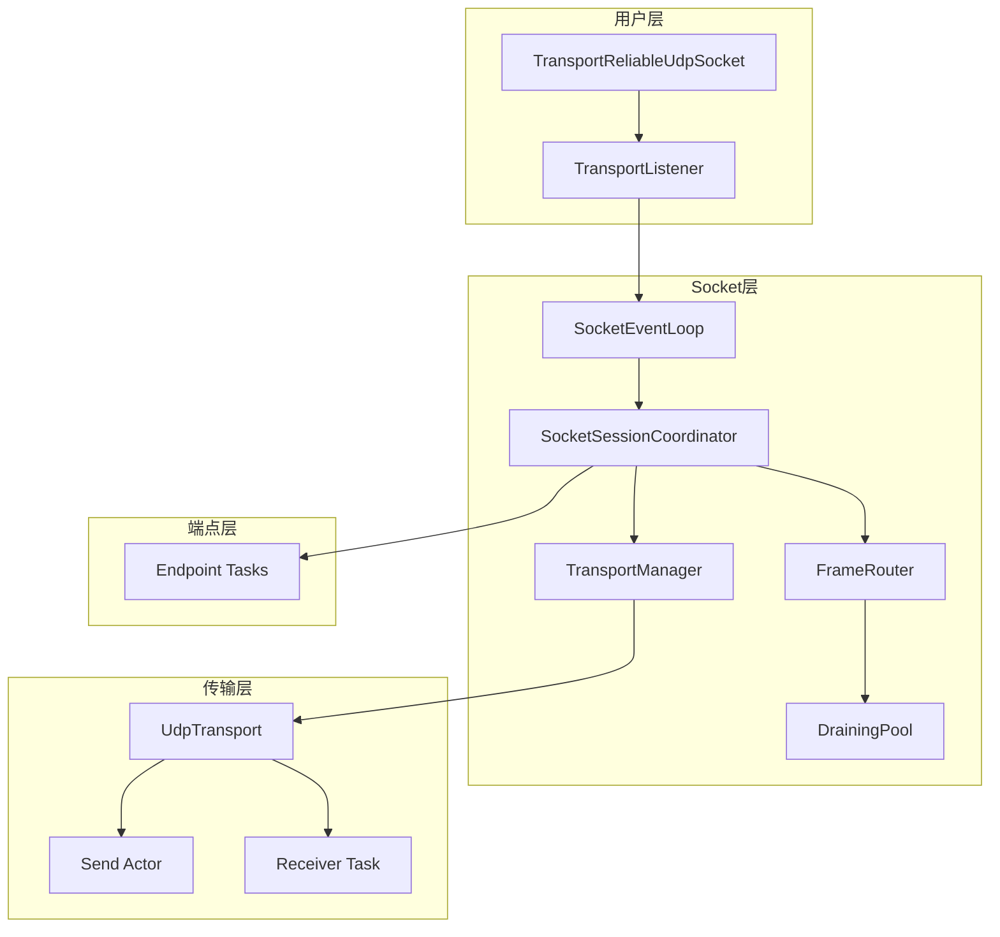

# Socket层架构设计

**功能描述:**

Socket层是协议栈的核心管理层，位于传输层之上，负责协调和管理所有网络连接的生命周期。它采用Actor模式设计，通过 `SocketEventLoop` 统一处理用户API调用、网络事件和连接管理。Socket层的主要职责包括连接建立、帧路由分发、会话协调和连接迁移支持。该层与传输层紧密协作，将底层的网络传输能力抽象为高层的连接管理服务。

**实现位置:**

- **Socket层主模块**: `src/socket.rs` - Socket层的公共接口和模块组织
- **Socket命令**: `src/socket/command.rs` - Socket Actor的命令定义
- **Socket句柄**: `src/socket/handle.rs` - 用户面向的API接口
- **事件循环**: `src/socket/event_loop.rs` - Socket Actor的主事件循环
- **会话协调器**: `src/socket/event_loop/session_coordinator.rs` - 统一协调各层交互
- **帧路由**: `src/socket/event_loop/routing.rs` - 智能帧路由和连接映射管理
- **排水池**: `src/socket/event_loop/draining.rs` - 连接ID的排水状态管理

## 1. Socket层架构概览

Socket层采用分层协调架构，将复杂的连接管理逻辑分解为多个专门化的组件：



### 1.1 核心设计原则

**1. Actor模式架构**
- 单一事件循环处理所有网络和用户事件
- 通过消息传递实现无锁并发
- 状态隔离，避免竞态条件

**2. 分层协调设计**
- 会话协调器统一管理各组件交互
- 帧路由器负责智能路由决策
- 传输管理器封装底层传输操作

**3. 连接生命周期管理**
- 完整的连接建立、维护和清理流程
- 支持连接迁移和地址更新
- 排水池防止CID冲突

## 2. Socket层与传输层的关系

### 2.1 层次关系

Socket层位于传输层之上，两者通过明确的接口进行交互：

```rust
// Socket层通过TransportManager与传输层交互
pub(crate) struct SocketSessionCoordinator<T: BindableTransport> {
    /// 传输管理器 - 封装传输层操作
    transport_manager: TransportManager<T>,
    // ... 其他组件
}
```

**Socket层的职责**:
- 连接生命周期管理
- 帧路由和分发
- 用户API接口
- 会话协调

**传输层的职责**:
- 底层网络I/O
- 帧序列化/反序列化
- 批量发送优化
- 地址重绑定

### 2.2 交互模式

**1. 向下调用传输层**
```rust
// Socket层调用传输层发送帧
async fn send_frames_to_transport(&self, batch: FrameBatch) -> Result<()> {
    self.transport_manager.send_tx()
        .send(TransportCommand::Send(batch))
        .await?;
    Ok(())
}

// Socket层从传输层接收数据报
async fn receive_from_transport(&self) -> Result<ReceivedDatagram> {
    let transport = self.transport_manager.transport();
    transport.recv_frames().await
}
```

**2. 传输层向上通知**
```rust
// 传输层通过事件循环向上传递接收到的帧
Ok(datagram) = transport.recv_frames() => {
    if let Frame::Syn { .. } = &datagram.frames[0] {
        // 处理新连接请求
        self.session_coordinator.handle_new_connection(datagram.frames, datagram.remote_addr).await;
    } else {
        // 分发到现有连接
        for frame in datagram.frames {
            self.session_coordinator.dispatch_frame(frame, datagram.remote_addr).await;
        }
    }
}
```

## 3. Socket层核心组件

### 3.1 SocketEventLoop - 主事件循环

`SocketEventLoop` 是Socket层的核心，负责处理所有事件：

```rust
// 位于 src/socket/event_loop.rs
pub(crate) struct SocketEventLoop<T: BindableTransport> {
    /// Socket会话协调器 - 统一协调各层交互的中央控制器
    session_coordinator: SocketSessionCoordinator<T>,
    /// 命令接收通道
    command_rx: mpsc::Receiver<SocketActorCommand>,
}

impl<T: BindableTransport> SocketEventLoop<T> {
    pub(crate) async fn run(&mut self) {
        let mut cleanup_interval = 
            tokio::time::interval(std::time::Duration::from_secs(2));

        loop {
            let transport = self.session_coordinator.transport_manager().transport();
            
            tokio::select! {
                // 1. 处理用户API命令
                Some(command) = self.command_rx.recv() => {
                    if self.handle_actor_command(command).await.is_err() {
                        break;
                    }
                }
                // 2. 处理来自传输层的帧
                Ok(datagram) = transport.recv_frames() => {
                    if !datagram.frames.is_empty() {
                        if let Frame::Syn { .. } = &datagram.frames[0] {
                            self.session_coordinator.handle_new_connection(datagram.frames, datagram.remote_addr).await;
                        } else {
                            for frame in datagram.frames {
                                self.session_coordinator.dispatch_frame(frame, datagram.remote_addr).await;
                            }
                        }
                    }
                }
                // 3. 定期清理排水池
                _ = cleanup_interval.tick() => {
                    self.session_coordinator.frame_router_mut().cleanup_draining_pool();
                }
                else => break,
            }
        }
    }
}
```

**事件处理流程**:
1. **用户命令处理**: 连接建立、重绑定等API调用
2. **网络事件处理**: 接收和分发来自传输层的帧
3. **定期维护**: 清理过期的排水连接ID

### 3.2 SocketSessionCoordinator - 会话协调器

`SocketSessionCoordinator` 是Socket层的中央协调器，负责管理各组件间的交互：

```rust
// 位于 src/socket/event_loop/session_coordinator.rs
pub(crate) struct SocketSessionCoordinator<T: BindableTransport> {
    /// 传输管理器
    transport_manager: TransportManager<T>,
    /// 帧路由管理器  
    frame_router: FrameRouter,
    /// 配置信息
    config: Arc<Config>,
    /// 向用户层发送新连接的通道
    accept_tx: mpsc::Sender<(Stream, SocketAddr)>,
    /// 发送命令到上层的通道
    command_tx: mpsc::Sender<SocketActorCommand>,
}
```

**核心功能**:

**1. 新连接处理**
```rust
pub(crate) async fn handle_new_connection(
    &mut self,
    mut frames: Vec<Frame>,
    remote_addr: SocketAddr,
) {
    // 1. 提取SYN帧和0-RTT数据
    let syn_frame = frames.remove(0);
    let zero_rtt_frames = frames;

    // 2. 验证协议版本
    if !self.validate_protocol_version(syn_frame.version(), remote_addr) {
        return;
    }

    // 3. 生成唯一连接ID
    let local_cid = self.generate_unique_connection_id();
    let peer_cid = syn_frame.source_cid();

    // 4. 创建服务器端点
    let (endpoint, tx_to_endpoint, stream) = 
        self.create_server_endpoint(local_cid, peer_cid, remote_addr);

    // 5. 注册连接到路由器
    self.register_connection_to_router(local_cid, remote_addr, tx_to_endpoint);

    // 6. 处理0-RTT数据
    if !zero_rtt_frames.is_empty() {
        self.handle_zero_rtt_frames(zero_rtt_frames, &tx_to_endpoint, remote_addr).await;
    }

    // 7. 发送连接给用户
    self.send_connection_to_user(stream, remote_addr, local_cid).await;
}
```

**2. 客户端连接创建**
```rust
pub(crate) async fn create_client_connection(
    &mut self,
    remote_addr: SocketAddr,
    config: Config,
    initial_data: Option<bytes::Bytes>,
) -> Result<Stream> {
    // 1. 生成连接ID
    let local_cid = self.generate_unique_connection_id();
    let peer_cid = 0; // 服务器端将分配

    // 2. 创建客户端端点
    let (endpoint, tx_to_endpoint, stream) = 
        self.create_client_endpoint(local_cid, peer_cid, remote_addr, config);

    // 3. 注册连接到路由器
    self.register_connection_to_router(local_cid, remote_addr, tx_to_endpoint);

    // 4. 发送SYN帧（可能包含0-RTT数据）
    let syn_frame = Frame::new_syn(local_cid, peer_cid, initial_data);
    self.transport_manager.send_tx()
        .send(TransportCommand::Send(FrameBatch {
            remote_addr,
            frames: vec![syn_frame],
        }))
        .await?;

    Ok(stream)
}
```

### 3.3 FrameRouter - 帧路由器

`FrameRouter` 负责智能的帧路由和连接映射管理：

```rust
// 位于 src/socket/event_loop/routing.rs
pub(crate) struct FrameRouter {
    /// 活跃连接映射：本地CID -> 连接元数据
    active_connections: HashMap<u32, ConnectionMeta>,
    /// 地址路由表：远程地址 -> 本地CID (握手期间使用)
    address_routing: HashMap<SocketAddr, u32>,
    /// 正在排水的连接ID池
    draining_pool: DrainingPool,
}
```

**智能路由算法**:
```rust
pub(crate) async fn dispatch_frame(
    &mut self,
    frame: Frame,
    remote_addr: SocketAddr,
) -> RoutingResult {
    let cid = frame.destination_cid();

    // 1. 优先通过目标CID路由到已建立的连接（支持连接迁移）
    if cid != 0 {
        if let Some(meta) = self.active_connections.get(&cid) {
            if meta.sender.send((frame, remote_addr)).await.is_err() {
                self.remove_connection_by_cid(cid);
                return RoutingResult::ConnectionNotFound;
            }
            return RoutingResult::Dispatched;
        }
    }

    // 2. 通过远程地址路由到握手期间的连接
    if let Some(&cid) = self.address_routing.get(&remote_addr) {
        if let Some(meta) = self.active_connections.get(&cid) {
            if meta.sender.send((frame, remote_addr)).await.is_err() {
                self.remove_connection_by_cid(cid);
                return RoutingResult::ConnectionNotFound;
            }
            return RoutingResult::Dispatched;
        }
    }

    // 3. 检查是否在排水池中
    if self.draining_pool.contains(&cid) {
        return RoutingResult::ConnectionDraining;
    }

    RoutingResult::ConnectionNotFound
}
```

**连接迁移支持**:
```rust
pub(crate) fn update_connection_address(&mut self, cid: u32, new_addr: SocketAddr) {
    // 更新地址路由表，支持连接迁移
    if let Some(meta) = self.active_connections.get(&cid) {
        // 移除旧的地址映射
        self.address_routing.retain(|_, &mut existing_cid| existing_cid != cid);
        // 添加新的地址映射
        self.address_routing.insert(new_addr, cid);
    }
}
```

### 3.4 DrainingPool - 排水池

`DrainingPool` 管理处于排水状态的连接ID，防止CID冲突：

```rust
// 位于 src/socket/event_loop/draining.rs
pub(crate) struct DrainingPool {
    /// 排水中的CID及其开始时间
    cids: HashMap<u32, Instant>,
    /// 排水超时时间
    timeout: Duration,
}
```

**排水机制**:
```rust
impl DrainingPool {
    /// 添加CID到排水池
    pub(crate) fn insert(&mut self, cid: u32) {
        self.cids.insert(cid, Instant::now());
    }

    /// 清理过期的CID
    pub(crate) fn cleanup(&mut self) {
        let now = Instant::now();
        let timeout = self.timeout;

        self.cids
            .retain(|_cid, start_time| now.duration_since(*start_time) < timeout);
    }
}
```

## 4. 用户API接口

### 4.1 TransportReliableUdpSocket - 主要API

`TransportReliableUdpSocket` 提供用户面向的连接管理API：

```rust
// 位于 src/socket/handle.rs
pub struct TransportReliableUdpSocket<T: BindableTransport> {
    pub(crate) command_tx: mpsc::Sender<SocketActorCommand>,
    _marker: PhantomData<T>,
}

impl<T: BindableTransport> TransportReliableUdpSocket<T> {
    /// 绑定到指定地址并创建监听器
    pub async fn bind(addr: SocketAddr) -> Result<(Self, TransportListener)> {
        let transport = Arc::new(T::bind(addr).await?);
        
        // 创建各种通道
        let (command_tx, command_rx) = mpsc::channel(128);
        let (send_tx, send_rx) = mpsc::channel::<TransportCommand<T>>(1024);
        let (accept_tx, accept_rx) = mpsc::channel(128);

        // 创建组件
        let transport_manager = TransportManager::new(transport, send_tx);
        let frame_router = FrameRouter::new(DrainingPool::new(config.connection.drain_timeout));
        let session_coordinator = SocketSessionCoordinator::new(
            transport_manager, frame_router, config, accept_tx, command_tx.clone()
        );

        // 启动事件循环
        let mut actor = SocketEventLoop { session_coordinator, command_rx };
        tokio::spawn(async move { actor.run().await });

        Ok((handle, listener))
    }

    /// 建立到远程地址的连接
    pub async fn connect(&self, remote_addr: SocketAddr) -> Result<Stream> {
        self.connect_with_config(remote_addr, Config::default(), None).await
    }

    /// 重绑定到新地址
    pub async fn rebind(&self, new_local_addr: SocketAddr) -> Result<()> {
        let (response_tx, response_rx) = oneshot::channel();
        let cmd = SocketActorCommand::Rebind { new_local_addr, response_tx };
        self.command_tx.send(cmd).await.map_err(|_| Error::ChannelClosed)?;
        response_rx.await.map_err(|_| Error::ChannelClosed)?
    }
}
```

### 4.2 TransportListener - 监听器API

`TransportListener` 提供服务器端的连接接受功能：

```rust
// 位于 src/socket/handle.rs
pub struct TransportListener {
    pub(crate) accept_rx: mpsc::Receiver<(Stream, SocketAddr)>,
}

impl TransportListener {
    /// 等待新的传入连接
    pub async fn accept(&mut self) -> Result<(Stream, SocketAddr)> {
        self.accept_rx
            .recv()
            .await
            .ok_or(crate::error::Error::ChannelClosed)
    }
}
```

## 5. 与传输层的协作机制

### 5.1 数据流向

**发送路径**:
```
用户API -> SocketEventLoop -> SocketSessionCoordinator -> TransportManager -> Transport Layer
```

**接收路径**:
```
Transport Layer -> SocketEventLoop -> SocketSessionCoordinator -> FrameRouter -> Endpoint
```

### 5.2 事件协调

**1. 连接建立事件**
```rust
// 客户端发起连接
用户调用 connect() -> SocketEventLoop 处理 Connect 命令 -> 
SocketSessionCoordinator 创建客户端端点 -> 通过 TransportManager 发送 SYN 帧

// 服务器接受连接  
传输层接收 SYN 帧 -> SocketEventLoop 检测到新连接 -> 
SocketSessionCoordinator 创建服务器端点 -> 通过 accept_tx 发送给用户
```

**2. 数据传输事件**
```rust
// 发送数据
用户调用 stream.write() -> Endpoint 处理 -> 通过 TransportManager 发送帧

// 接收数据
传输层接收帧 -> SocketEventLoop 接收数据报 -> 
FrameRouter 路由到对应连接 -> Endpoint 处理帧
```

**3. 连接迁移事件**
```rust
// 地址更新
Endpoint 检测到新地址 -> 发送 UpdateAddr 命令 -> 
SocketEventLoop 处理 -> FrameRouter 更新地址映射
```

### 5.3 错误处理

**传输层错误处理**:
```rust
// 传输层错误向上传播
if let Err(e) = transport.recv_frames() => {
    error!("Transport receive error: {}", e);
    // 继续处理其他事件，不中断事件循环
}
```

**连接错误处理**:
```rust
// 连接错误处理
if meta.sender.send((frame, remote_addr)).await.is_err() {
    debug!("Endpoint died, removing connection");
    self.remove_connection_by_cid(cid);
    return RoutingResult::ConnectionNotFound;
}
```

## 6. 架构优势

### 6.1 高并发性能
- **Actor模式**: 单一事件循环避免锁竞争
- **异步处理**: 完全异步设计，最大化并发性能
- **批量操作**: 支持批量帧处理和发送

### 6.2 高可靠性
- **错误隔离**: 单个连接错误不影响其他连接
- **状态管理**: 完整的连接生命周期管理
- **排水机制**: 防止CID冲突和延迟包干扰

### 6.3 高可扩展性
- **模块化设计**: 各组件职责清晰，易于扩展
- **接口抽象**: 通过trait支持不同的传输实现
- **配置化**: 支持灵活的配置参数

### 6.4 连接迁移支持
- **智能路由**: 支持基于CID和地址的双重路由
- **地址更新**: 运行时动态更新连接地址
- **状态保持**: 连接迁移过程中保持连接状态

## 7. 使用示例

### 7.1 服务器端使用

```rust
// 创建服务器
let (socket, mut listener) = TransportReliableUdpSocket::<UdpTransport>::bind("127.0.0.1:8080".parse().unwrap()).await?;

// 接受连接
while let Ok((stream, remote_addr)) = listener.accept().await {
    println!("Accepted connection from: {}", remote_addr);
    
    // 处理连接
    tokio::spawn(async move {
        let mut buf = [0u8; 1024];
        while let Ok(n) = stream.read(&mut buf).await {
            if n == 0 { break; }
            stream.write_all(&buf[..n]).await.unwrap();
        }
    });
}
```

### 7.2 客户端使用

```rust
// 创建客户端
let (socket, _) = TransportReliableUdpSocket::<UdpTransport>::bind("127.0.0.1:0".parse().unwrap()).await?;

// 建立连接
let mut stream = socket.connect("127.0.0.1:8080".parse().unwrap()).await?;

// 发送数据
stream.write_all(b"Hello, Server!").await?;

// 接收响应
let mut buf = [0u8; 1024];
let n = stream.read(&mut buf).await?;
println!("Received: {}", String::from_utf8_lossy(&buf[..n]));
```

### 7.3 连接迁移

```rust
// 连接迁移示例
let mut stream = socket.connect("127.0.0.1:8080".parse().unwrap()).await?;

// 迁移到新地址
stream.migrate("127.0.0.1:8081".parse().unwrap()).await?;

// 继续使用连接
stream.write_all(b"Data after migration").await?;
```

这种设计确保了Socket层的高性能、高可靠性和高可维护性，为上层应用提供了强大的连接管理能力，同时与传输层形成了良好的协作关系。 