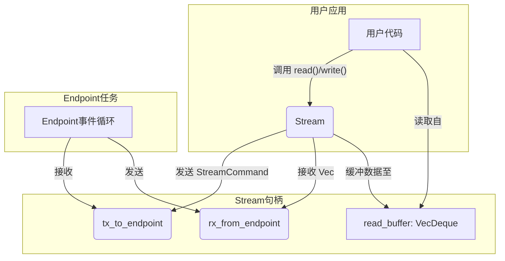

# 用户接口 (`Stream`) - 熟悉的字节流API

## 概述

`stream`模块是整个可靠UDP协议栈最顶层的用户接口。它将底层所有复杂的、面向数据包的异步操作（如连接管理、重传、拥塞控制）封装成一个简洁、易于使用的`Stream`结构体。这个结构体实现了`tokio::io::AsyncRead`和`tokio::io::AsyncWrite`两个核心`trait`，为开发者提供了与`tokio::net::TcpStream`几乎完全相同的编程体验。

**核心使命:**
- **抽象与封装**: 向用户完全隐藏底层的`Endpoint`、`Frame`、ACK和重传逻辑。
- **提供标准接口**: 实现`AsyncRead`和`AsyncWrite`，无缝集成到Tokio的I/O生态系统中。
- **连接应用层与协议栈**: 作为用户应用程序与`Endpoint`任务之间的桥梁，通过异步通道双向传递数据和命令。
- **提供高级功能**: 暴露如`migrate()`等协议特有的高级功能。

**架构实现:**
- **流结构体**: `src/core/stream.rs` - `Stream`结构体的定义及其`AsyncRead`/`AsyncWrite`的实现。

## 设计原则

### 1. 最小意外原则 (Principle of Least Astonishment)
- **API一致性**: `Stream`的API设计刻意模仿了`TcpStream`，用户可以使用熟悉的`read()`, `write_all()`, `shutdown()`等方法，极大地降低了学习成本。
- **行为可预测**: `read()`在连接关闭时返回`Ok(0)`，`write()`在连接断开时返回`ErrorKind::BrokenPipe`，这些行为都符合标准库I/O对象的惯例。

### 2. 异步解耦
- **Actor模型交互**: `Stream`本身不包含任何协议的核心逻辑。它是一个轻量级的“句柄”（Handle），其所有操作都被转换成`StreamCommand`消息，通过`mpsc`通道发送给在独立任务中运行的`Endpoint` Actor。
- **双向通道**:
    - **写路径 (`Stream` -> `Endpoint`)**: 用户调用`write()`时，数据被封装成`StreamCommand::SendData`发送出去。
    - **读路径 (`Endpoint` -> `Stream`)**: `Endpoint`将从网络接收并重组好的有序数据通过另一个`mpsc`通道发送给`Stream`。
- **无阻塞IO**: `poll_write`通过`try_send`实现，如果通道已满，则返回`Poll::Pending`，将背压（Backpressure）自然地传递给调用者。`poll_read`在内部缓冲区为空时，会异步地`poll_recv`等待`Endpoint`传来新数据。

## 整体架构与数据流

`Stream`是连接用户代码和`Endpoint`任务的桥梁。


**数据流解读:**
- **写入流程**:
    1. 用户代码调用`stream.write(buf)`。
    2. `poll_write`方法被调用，它尝试将`buf`封装成`StreamCommand::SendData`并通过`tx_to_endpoint`通道发送。
    3. 如果通道未满，发送成功，返回`Poll::Ready(Ok(buf.len()))`。
    4. 如果通道已满（表示`Endpoint`处理不过来），`try_send`失败，`poll_write`返回`Poll::Pending`，用户的`write`调用会异步地等待。

- **读取流程**:
    1. 用户代码调用`stream.read(buf)`。
    2. `poll_read`方法被调用，它首先检查内部的`read_buffer`。
    3. **如果`read_buffer`中有数据**: 从`read_buffer`的第一个`Bytes`块中拷贝数据到用户的`buf`中，并返回`Poll::Ready(Ok(()))`。
    4. **如果`read_buffer`为空**: 它会调用`rx_from_endpoint.poll_recv(cx)`来异步地等待`Endpoint`任务发送新的数据过来。
    5. **收到新数据**: 当`poll_recv`返回`Poll::Ready(Some(data))`时，`Stream`将收到的`Vec<Bytes>`存入`read_buffer`，然后**循环回到第3步**，从刚填充的缓冲区中读取数据。
    6. **通道关闭**: 当`poll_recv`返回`Poll::Ready(None)`时，表示`Endpoint`已经终止，连接已关闭。`poll_read`返回`Poll::Ready(Ok(()))`，用户的`read`调用会得到`Ok(0)`，表示EOF。
    7. **无新数据**: 当`poll_recv`返回`Poll::Pending`时，表示当前既没有缓冲数据，也没有新数据到达，`poll_read`返回`Poll::Pending`，用户的`read`调用会异步地等待。

## 核心实现解析

### `AsyncWrite` 实现

`poll_write`的实现非常简洁，它是一个非阻塞的“尽力而为”发送。

```rust
// In src/core/stream.rs
fn poll_write(
    self: Pin<&mut Self>,
    _cx: &mut Context<'_>,
    buf: &[u8],
) -> Poll<std::io::Result<usize>> {
    match self.tx_to_endpoint.try_send(...) {
        Ok(_) => Poll::Ready(Ok(buf.len())),
        Err(mpsc::error::TrySendError::Full(_)) => Poll::Pending, // 背压
        Err(mpsc::error::TrySendError::Closed(_)) => {
            Poll::Ready(Err(std::io::ErrorKind::BrokenPipe.into()))
        }
    }
}
```

`poll_shutdown`同样是将一个`StreamCommand::Close`消息发送给`Endpoint`，由`Endpoint`来执行实际的四次挥手关闭逻辑。

### `AsyncRead` 实现

`poll_read`的实现略微复杂，因为它需要管理一个内部的`read_buffer`来处理`Endpoint`一次性发送多个数据块(`Vec<Bytes>`)和用户`read`缓冲区大小不匹配的情况。

```rust
// In src/core/stream.rs
fn poll_read(
    mut self: Pin<&mut Self>,
    cx: &mut Context<'_>,
    buf: &mut ReadBuf<'_>,
) -> Poll<std::io::Result<()>> {
    loop {
        // 1. 优先从内部缓冲区读取
        if !self.read_buffer.is_empty() {
            // ... copy data from self.read_buffer to buf ...
            if bytes_copied > 0 {
                return Poll::Ready(Ok(())); // 只要读到了数据，就必须立即返回
            }
        }

        // 2. 缓冲区为空，尝试从通道拉取新数据
        match self.rx_from_endpoint.poll_recv(cx) {
            Poll::Ready(Some(data_vec)) => {
                self.read_buffer.extend(data_vec);
                continue; // 收到新数据，回到循环开始处处理
            }
            Poll::Ready(None) => return Poll::Ready(Ok(())), // EOF
            Poll::Pending => return Poll::Pending, // 没数据，等待
        }
    }
}
```
这个`loop` + `continue`的模式是`AsyncRead`实现中的一个关键点，它确保了只要从底层通道收到了新数据，就会立即尝试用这些新数据来满足当前的`read`请求，而不是错误地返回`Pending`。

## 总结

`Stream`模块是协议栈人性化设计的体现。它成功地将底层复杂的、基于消息和数据包的协议核心，转换成了广大Rust开发者所熟悉和喜爱的标准异步字节流接口。通过这种方式，它极大地降低了协议的使用门槛，使得开发者可以像使用TCP一样，轻松地构建基于此可靠UDP协议的应用程序。
