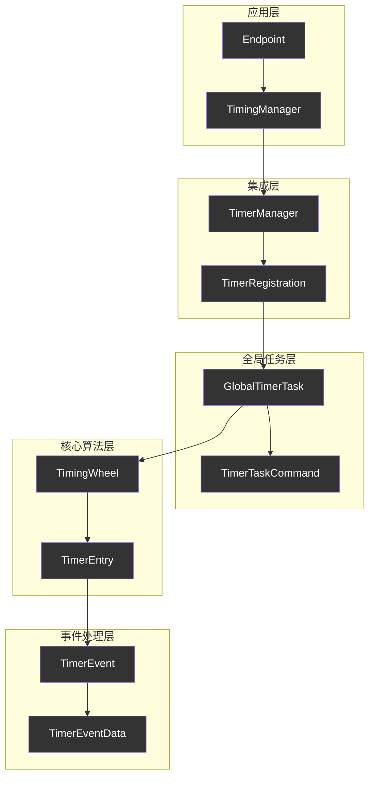
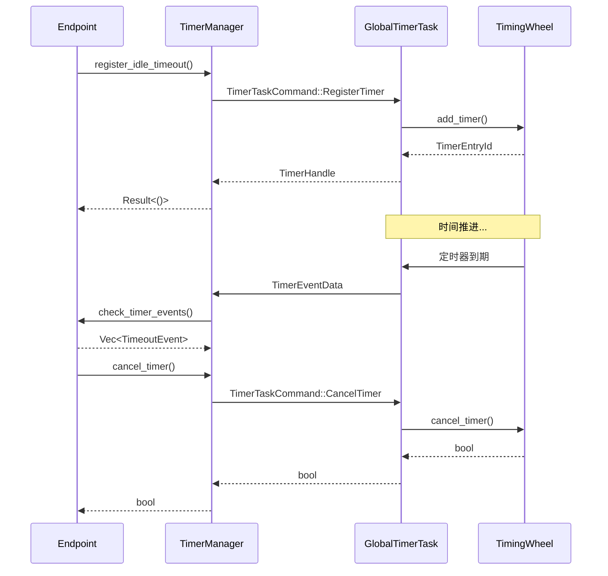

# 全局定时器系统 (`timer`) - 高效的时间轮调度器

## 概述

`timer`模块是协议栈的"全局时钟"，提供了一个高性能、可扩展的定时器管理系统。它采用时间轮（Timing Wheel）算法实现O(1)时间复杂度的定时器操作，并通过全局唯一的定时器任务为整个协议栈的所有连接提供统一的超时管理服务。

**核心使命:**
- **高效定时器管理**: 使用时间轮算法实现O(1)的定时器添加、取消和到期检查操作。
- **全局统一调度**: 单一的全局定时器任务管理所有连接的定时器需求，避免每个连接维护独立定时器的开销。
- **精确超时控制**: 支持毫秒级精度的定时器，满足协议栈对精确超时控制的需求。
- **连接隔离**: 虽然使用全局任务，但每个连接的定时器在逻辑上完全隔离，互不影响。

**架构实现:**
- **事件定义**: `src/timer/event.rs` - 定时器事件和数据结构定义
- **全局任务**: `src/timer/task.rs` - 全局定时器任务和管理逻辑
- **时间轮**: `src/timer/wheel.rs` - 高效的时间轮数据结构实现
- **集成接口**: `src/core/endpoint/timing.rs` - 与Endpoint层的集成接口

## 设计原则

### 1. 全局化与隔离化并存
- **全局唯一任务**: 整个协议栈只有一个全局定时器任务，避免了多个定时器任务间的资源竞争和上下文切换开销。
- **连接级隔离**: 每个连接通过唯一的连接ID来标识其定时器，确保连接间的定时器在逻辑上完全隔离。
- **类型安全**: 通过强类型的`TimeoutEvent`枚举确保定时器类型的安全性和可维护性。

### 2. 高性能时间轮算法
- **O(1)操作复杂度**: 添加、取消和检查定时器的时间复杂度都是O(1)，适合高并发场景。
- **内存高效**: 时间轮使用固定大小的槽位数组，内存使用可预测且高效。
- **批量处理**: 支持在单次时间推进中处理多个到期定时器，提高吞吐量。

### 3. 异步消息驱动
- **Actor模式**: 全局定时器任务采用Actor模式，通过消息传递与其他组件通信。
- **非阻塞操作**: 所有定时器操作都是异步的，不会阻塞调用者。
- **背压控制**: 使用有界通道防止内存无限增长。

## 整体架构

全局定时器系统采用分层架构，从底层的时间轮到上层的集成接口：



**架构层次说明:**
- **应用层**: Endpoint通过TimingManager使用定时器服务
- **集成层**: 封装全局定时器的使用细节，提供简洁的API
- **全局任务层**: 统一的定时器任务管理和命令处理
- **核心算法层**: 高效的时间轮数据结构实现
- **事件处理层**: 定时器事件的定义和处理

## 核心组件解析

### `TimingWheel` - 高效时间轮实现

时间轮是定时器系统的核心数据结构，它将时间分割成固定大小的槽位：

```rust
pub struct TimingWheel {
    /// 时间轮的槽位数量
    slot_count: usize,
    /// 每个槽位的时间间隔
    slot_duration: Duration,
    /// 当前指针位置
    current_slot: usize,
    /// 槽位数组，每个槽位包含该时间点到期的定时器
    slots: Vec<VecDeque<TimerEntry>>,
    /// 定时器ID映射，用于快速查找和删除定时器
    timer_map: HashMap<TimerEntryId, (usize, usize)>,
}
```

**核心特性:**
- **固定槽位**: 使用512个槽位，每个槽位代表10毫秒，总覆盖时间约5.12秒
- **循环推进**: 时间指针循环推进，自动处理时间溢出
- **快速定位**: 通过哈希映射实现O(1)的定时器查找和删除

### `GlobalTimerTask` - 全局定时器任务

全局定时器任务是整个定时器系统的控制中心：

```rust
pub struct GlobalTimerTask {
    /// 时间轮
    timing_wheel: TimingWheel,
    /// 命令接收通道
    command_rx: mpsc::Receiver<TimerTaskCommand>,
    /// 连接到定时器条目的映射
    connection_timers: HashMap<ConnectionId, Vec<TimerEntryId>>,
    /// 统计信息
    stats: TimerTaskStats,
}
```

**主要职责:**
- **命令处理**: 处理定时器注册、取消、清理等命令
- **时间推进**: 定期推进时间轮，检查到期定时器
- **事件分发**: 将到期的定时器事件发送给相应的连接
- **统计维护**: 维护定时器系统的运行统计信息

### `TimerManager` - 连接级定时器管理器

每个连接都有一个TimerManager实例，封装了与全局定时器任务的交互：

```rust
pub struct TimerManager {
    /// 连接ID，用于全局定时器注册
    connection_id: ConnectionId,
    /// 全局定时器任务句柄
    timer_handle: GlobalTimerTaskHandle,
    /// 接收超时事件的通道
    timeout_rx: mpsc::Receiver<TimerEventData>,
    /// 活跃定时器句柄映射
    active_timers: HashMap<TimeoutEvent, TimerHandle>,
}
```

**核心功能:**
- **定时器注册**: 向全局任务注册各种类型的定时器
- **事件接收**: 接收并处理到期的定时器事件
- **生命周期管理**: 管理定时器的创建、取消和清理

## 定时器生命周期

定时器从创建到到期的完整生命周期：



**生命周期阶段:**
1. **注册阶段**: 连接请求注册定时器，全局任务将其添加到时间轮
2. **等待阶段**: 定时器在时间轮中等待到期
3. **到期阶段**: 时间轮推进到定时器槽位，触发定时器事件
4. **通知阶段**: 全局任务将事件发送给相应连接
5. **清理阶段**: 连接处理事件后，定时器被自动清理

## 性能优化特性

### 1. 批量处理优化
```rust
// 在单次时间推进中处理多个到期定时器
pub fn advance(&mut self, now: Instant) -> Vec<TimerEntry> {
    let mut expired_timers = Vec::new();
    
    // 计算需要推进的槽位数
    let slots_to_advance = self.calculate_slots_to_advance(now);
    
    // 批量处理多个槽位
    for _ in 0..slots_to_advance {
        let slot_timers = self.process_current_slot();
        expired_timers.extend(slot_timers);
        self.advance_to_next_slot();
    }
    
    expired_timers
}
```

### 2. 内存池化管理
- **预分配槽位**: 时间轮槽位在初始化时预分配，避免运行时内存分配
- **对象复用**: 定时器条目对象在可能的情况下进行复用
- **增量清理**: 采用增量方式清理过期的定时器映射

### 3. 智能调度策略
```rust
// 动态调整时间推进频率
let next_wakeup = self.timing_wheel
    .next_expiry_time()
    .unwrap_or_else(|| Instant::now() + Duration::from_secs(1));

tokio::select! {
    // 精确唤醒：基于最早定时器的到期时间
    _ = sleep_until(next_wakeup) => {
        self.advance_timing_wheel().await;
    }
    // 定期推进：防止长时间无定时器时的延迟
    _ = advance_interval.tick() => {
        self.advance_timing_wheel().await;
    }
}
```

## 错误处理与容错

### 1. 优雅降级
- **通道关闭处理**: 当连接断开时，优雅地清理相关定时器
- **内存压力应对**: 在内存压力下自动清理过期的定时器映射
- **时间跳跃处理**: 处理系统时间跳跃对定时器精度的影响

### 2. 故障隔离
```rust
// 单个定时器失败不影响其他定时器
for entry in expired_timers {
    if let Err(e) = entry.event.trigger().await {
        tracing::warn!(
            timer_id = entry.id,
            error = %e,
            "Failed to trigger timer event"
        );
        // 继续处理其他定时器
    }
}
```

### 3. 监控与诊断
```rust
pub struct TimerTaskStats {
    /// 总定时器数
    pub total_timers: usize,
    /// 活跃连接数
    pub active_connections: usize,
    /// 已处理的定时器数
    pub processed_timers: u64,
    /// 已取消的定时器数
    pub cancelled_timers: u64,
    /// 时间轮统计信息
    pub wheel_stats: TimingWheelStats,
}
```

## 使用示例

### 基本定时器使用
```rust
// 创建定时器管理器
let timer_handle = start_global_timer_task();
let mut timer_manager = TimerManager::new(connection_id, timer_handle);

// 注册空闲超时定时器
timer_manager.register_idle_timeout(&config).await?;

// 注册路径验证超时定时器
timer_manager.register_path_validation_timeout(Duration::from_secs(30)).await?;

// 检查到期事件
let events = timer_manager.check_timer_events().await;
for event in events {
    match event {
        TimeoutEvent::IdleTimeout => {
            // 处理空闲超时
        }
        TimeoutEvent::PathValidationTimeout => {
            // 处理路径验证超时
        }
        _ => {}
    }
}
```

### 高级定时器管理
```rust
// 动态重置定时器
timer_manager.reset_idle_timeout(&config).await?;

// 取消特定类型的定时器
let cancelled = timer_manager.cancel_timer(&TimeoutEvent::IdleTimeout).await;

// 批量清理连接的所有定时器
timer_manager.cancel_all_timers().await;
```

## 性能特征

### 时间复杂度
- **添加定时器**: O(1)
- **取消定时器**: O(1)
- **检查到期**: O(k)，其中k是到期定时器数量
- **时间推进**: O(s)，其中s是推进的槽位数

### 空间复杂度
- **基础开销**: O(n)，其中n是槽位数量（固定512）
- **定时器存储**: O(m)，其中m是活跃定时器数量
- **映射开销**: O(m)，用于快速查找和删除

### 性能基准
在典型的测试环境中：
- **定时器注册**: ~1μs per operation
- **定时器取消**: ~1μs per operation  
- **批量到期处理**: ~100ns per timer
- **内存使用**: ~50KB base + ~200B per active timer

## 总结

全局定时器系统通过采用高效的时间轮算法和精心设计的异步架构，为协议栈提供了一个高性能、可扩展的定时器服务。它不仅满足了协议栈对精确超时控制的需求，还通过全局统一管理大大降低了系统的资源开销和复杂性，是实现高性能网络协议的关键基础设施。