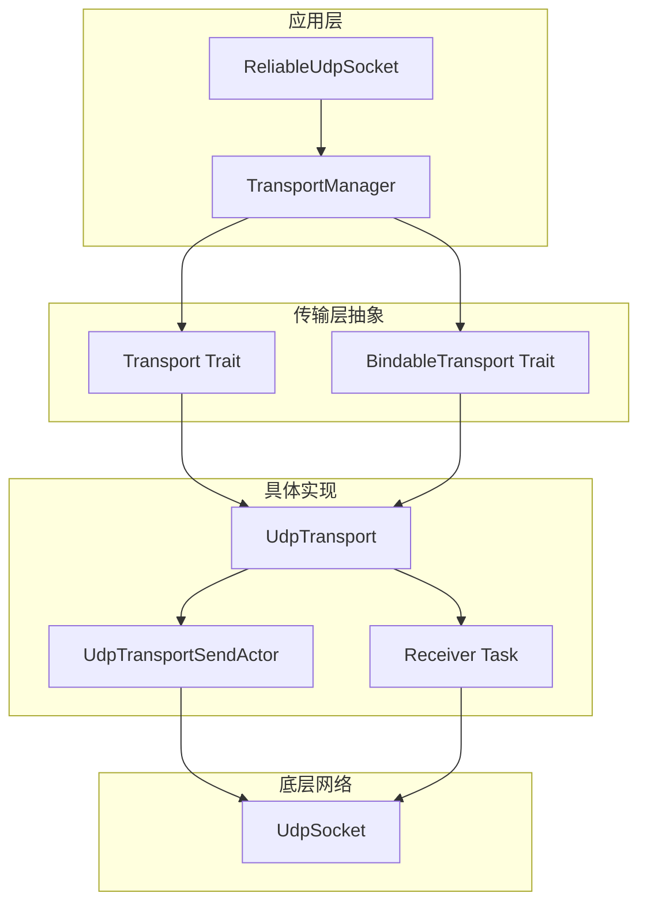
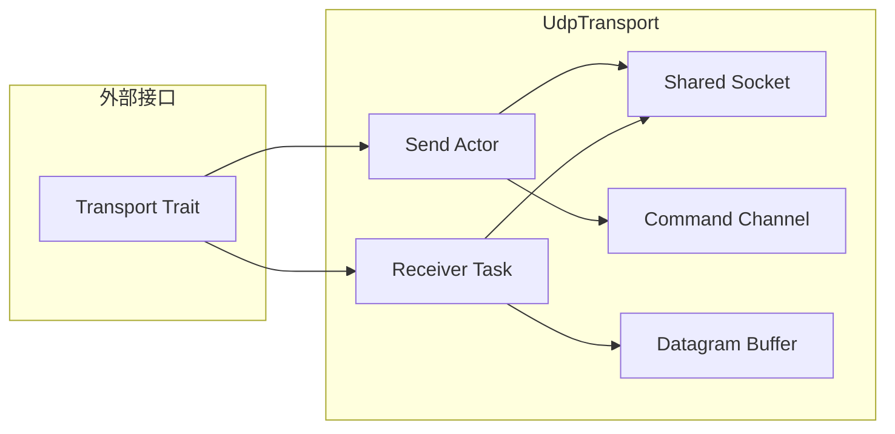

# 传输层架构设计

**功能描述:**

传输层模块 (`transport`) 是协议栈的底层网络抽象层，负责处理所有与网络传输相关的操作。它采用分层设计，通过 `Transport` 和 `BindableTransport` trait 提供统一的传输接口，并实现了基于UDP的高性能传输组件。该模块的核心设计理念是**完全解耦的异步架构**，通过Actor模式和消息传递实现无锁并发，确保在高并发场景下的性能和稳定性。

**实现位置:**

- **传输层抽象**: `src/socket/transport.rs` - 定义传输层接口和核心数据结构
- **传输管理器**: `src/socket/transport/manager.rs` - 统一管理传输操作和重绑定
- **传输发送器**: `src/socket/transport/sender.rs` - 批量帧发送的专用任务
- **UDP传输实现**: `src/socket/transport/udp.rs` - 基于UDP的具体传输实现
- **传输命令**: `src/socket/transport/command.rs` - 传输层操作的命令定义

## 1. 传输层架构概览

传输层采用分层抽象设计，将网络传输的复杂性封装在统一的接口之下：



### 1.1 核心设计原则

**1. 完全解耦的异步架构**
- 发送和接收操作完全分离，避免相互阻塞
- 使用Actor模式管理状态，确保线程安全
- 通过消息传递实现无锁并发

**2. 批量处理优化**
- 帧聚合发送，减少网络开销
- 异步批处理，提高吞吐量
- 智能的背压控制，防止内存溢出

**3. 动态重绑定支持**
- 运行时地址重绑定，支持连接迁移
- 原子性操作，确保重绑定过程中的数据完整性
- 透明的地址缓存，提供快速访问

## 2. 传输层接口设计

### 2.1 Transport Trait

`Transport` trait 定义了传输层的基本操作接口：

```rust
// 位于 src/socket/transport.rs
#[async_trait]
pub trait Transport: Send + Sync + Debug + 'static {
    /// 向指定的远程地址发送一批帧
    /// Sends a batch of frames to the specified remote address
    async fn send_frames(&self, batch: FrameBatch) -> Result<()>;

    /// 接收下一个数据报并将其解码为帧
    /// Receives the next datagram and decodes it into frames
    async fn recv_frames(&self) -> Result<ReceivedDatagram>;

    /// 返回此传输绑定的本地地址
    /// Returns the local address this transport is bound to
    fn local_addr(&self) -> Result<SocketAddr>;
}
```

### 2.2 BindableTransport Trait

`BindableTransport` 扩展了 `Transport`，增加了地址绑定能力：

```rust
// 位于 src/socket/transport.rs
#[async_trait]
pub trait BindableTransport: Transport + Sized {
    /// 创建绑定到指定地址的新传输
    /// Creates a new transport bound to the specified address
    async fn bind(addr: SocketAddr) -> Result<Self>;

    /// 将传输重新绑定到新的本地地址
    /// Rebinds the transport to a new local address
    async fn rebind(&self, new_addr: SocketAddr) -> Result<()>;
}
```

### 2.3 核心数据结构

**FrameBatch**: 表示要发送到远程地址的帧批次
```rust
#[derive(Debug, Clone)]
pub struct FrameBatch {
    /// 目标地址
    pub remote_addr: SocketAddr,
    /// 要发送的帧
    pub frames: Vec<Frame>,
}
```

**ReceivedDatagram**: 表示接收到的数据报
```rust
#[derive(Debug)]
pub struct ReceivedDatagram {
    /// 数据报的源地址
    pub remote_addr: SocketAddr,
    /// 从数据报解码的帧
    pub frames: Vec<Frame>,
}
```

## 3. 传输管理器架构

### 3.1 TransportManager 设计

`TransportManager` 是传输层的统一管理组件，负责协调传输操作和重绑定：

```rust
// 位于 src/socket/transport/manager.rs
#[derive(Debug)]
pub(crate) struct TransportManager<T: BindableTransport> {
    /// 传输实例的原子引用，支持运行时替换
    transport: Arc<T>,
    /// 向传输发送Actor的命令通道
    send_tx: mpsc::Sender<TransportCommand<T>>,
}
```

**核心功能**:
- **统一管理**: 封装所有传输相关操作，提供简洁的API
- **原子重绑定**: 支持运行时安全地替换传输实例
- **命令分发**: 通过消息传递向传输Actor发送命令

### 3.2 重绑定机制

重绑定操作是传输管理器的核心功能，确保在地址变更时数据不丢失：

```rust
// 位于 src/socket/transport/manager.rs
pub(crate) async fn rebind(&mut self, new_addr: SocketAddr) -> Result<SocketAddr> {
    // 1. 创建新的传输实例
    let new_transport = Arc::new(T::bind(new_addr).await?);
    let actual_addr = new_transport.local_addr()?;

    // 2. 发送替换命令到传输Actor
    let swap_command = TransportCommand::SwapTransport(new_transport.clone());
    if self.send_tx.send(swap_command).await.is_err() {
        return Err(Error::ChannelClosed);
    }

    // 3. 更新本地传输引用
    self.transport = new_transport;

    Ok(actual_addr)
}
```

## 4. UDP传输实现架构

### 4.1 三组件解耦设计

`UdpTransport` 采用三组件完全解耦的架构：



**1. Send Actor (`UdpTransportSendActor`)**
- 管理所有发送操作和套接字重绑定
- 通过命令通道序列化写访问
- 处理帧序列化和批量发送

**2. Receiver Task (`receiver_task`)**
- 专用的异步任务，持续轮询UDP套接字
- 将接收到的数据报推入无锁队列
- 处理帧反序列化和错误恢复

**3. Shared Socket (`Arc<ArcSwap<UdpSocket>>`)**
- 允许发送Actor和接收任务安全访问底层套接字
- 支持原子性替换，无需锁
- 确保重绑定过程中的数据完整性

### 4.2 Send Actor 实现

Send Actor 是UDP传输的核心组件，负责所有发送相关操作：

```rust
// 位于 src/socket/transport/udp.rs
struct UdpTransportSendActor {
    /// 与UdpTransport接收器共享的ArcSwap引用
    shared_socket: Arc<ArcSwap<UdpSocket>>,
    /// 命令接收通道
    command_rx: mpsc::Receiver<UdpTransportCommand>,
    /// 缓存的本地地址引用
    local_addr: Arc<ArcSwap<SocketAddr>>,
}

impl UdpTransportSendActor {
    async fn run(mut self) {
        while let Some(command) = self.command_rx.recv().await {
            match command {
                UdpTransportCommand::Send { batch, response_tx } => {
                    let result = self.handle_send(batch).await;
                    let _ = response_tx.send(result);
                }
                UdpTransportCommand::GetLocalAddr { response_tx } => {
                    let result = self.shared_socket.load().local_addr().map_err(Into::into);
                    let _ = response_tx.send(result);
                }
                UdpTransportCommand::Rebind { new_addr, response_tx } => {
                    let result = self.handle_rebind(new_addr).await;
                    let _ = response_tx.send(result);
                }
            }
        }
    }
}
```

**核心操作**:

**帧发送处理**:
```rust
async fn handle_send(&self, batch: FrameBatch) -> Result<()> {
    if batch.frames.is_empty() {
        return Ok(());
    }

    // 原子加载当前套接字 - 无锁！
    let socket = self.shared_socket.load();
    let buffer = Self::serialize_frames(&batch.frames);

    socket.send_to(&buffer, batch.remote_addr).await?;
    Ok(())
}
```

**重绑定处理**:
```rust
async fn handle_rebind(&self, new_addr: SocketAddr) -> Result<SocketAddr> {
    let new_socket = UdpSocket::bind(new_addr).await?;
    let actual_addr = new_socket.local_addr()?;

    // 原子地替换套接字
    self.shared_socket.store(Arc::new(new_socket));
    
    // 原子地更新缓存的本地地址
    self.local_addr.store(Arc::new(actual_addr));

    Ok(actual_addr)
}
```

### 4.3 Receiver Task 实现

Receiver Task 负责持续接收和处理网络数据：

```rust
// 位于 src/socket/transport/udp.rs
async fn receiver_task(
    shared_socket: Arc<ArcSwap<UdpSocket>>,
    datagram_tx: async_channel::Sender<ReceivedDatagram>,
    mut shutdown_rx: watch::Receiver<()>,
) {
    let mut buffer = [0u8; 2048]; // Max UDP packet size

    loop {
        // 在每次迭代时加载当前套接字以处理重绑定
        let socket = shared_socket.load_full();

        tokio::select! {
            biased;
            
            _ = shutdown_rx.changed() => {
                break;
            }
            result = socket.recv_from(&mut buffer) => {
                match result {
                    Ok((len, remote_addr)) => {
                        let datagram_buf = buffer[..len].to_vec();
                        let frames = deserialize_frames(&datagram_buf);

                        let received = ReceivedDatagram { remote_addr, frames };

                        // 使用 try_send 实现非阻塞行为
                        if let Err(e) = datagram_tx.try_send(received) {
                            warn!("Failed to push received datagram to buffer, dropping packet");
                        }
                    }
                    Err(e) => {
                        error!("UDP recv_from error: {}", e);
                        tokio::time::sleep(std::time::Duration::from_millis(10)).await;
                    }
                }
            }
        }
    }
}
```

**关键特性**:
- **非阻塞接收**: 使用 `try_send` 防止网络I/O任务阻塞
- **背压控制**: 有界通道防止内存无限增长
- **错误恢复**: 优雅处理网络错误，避免忙循环
- **重绑定感知**: 每次迭代重新加载套接字，支持动态重绑定

## 5. 批量发送优化

### 5.1 Transport Sender Task

`transport_sender_task` 是批量发送优化的核心组件：

```rust
// 位于 src/socket/transport/sender.rs
pub async fn transport_sender_task<T: Transport>(
    mut transport: Arc<T>,
    mut rx: mpsc::Receiver<TransportCommand<T>>,
) {
    const MAX_BATCH_SIZE: usize = 64;
    let mut commands = Vec::with_capacity(MAX_BATCH_SIZE);

    loop {
        // 等待第一个命令到达
        let first_cmd = match rx.recv().await {
            Some(cmd) => cmd,
            None => return, // 通道关闭
        };

        match first_cmd {
            TransportCommand::Send(batch) => {
                commands.push(batch);

                // 尝试批量处理待处理的Send命令
                while commands.len() < MAX_BATCH_SIZE {
                    if let Ok(TransportCommand::Send(batch)) = rx.try_recv() {
                        commands.push(batch);
                    } else {
                        break;
                    }
                }

                // 处理所有批量发送命令
                for batch in commands.drain(..) {
                    if let Err(e) = transport.send_frames(batch).await {
                        error!("Failed to send frame batch: {}", e);
                    }
                }
            }
            TransportCommand::SwapTransport(new_transport) => {
                transport = new_transport;
            }
        }
    }
}
```

**优化策略**:
- **批量聚合**: 最多64个发送命令批量处理
- **非阻塞尝试**: 使用 `try_recv` 避免不必要的等待
- **传输切换**: 支持运行时切换传输实例

### 5.2 帧序列化优化

帧序列化采用高效的缓冲区管理：

```rust
// 位于 src/socket/transport/udp.rs
#[inline]
fn serialize_frames(frames: &[Frame]) -> Vec<u8> {
    let mut buffer = Vec::with_capacity(2048);
    for frame in frames {
        frame.encode(&mut buffer);
    }
    buffer
}
```

**优化特性**:
- **预分配缓冲区**: 避免频繁的内存分配
- **内联优化**: 使用 `#[inline]` 减少函数调用开销
- **批量编码**: 一次性序列化多个帧

## 6. 架构优势

### 6.1 完全解耦设计
- **发送接收分离**: 发送和接收操作完全独立，避免相互阻塞
- **Actor模式**: 使用消息传递确保线程安全，无需锁
- **状态隔离**: 每个组件管理自己的状态，减少复杂性

### 6.2 高性能特性
- **批量处理**: 帧聚合发送，减少网络开销
- **异步I/O**: 完全异步设计，最大化并发性能
- **零拷贝优化**: 最小化内存拷贝，提高吞吐量

### 6.3 动态重绑定支持
- **原子操作**: 使用 `ArcSwap` 实现无锁的套接字替换
- **透明切换**: 重绑定过程对上层透明
- **数据完整性**: 确保重绑定过程中不丢失数据

### 6.4 健壮性保障
- **背压控制**: 有界通道防止内存溢出
- **错误恢复**: 优雅处理网络错误和异常情况
- **资源管理**: 自动清理和资源释放

## 7. 使用示例

### 7.1 基本使用

```rust
// 创建UDP传输
let transport = UdpTransport::new("127.0.0.1:8080".parse().unwrap()).await?;

// 发送帧批次
let batch = FrameBatch {
    remote_addr: "127.0.0.1:8081".parse().unwrap(),
    frames: vec![frame1, frame2, frame3],
};
transport.send_frames(batch).await?;

// 接收数据报
let datagram = transport.recv_frames().await?;
println!("Received {} frames from {}", datagram.frames.len(), datagram.remote_addr);
```

### 7.2 重绑定操作

```rust
// 重绑定到新地址
let new_addr = "127.0.0.1:8082".parse().unwrap();
transport.rebind(new_addr).await?;

// 获取当前本地地址
let local_addr = transport.local_addr()?;
println!("Transport bound to: {}", local_addr);
```

这种设计确保了传输层的高性能、高可靠性和高可维护性，为上层协议提供了坚实的网络基础。 