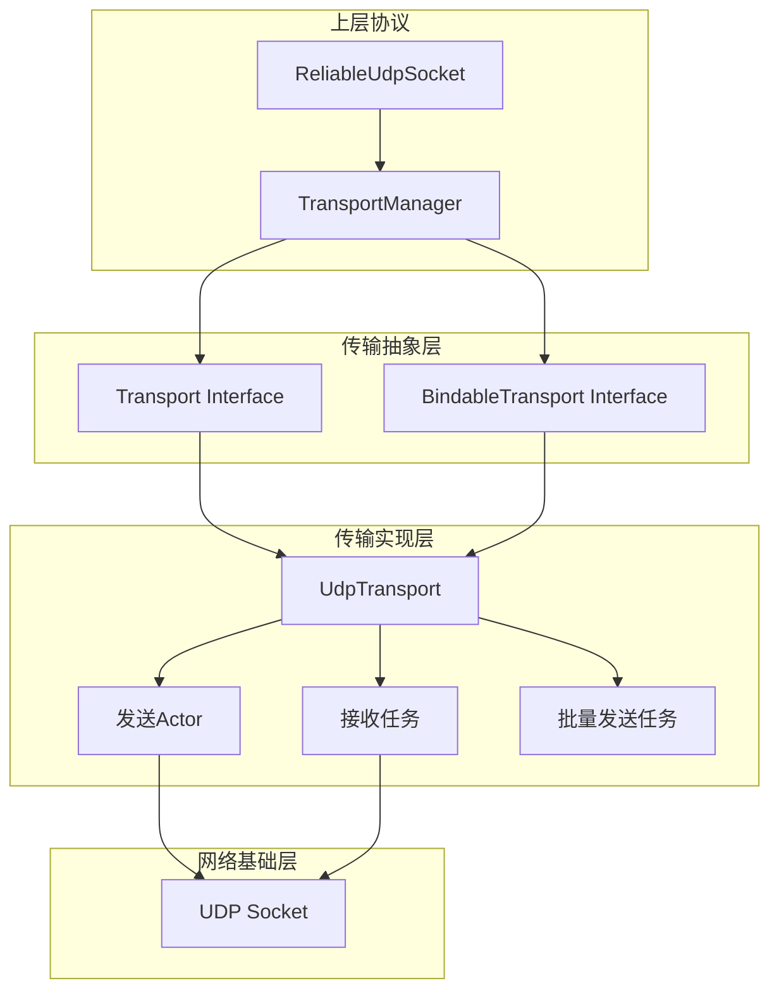
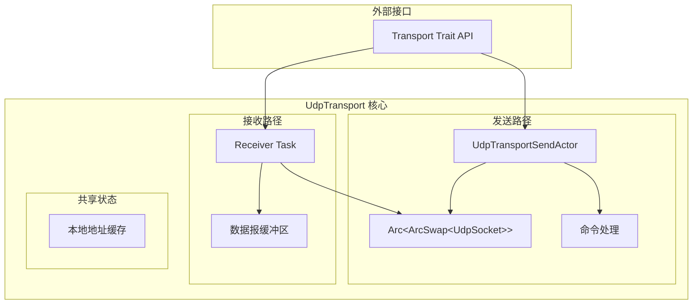

# 传输层架构设计

## 概述

传输层 (`transport`) 是可靠UDP协议栈的网络基础设施层，负责所有底层网络通信操作。它通过精心设计的三层架构提供高性能、高可靠性的网络传输能力，是整个协议栈的基石。

**核心职责:**
- 帧的网络发送与接收
- 地址绑定与动态重绑定
- 批量传输优化
- 并发访问协调

**实现架构:**
- **传输抽象层**: `src/socket/transport.rs` - 定义统一的传输接口和数据模型
- **传输管理层**: `src/socket/transport/manager.rs` - 提供传输操作的统一管理入口  
- **批量发送层**: `src/socket/transport/sender.rs` - 优化网络发送的批处理任务
- **UDP实现层**: `src/socket/transport/udp.rs` - 基于UDP的具体传输实现
- **命令协调层**: `src/socket/transport/command.rs` - 定义传输层操作命令

## 设计原则

传输层的设计遵循四项核心原则，确保在复杂网络环境下的高性能表现：

### 1. 完全异步解耦架构
- **独立的发送与接收通路**: 发送和接收操作完全分离，消除相互阻塞的可能性
- **Actor模式状态管理**: 每个组件在独立的异步任务中运行，通过消息传递协调
- **无锁并发设计**: 使用原子操作和通道通信代替传统锁机制，避免竞争和死锁

### 2. 智能批量处理
- **帧聚合传输**: 将多个小帧聚合为单个UDP数据报，提升网络利用率
- **适应性批处理**: 根据网络状况动态调整批次大小，平衡延迟和吞吐量
- **背压保护机制**: 通过有界通道实现流量控制，防止内存无限增长

### 3. 动态地址管理
- **运行时重绑定**: 支持在连接活跃期间更换本地地址，适应网络环境变化
- **原子地址切换**: 使用`ArcSwap`实现无锁的地址原子替换，保证数据完整性
- **透明地址缓存**: 提供快速的地址访问，减少系统调用开销

### 4. 故障容错设计
- **优雅错误处理**: 网络错误不会导致整个传输层崩溃，具有自我恢复能力
- **资源自动清理**: 组件生命周期管理确保资源不泄漏
- **监控与可观测**: 详细的日志记录便于问题诊断和性能调优

## 整体架构

传输层采用清晰的分层设计，每层专注于特定职责：



**层次说明:**
- **传输抽象层**: 定义标准接口，为上层提供统一的传输能力
- **传输实现层**: 具体的UDP传输实现，包含三个专业化组件
- **网络基础层**: 操作系统提供的底层网络API

## 核心接口设计

传输层通过简洁而强大的trait系统提供标准化接口，确保不同传输实现的一致性和可替换性。

### Transport Trait - 基础传输能力

`Transport` trait 定义了所有传输实现必须提供的核心功能：

```rust
#[async_trait]
pub trait Transport: Send + Sync + Debug + 'static {
    /// 批量发送帧到指定远程地址
    async fn send_frames(&self, batch: FrameBatch) -> Result<()>;

    /// 接收下一个数据报并解码为帧
    async fn recv_frames(&self) -> Result<ReceivedDatagram>;

    /// 获取传输绑定的本地地址
    fn local_addr(&self) -> Result<SocketAddr>;
}
```

**设计要点:**
- **异步发送**: `send_frames` 支持高并发的非阻塞发送
- **流式接收**: `recv_frames` 提供连续的数据流接收
- **地址查询**: `local_addr` 快速获取当前绑定地址，用于连接管理

### BindableTransport Trait - 动态绑定能力

`BindableTransport` 扩展基础传输能力，添加地址绑定和重绑定功能：

```rust
#[async_trait]
pub trait BindableTransport: Transport + Sized {
    /// 创建绑定到指定地址的新传输实例
    async fn bind(addr: SocketAddr) -> Result<Self>;

    /// 将现有传输重新绑定到新地址
    async fn rebind(&self, new_addr: SocketAddr) -> Result<()>;
}
```

**设计优势:**
- **初始绑定**: `bind` 方法支持创建时指定地址
- **动态重绑定**: `rebind` 支持运行时地址切换，实现连接迁移
- **类型安全**: 通过trait继承确保所有可绑定传输都具备基础传输能力

### 核心数据模型

#### FrameBatch - 发送数据批次

表示要发送到特定远程地址的帧集合，支持批量传输优化：

```rust
#[derive(Debug, Clone)]
pub struct FrameBatch {
    /// 目标远程地址
    pub remote_addr: SocketAddr,
    /// 要发送的帧数组
    pub frames: Vec<Frame>,
}
```

**使用场景:**
- 多帧聚合发送，减少网络调用次数
- 单个目标地址的批量数据传输
- 传输层批处理优化的数据载体

#### ReceivedDatagram - 接收数据报

表示从网络接收到的完整数据报，包含解码后的帧信息：

```rust
#[derive(Debug)]
pub struct ReceivedDatagram {
    /// 数据报的源地址
    pub remote_addr: SocketAddr,
    /// 解码得到的帧数组
    pub frames: Vec<Frame>,
}
```

**设计特点:**
- 保留源地址信息，支持多对等方通信
- 批量解码帧，提高处理效率
- 不可变设计，确保数据安全

## 传输管理层设计

### TransportManager - 统一传输管理

`TransportManager` 作为传输层的协调中心，为上层提供统一的传输管理接口：

```rust
#[derive(Debug)]
pub(crate) struct TransportManager<T: BindableTransport> {
    /// 传输实例的共享引用
    transport: Arc<T>,
    /// 向批量发送任务的命令通道
    send_tx: mpsc::Sender<TransportCommand<T>>,
}
```

**职责分工:**
- **接口统一**: 为上层协议提供简化的传输操作接口
- **实例管理**: 维护传输实例的生命周期和引用
- **命令协调**: 将操作请求转发给专业化的处理组件

### 动态重绑定机制

传输管理器的重绑定功能支持在不中断服务的情况下更换网络地址：

```rust
pub(crate) async fn rebind(&mut self, new_addr: SocketAddr) -> Result<SocketAddr> {
    // 第一步：创建新的传输实例
    let new_transport = Arc::new(T::bind(new_addr).await?);
    let actual_addr = new_transport.local_addr()?;

    // 第二步：原子替换批量发送任务中的传输
    let swap_command = TransportCommand::SwapTransport(new_transport.clone());
    self.send_tx.send(swap_command).await.map_err(|_| Error::ChannelClosed)?;

    // 第三步：更新本地传输引用
    self.transport = new_transport;

    Ok(actual_addr)
}
```

**重绑定特性:**
- **非阻塞操作**: 重绑定过程不影响正在进行的接收操作
- **原子切换**: 确保新旧传输实例之间的无缝切换
- **错误恢复**: 重绑定失败时保持原有传输状态不变

## UDP传输实现架构

UDP传输层采用高度专业化的三组件架构，实现完全的发送接收解耦和无锁并发：

### 三组件解耦设计



### 组件职责分析

#### 1. UdpTransportSendActor - 发送专家
**核心职责:**
- 独占管理UDP套接字的所有写入操作
- 处理帧序列化和网络发送
- 执行套接字重绑定操作
- 维护本地地址缓存更新

**工作模式:**
```rust
async fn run(mut self) {
    while let Some(command) = self.command_rx.recv().await {
        match command {
            UdpTransportCommand::Send { batch, response_tx } => {
                let result = self.handle_send(batch).await;
                let _ = response_tx.send(result);
            }
            UdpTransportCommand::Rebind { new_addr, response_tx } => {
                let result = self.handle_rebind(new_addr).await;
                let _ = response_tx.send(result);
            }
        }
    }
}
```

#### 2. Receiver Task - 接收专家  
**核心职责:**
- 持续轮询UDP套接字获取新数据报
- 执行帧反序列化和验证
- 管理接收缓冲区和背压控制
- 处理网络错误和恢复

**工作模式:**
```rust
async fn receiver_task(
    shared_socket: Arc<ArcSwap<UdpSocket>>,
    datagram_tx: async_channel::Sender<ReceivedDatagram>,
    mut shutdown_rx: watch::Receiver<()>,
) {
    let mut buffer = [0u8; 2048];
    
    loop {
        let socket = shared_socket.load_full();
        
        tokio::select! {
            _ = shutdown_rx.changed() => break,
            result = socket.recv_from(&mut buffer) => {
                // 处理接收逻辑
            }
        }
    }
}
```

#### 3. Shared Socket - 状态协调者
**核心特性:**
- **无锁共享**: 使用`ArcSwap`实现原子的套接字引用替换
- **并发安全**: 发送和接收任务可以安全地并发访问
- **重绑定支持**: 支持运行时原子地替换底层套接字

**技术实现:**
```rust
// 原子加载当前套接字进行发送
let socket = self.shared_socket.load();
socket.send_to(&buffer, batch.remote_addr).await?;

// 原子替换套接字实现重绑定
let new_socket = UdpSocket::bind(new_addr).await?;
self.shared_socket.store(Arc::new(new_socket));
```

## 批量发送优化架构

### Transport Sender Task - 批量处理引擎

传输层通过专用的批量发送任务实现网络传输的性能优化：

```rust
pub async fn transport_sender_task<T: Transport>(
    mut transport: Arc<T>,
    mut rx: mpsc::Receiver<TransportCommand<T>>,
) {
    const MAX_BATCH_SIZE: usize = 64;
    let mut commands = Vec::with_capacity(MAX_BATCH_SIZE);

    loop {
        // 等待第一个命令到达
        let first_cmd = rx.recv().await?;
        
        match first_cmd {
            TransportCommand::Send(batch) => {
                commands.push(batch);
                
                // 尝试聚合更多待发送命令
                while commands.len() < MAX_BATCH_SIZE {
                    if let Ok(TransportCommand::Send(batch)) = rx.try_recv() {
                        commands.push(batch);
                    } else {
                        break;
                    }
                }
                
                // 批量处理所有发送命令
                for batch in commands.drain(..) {
                    let _ = transport.send_frames(batch).await;
                }
            }
            TransportCommand::SwapTransport(new_transport) => {
                transport = new_transport;
            }
        }
    }
}
```

### 批量处理优势

#### 1. 网络效率提升
- **减少系统调用**: 批量发送减少用户态与内核态切换开销
- **提高吞吐量**: 聚合处理提升网络带宽利用率
- **降低延迟抖动**: 统一的发送时机减少网络传输的时间差异

#### 2. 资源利用优化
- **内存分配优化**: 预分配命令缓冲区，避免频繁内存分配
- **CPU缓存友好**: 连续的批量处理提升缓存命中率
- **任务调度优化**: 减少任务切换，提高处理效率

#### 3. 流量控制机制
- **自适应批次**: 根据网络负载动态调整批次大小
- **背压处理**: 通过有界通道控制内存使用
- **负载均衡**: 避免网络突发导致的拥塞

## 传输层架构优势

### 性能优势

#### 1. 高并发性能
- **完全异步架构**: 所有I/O操作都是非阻塞的，支持高并发场景
- **无锁并发模型**: 通过消息传递和原子操作避免锁竞争，提升并发性能
- **专业化组件**: 发送和接收任务专门优化各自领域，最大化性能

#### 2. 网络效率
- **批量传输优化**: 帧聚合减少网络开销，提升带宽利用率
- **零拷贝设计**: 最小化内存拷贝，降低CPU开销
- **智能缓冲管理**: 预分配缓冲区减少内存分配开销

### 可靠性优势

#### 1. 故障容错
- **优雅错误处理**: 网络错误不会导致系统崩溃，具有自我恢复能力
- **背压保护**: 有界通道防止内存无限增长，避免OOM错误
- **资源自动管理**: 组件生命周期管理确保资源不泄漏

#### 2. 动态适应性
- **运行时重绑定**: 支持网络环境变化时的地址切换
- **透明迁移**: 重绑定过程对上层应用完全透明
- **原子状态切换**: 确保状态变更的一致性和安全性

### 可维护性优势

#### 1. 模块化设计
- **清晰的职责分离**: 每个组件有明确的功能边界
- **松耦合架构**: 组件间通过标准接口交互，易于测试和替换
- **可扩展性**: 新的传输协议可以通过实现相同trait轻松集成

#### 2. 可观测性
- **结构化日志**: 详细的操作日志便于问题诊断
- **性能监控**: 关键路径的性能指标暴露
- **调试友好**: 清晰的代码结构便于问题定位

## 使用指南

### 基本传输操作

```rust
use std::net::SocketAddr;

// 创建UDP传输实例
let transport = UdpTransport::bind("127.0.0.1:0".parse()?).await?;
let local_addr = transport.local_addr()?;

// 发送帧批次到远程地址
let batch = FrameBatch {
    remote_addr: "127.0.0.1:8081".parse()?,
    frames: vec![frame1, frame2, frame3],
};
transport.send_frames(batch).await?;

// 接收数据报
let datagram = transport.recv_frames().await?;
println!("从 {} 接收到 {} 个帧", 
         datagram.remote_addr, 
         datagram.frames.len());
```

### 动态重绑定

```rust
// 在服务运行期间更换本地地址
let new_addr: SocketAddr = "127.0.0.1:9090".parse()?;
transport.rebind(new_addr).await?;

// 验证地址已更新
let current_addr = transport.local_addr()?;
assert_eq!(current_addr.port(), 9090);
```

### 传输管理器使用

```rust
// 通过传输管理器统一管理
let transport = Arc::new(UdpTransport::bind(addr).await?);
let (send_tx, send_rx) = mpsc::channel(1024);

// 启动批量发送任务
tokio::spawn(transport_sender_task(transport.clone(), send_rx));

// 创建传输管理器
let mut manager = TransportManager::new(transport, send_tx);

// 执行重绑定操作
let new_addr = manager.rebind("127.0.0.1:0".parse()?).await?;
println!("传输已重绑定到: {}", new_addr);
```

传输层的设计充分体现了现代异步系统的最佳实践，为可靠UDP协议栈提供了坚实的网络基础设施。通过精心设计的架构，它在性能、可靠性和可维护性之间达到了最佳平衡。 