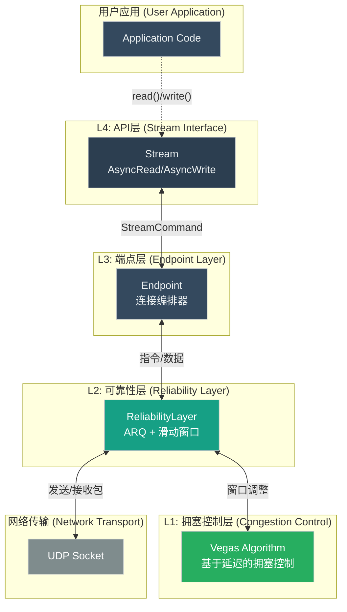
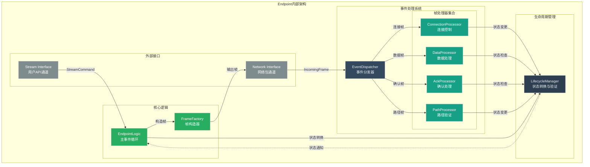

# 1: 清晰的协议分层

**功能描述:**

项目遵循现代网络协议栈的设计思想，实现了一套清晰、解耦的垂直分层架构。这种架构将不同的职责分离到独立的组件中，极大地提高了代码的可维护性、可测试性和可扩展性。它将复杂的协议逻辑分解为一系列内聚且可独立测试的层次。

### 1. 架构概览

协议栈从上到下可以分为四个逻辑层次，其核心设计思想是 **"编排与实现分离"**。

1.  **L4: API层 (`Stream`)**:
    *   **职责**: 为用户提供符合人体工程学的 `AsyncRead`/`AsyncWrite` 字节流接口，隐藏所有底层包的细节。并将用户的读写操作转换为命令，通过MPSC通道发送给对应的 `Endpoint` 任务进行处理。

2.  **L3: 端点层 (`Endpoint`)**:
    *   **职责**: 作为连接的"大脑"和中央编排器，负责管理单个连接的完整生命周期（握手、通信、连接迁移、关闭），并根据状态向下层的 `ReliabilityLayer` 发出明确指令。它处理来自API层和网络层的所有事件，但不实现具体的可靠性算法。
    *   **核心组件**:
        *   `LifecycleManager`: 统一的连接生命周期管理器，负责所有状态转换、验证和连接生命周期事件的协调。完全替代了旧的StateManager，提供更现代化和一致的状态管理。
        *   `EventDispatcher`: 事件分发器，将不同类型的帧分发给相应的处理器。
        *   `FrameProcessors`: 专门的帧处理器集合，分别处理连接控制、数据传输、确认和路径验证等不同类型的帧。

3.  **L2: 可靠性层 (`ReliabilityLayer`)**:
    *   **职责**: 这是一个综合性的功能实现层，封装了基于SACK的ARQ（自动重传请求）、动态RTO计算、快速重传、滑动窗口流量控制等核心可靠性机制。它接收来自端点层的清晰指令，执行具体的算法逻辑。

4.  **L1: 拥塞控制层 (`CongestionControl` Trait)**:
    *   **职责**: 作为可插拔的算法层，当前实现了基于延迟的Vegas算法，并且设计为trait形式以支持未来轻松集成其他算法（如BBR）。

### 2. Endpoint内部架构

端点层作为协议的核心编排器，内部采用了高度模块化的设计。下图展示了Endpoint内部各组件的详细结构和交互关系：

### 3. 数据流程分析

#### 3.1 写数据路径 (Write Path)

1.  **用户调用**: 用户调用 `stream.write(data)`
2.  **命令转换**: `Stream` 将写请求转换为 `StreamCommand::Write`，通过MPSC通道发送给 `Endpoint`
3.  **状态检查**: `Endpoint` 通过 `LifecycleManager` 检查当前连接状态是否允许发送数据
4.  **可靠性处理**: 将数据交给 `ReliabilityLayer` 进行分包、序号标记、缓冲等处理
5.  **拥塞控制**: `ReliabilityLayer` 咨询 `CongestionControl` 当前的发送窗口大小
6.  **网络发送**: 构造最终的UDP包并发送到网络

#### 3.2 读数据路径 (Read Path)

1.  **网络接收**: 从UDP socket接收到原始包
2.  **事件分发**: `EventDispatcher` 根据帧类型将包分发给相应的 `FrameProcessor`
3.  **帧处理**: 各个处理器根据帧类型执行相应逻辑（数据重组、确认处理、状态更新等）
4.  **状态协调**: 处理器通过 `LifecycleManager` 进行必要的状态检查和更新
5.  **数据重组**: `ReliabilityLayer` 将乱序的包重新排序，组装成连续的字节流
6.  **用户接收**: 通过MPSC通道将重组后的数据发送给 `Stream`，用户通过 `stream.read()` 获取

#### 3.3 生命周期管理 (Lifecycle Management)

`LifecycleManager` 统一管理连接的整个生命周期：

*   **连接建立**: 处理握手过程中的状态转换 (`Connecting` → `SynReceived` → `Established`)
*   **正常通信**: 维护 `Established` 状态，协调数据传输
*   **连接迁移**: 处理路径验证和地址迁移 (`Established` → `PathValidating` → `Established`)
*   **优雅关闭**: 管理四次挥手过程 (`Established` → `Closing` → `ClosingWait` → `Closed`)
*   **异常处理**: 处理错误情况下的状态转换和资源清理

### 4. 设计优势

#### 4.1 职责分离 (Separation of Concerns)

*   **状态管理**: `LifecycleManager` 专注于连接状态的一致性和转换逻辑
*   **事件处理**: `EventDispatcher` 和 `FrameProcessors` 专注于不同类型帧的解析和处理
*   **可靠性保证**: `ReliabilityLayer` 专注于数据传输的可靠性算法
*   **拥塞控制**: 独立的算法层，易于替换和扩展

#### 4.2 高度模块化 (High Modularity)

*   每个组件都有明确的接口和职责边界
*   组件间通过明确的API进行交互，降低耦合度
*   便于单独测试和验证每个组件的功能
*   支持组件的独立演进和优化

#### 4.3 代码复用性 (Code Reusability)

*   `FrameProcessors` 可以在不同类型的连接中复用
*   `CongestionControl` trait允许插入不同的拥塞控制算法
*   `LifecycleManager` 的状态转换逻辑对所有连接通用

#### 4.4 可扩展性 (Extensibility)

*   易于添加新的帧类型和对应的处理器
*   可以轻松集成新的拥塞控制算法
*   支持协议的向后兼容升级

### 5. 实现细节

#### 5.1 无锁并发模型

*   每个 `Endpoint` 运行在独立的Tokio任务中
*   通过MPSC通道进行跨任务通信，避免共享状态锁
*   所有状态修改都在单一任务内进行，保证线程安全

#### 5.2 现代化状态管理

*   `LifecycleManager` 提供统一的状态转换接口
*   支持复杂的状态转换验证和约束
*   完全替代了旧的StateManager，消除了状态管理的双重性

#### 5.3 性能优化

*   帧处理器采用零拷贝设计，减少内存分配
*   支持包聚合和批处理，提高网络效率
*   事件驱动的架构，减少不必要的轮询 