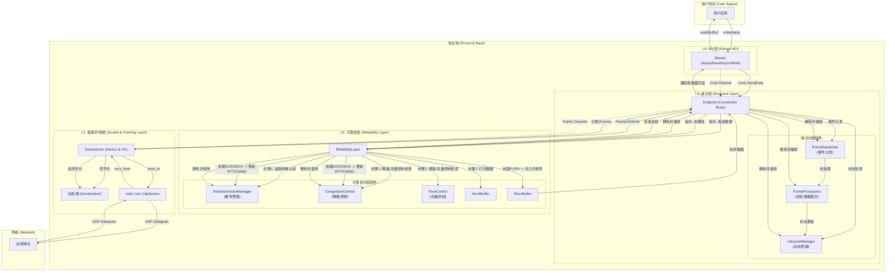

# 1: 清晰的协议分层

**功能描述:**

项目遵循现代网络协议栈的设计思想，实现了一套清晰、解耦的垂直分层架构。这种架构将不同的职责分离到独立的组件中，极大地提高了代码的可维护性、可测试性和可扩展性。它将复杂的协议逻辑分解为一系列内聚且可独立测试的层次。

### 1. 架构概览

协议栈从上到下可以分为四个逻辑层次，其核心设计思想是 **"编排与实现分离"**。

1.  **L4: API层 (`Stream`)**:
    *   **职责**: 为用户提供符合人体工程学的 `AsyncRead`/`AsyncWrite` 字节流接口，隐藏所有底层包的细节。并将用户的读写操作转换为命令，通过MPSC通道发送给对应的 `Endpoint` 任务进行处理。

2.  **L3: 端点层 (`Endpoint`)**:
    *   **职责**: 作为连接的"大脑"和中央编排器，负责管理单个连接的完整生命周期（握手、通信、连接迁移、关闭），并根据状态向下层的 `ReliabilityLayer` 发出明确指令。它处理来自API层和网络层的所有事件，但不实现具体的可靠性算法。
    *   **核心组件**:
        *   `LifecycleManager`: 统一的连接生命周期管理器，负责所有状态转换、验证和连接生命周期事件的协调。完全替代了旧的StateManager，提供更现代化和一致的状态管理。
        *   `EventDispatcher`: 事件分发器，将不同类型的帧分发给相应的处理器。
        *   `FrameProcessors`: 专门的帧处理器集合，分别处理连接控制、数据传输、确认和路径验证等不同类型的帧。

3.  **L2: 可靠性层 (`ReliabilityLayer`)**:
    *   **职责**: 这是一个综合性的功能实现层，封装了所有与"可靠"和"有序"相关的复杂机制。它对上层 `Endpoint` 隐藏了这些细节，只暴露高级接口。
    *   **内部组件**:
        *   `RetransmissionManager`: 统一的重传管理器，内部包含SACK和简单重传逻辑。
        *   `CongestionControl` Trait: 可插拔的拥塞控制器（如Vegas）。
        *   `FlowControl`: 实现滑动窗口流量控制。
        *   `SendBuffer`/`RecvBuffer`: 管理待发送和已接收的数据。

4.  **L1: 套接字/帧层 (`Socket` & `Framing`)**:
    *   **职责**:
        *   **`SocketActor`**: 拥有唯一的 `UdpSocket`，负责所有网络IO。它在一个独立的任务中运行，充当了所有连接的IO网关，并通过解复用（Demultiplexing）将收到的包分发给正确的`Endpoint`。
        *   **`Framing`**: 提供协议中所有 `Frame` 的定义，以及它们与原始字节之间的序列化和反序列化逻辑。

### 2. 架构设计图

### 3. 数据流与交互流程

#### 写路径 (Write Path)

1.  `UserApp` 调用 `Stream::write`。
2.  `Stream` 将数据通过 `Cmd::SendData` 命令发送给 `Endpoint`。
3.  `Endpoint` 通过 `LifecycleManager` 检查当前连接状态是否允许发送数据。
4.  `Endpoint` 指令 `ReliabilityLayer` 发送数据。
5.  `ReliabilityLayer` 依次执行：检查拥塞和流量控制许可 -> 将数据打包成 `PUSH` 帧 -> 交由 `RetransmissionManager` 追踪。
6.  `Endpoint` 收集所有待发送帧（包括数据帧和可能的ACK帧），交给 `SocketActor`。
7.  `SocketActor` 序列化帧并通过 `UdpSocket` 发出。

#### 读路径 (Read Path)

1.  `SocketActor` 从 `UdpSocket` 接收数据报，反序列化成帧。
2.  `SocketActor` 根据连接ID将帧分发给对应的 `Endpoint`。
3.  `Endpoint` 通过 `EventDispatcher` 将帧分发给相应的 `FrameProcessors`。
4.  `FrameProcessors` 处理帧并可能通过 `LifecycleManager` 更新连接状态。
5.  `Endpoint` 指令 `ReliabilityLayer` 处理该帧。
6.  `ReliabilityLayer` 进行分派：
    *   **`PUSH` 帧**: 存入 `RecvBuffer` 进行排序。
    *   **`ACK`/`SACK` 帧**: 交由 `RetransmissionManager` 处理，后者会更新RTT估算和拥塞窗口。
7.  当 `RecvBuffer` 中有有序数据准备好后，`Endpoint` 会通知 `Stream`。
8.  `UserApp` 调用 `Stream::read` 获取数据。

#### 连接生命周期管理

`LifecycleManager` 作为端点层的核心组件，统一管理连接的整个生命周期：

*   **连接建立**: 处理握手过程中的状态转换（`Connecting` → `SynReceived` → `Established`）
*   **数据传输**: 在 `Established` 状态下协调数据的双向传输
*   **连接迁移**: 管理路径验证过程（`Established` → `ValidatingPath` → `Established`）
*   **优雅关闭**: 协调四次挥手过程（`Established` → `FinWait`/`Closing` → `ClosingWait` → `Closed`）
*   **状态验证**: 确保所有状态转换的合法性和一致性

这种设计是整个协议库能够保持高度模块化和灵活性的基石。通过将状态管理、事件处理和可靠性机制分离到不同的层次，我们实现了清晰的职责边界和高度的代码复用性。 