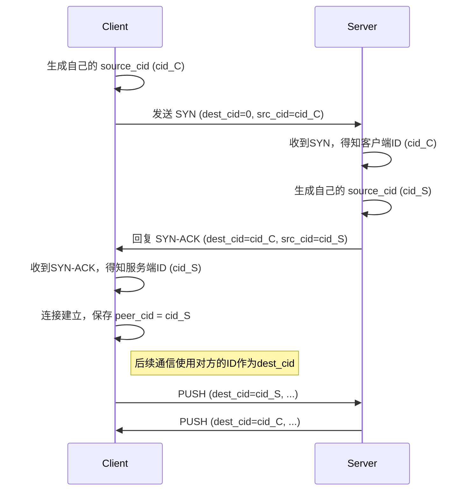

# 2.3: 双向连接ID握手

**功能描述:**

协议采用了一种安全的双向连接ID（Connection ID, CID）握手机制，取代了传统依赖五元组（源IP、源端口、目标IP、目标端口、协议）来标识连接的方式。每个端点都会为连接选择一个随机的32位ID，用于后续的所有通信。这套机制是实现连接迁移（NAT穿透）功能的核心基础。

**实现位置:**

- **ID 定义**: `src/packet/header.rs`: `LongHeader` 中定义了 `destination_cid` 和 `source_cid`。
- **握手逻辑**:
    - `src/socket/actor.rs`: 客户端连接发起和服务端连接受理。
    - `src/core/endpoint/logic.rs`: 客户端处理 `SYN-ACK`。

### 握手流程

1.  **客户端发起 (`SYN`)**:
    - 客户端在发起连接时，首先会用 `rand::random()` 生成一个随机的32位数字作为自己的连接ID，我们称之为 `cid_C`。
    - 它构造一个 `SYN` 包，在其长头部中设置 `source_cid = cid_C`。因为此时它还不知道服务器将选择哪个ID，所以 `destination_cid` 通常被设置为0。
    - `SocketActor` 会为这个未来的连接创建一个 `Endpoint` 任务。

2.  **服务器响应 (`SYN-ACK`)**:
    - 服务器的 `SocketActor` 收到 `SYN` 包后，从 `source_cid` 字段中解析出 `cid_C`。
    - 服务器也为这个连接生成一个自己唯一的随机ID，我们称之为 `cid_S`。
    - 服务器构造一个 `SYN-ACK` 包进行回复，在其长头部中，将 `source_cid` 设置为自己的ID (`cid_S`)，并将 `destination_cid` 设置为它刚刚从客户端收到的ID (`cid_C`)。
    - 同时，`SocketActor` 在其 `connections` 和 `addr_to_cid` 哈希表中记录下 `cid_S` 与客户端 `SocketAddr` 的映射关系。

3.  **客户端确认**:
    - 客户端的 `Endpoint` 任务收到 `SYN-ACK` 后，从其 `source_cid` 字段中解析出服务器的ID (`cid_S`)，并将其保存为 `peer_cid`（对端ID）。
    - 至此，双方都拥有了对方的连接ID，握手完成，连接进入 `Established` 状态。

### 后续通信

握手完成后，所有的后续数据包（使用 `ShortHeader`）都会在 `connection_id` 字段中填入**对方的CID**。`SocketActor` 在收到数据包时，会直接使用这个ID从 `connections` 哈希表中查找对应的 `Endpoint` 任务进行分发，而不再依赖于源 `SocketAddr`，这使得连接与网络地址解耦，为连接迁移铺平了道路。 