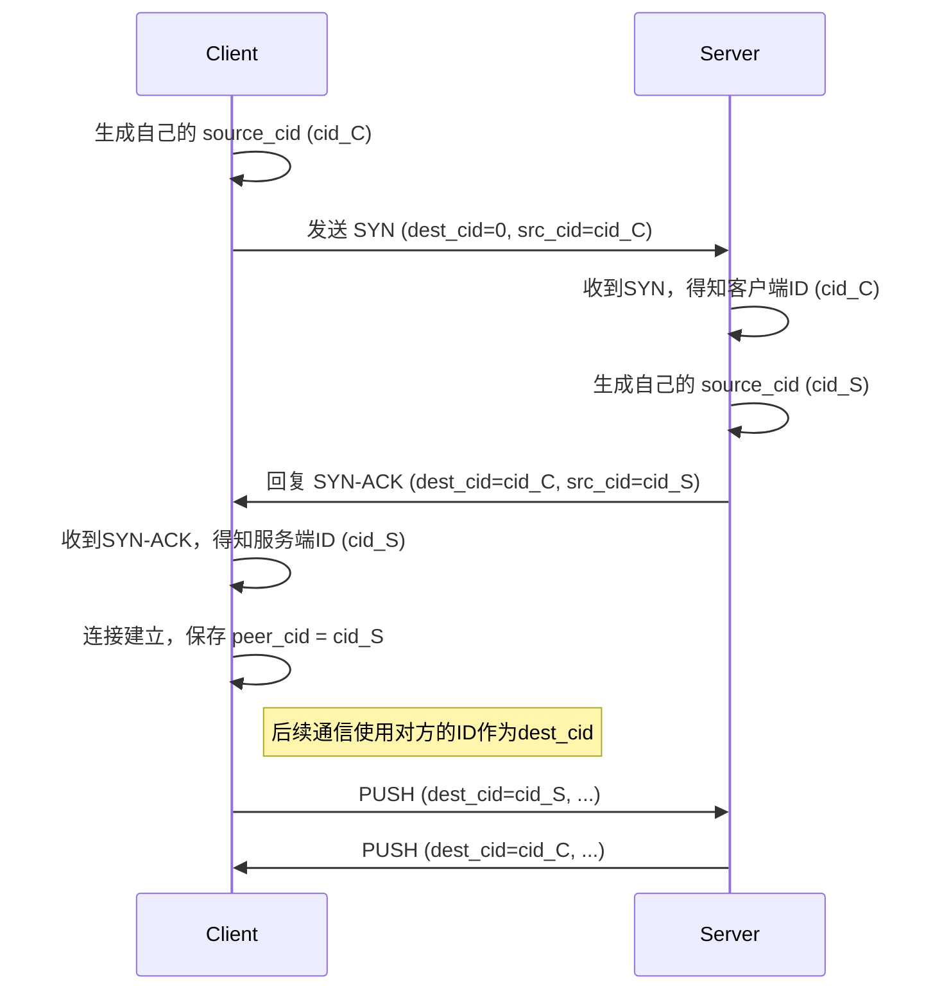
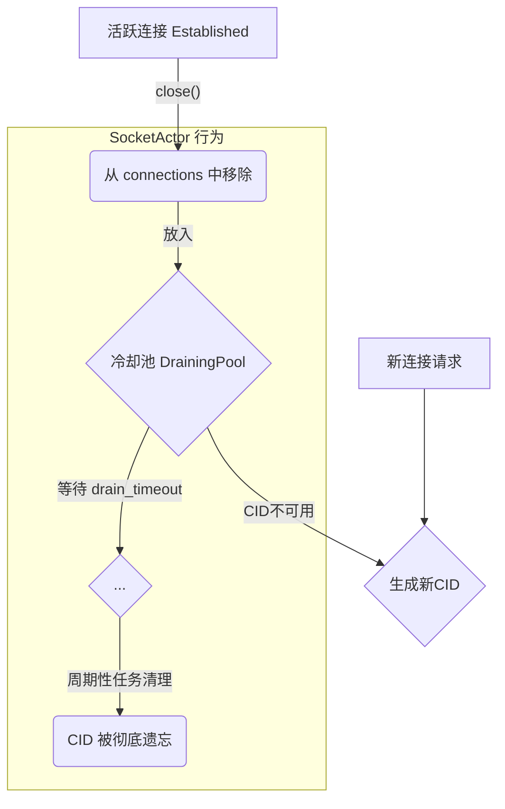

# 3: 双向连接ID握手

**功能描述:**

协议采用了一种安全的双向连接ID（Connection ID, CID）握手机制，取代了传统依赖五元组（源IP、源端口、目标IP、目标端口、协议）来标识连接的方式。每个端点都会为连接选择一个随机的32位ID，用于后续的所有通信。这套机制是实现连接迁移（NAT穿透）功能的核心基础。

**实现位置:**

- **ID 定义**: `src/packet/header.rs`: `LongHeader` 中定义了 `destination_cid` 和 `source_cid`。
- **握手逻辑**:
    - `src/socket/actor.rs`: 客户端连接发起和服务端连接受理。
    - `src/core/endpoint/logic.rs`: 客户端处理 `SYN-ACK`。

### 握手流程

### `SocketAddr` 在握手期间的角色 (Role of `SocketAddr` During Handshake)

虽然本协议的核心是基于CID进行路由以解耦网络地址，但在握手建立的初始阶段，`SocketAddr` 扮演了一个至关重要的“引导”角色。

1.  **初始SYN的挑战**: 客户端发出的第一个 `SYN` 包，其 `destination_cid` 为0，因此服务端的 `SocketActor` 无法通过CID来路由它。

2.  **建立地址映射**: 当 `SocketActor` 收到这个 `SYN` 后，它会识别出这是一个新的连接请求。在创建对应的 `Endpoint` 任务时，它会生成一个服务器侧的CID（`cid_S`），并立即在内部的一个辅助哈希表 `addr_to_cid` 中，创建一个从客户端地址到该CID的映射：`client_addr -> cid_S`。

3.  **处理重传的关键**: 这个地址映射在握手阶段的主要作用，是正确处理客户端的`SYN`重传。如果客户端因为没有收到`SYN-ACK`而重发了`SYN`包，`SocketActor`会利用`client_addr`在`addr_to_cid`中查找到之前为这个地址创建的、处于“半开”状态的连接。这使得`SocketActor`能够识别出这是一个重复的请求，而不是一个全新的连接尝试，从而采取正确的策略（在我们的实现中是替换掉旧的连接尝试），避免了为同一个客户端创建多个冗余的`Endpoint`实例。

4.  **向CID路由的过渡**: 一旦握手完成（客户端收到了`SYN-ACK`），所有后续的数据包都将携带明确的`destination_cid`。`SocketActor`将完全依赖这个CID在主`connections`哈希表中进行查找和分发，**不再需要`addr_to_cid`来辅助路由**。

5.  **映射的保留与清理**: 尽管在握手完成后就不再用于路由，但`addr_to_cid`中的这条映射关系会一直保留。这是因为它还承担着第二个重要功能：支持连接迁移。如果连接的对端地址发生变化，这个映射关系将是识别和验证新路径的基础。该映射只有在连接被完全关闭，其CID进入`DrainingPool`并最终被清理时，才会被彻底移除。

### 后续通信

握手完成后，所有的后续数据包（使用 `ShortHeader`）都会在 `connection_id` 字段中填入**对方的CID**。`SocketActor` 在收到数据包时，会直接使用这个ID从 `connections` 哈希表中查找对应的 `Endpoint` 任务进行分发，而不再依赖于源 `SocketAddr`，这使得连接与网络地址解耦，为连接迁移铺平了道路。

### CID 生命周期与 TIME_WAIT 状态 (CID Lifecycle & TIME_WAIT State)

为了防止已关闭连接的“迷途报文”干扰新建立的连接，协议实现了一个类似于TCP `TIME_WAIT` 的机制来管理CID的生命周期。直接重用刚关闭的CID是危险的，因为网络中可能仍有属于旧连接、但带有该CID的数据包正在传输。

**实现位置:**

- **核心逻辑**: `src/socket/draining.rs`: `DrainingPool` 结构体。
- **集成**: `src/socket/actor.rs`: `SocketActor` 使用 `DrainingPool` 来管理CID的清理。

**工作流程:**

1.  **连接关闭**: 当一个 `Endpoint` 任务终止时（无论是正常关闭、超时还是出错），它会通过一个 `RemoveConnection` 命令通知 `SocketActor`。
2.  **进入冷却池**: `SocketActor` 收到该命令后，并不会立即忘记这个连接的CID。相反，它会将该CID从活跃连接表 (`connections`) 中移除，然后放入一个专门的“冷却池” (`DrainingPool`) 中。
3.  **冷却期**: CID会在冷却池中停留一段预设的时间（由 `Config.drain_timeout` 定义）。在此期间：
    *   任何发往该CID的数据包都会被安全地忽略。
    *   `SocketActor` 在为新连接分配CID时，会检查并避开所有在冷却池中的CID，防止过早重用。
4.  **最终清理**: `SocketActor` 有一个周期性的清理任务，它会定期检查冷却池，并将所有已经超过 `drain_timeout` 时限的CID彻底清除。只有到这时，这些CID才有可能被未来的新连接重新使用。

这个机制确保了即使在网络状况不佳、存在大量延迟报文的情况下，协议的稳定性和安全性也能得到保障。 