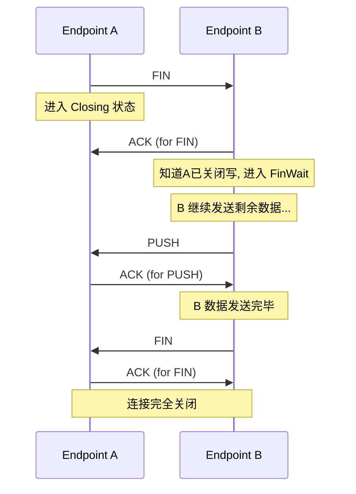

# 4: 0-RTT 连接与四次挥手

**功能描述:**

协议实现了高效的连接生命周期管理，包括支持0-RTT/1-RTT的快速连接建立机制，以及标准的四次挥手来确保连接被优雅、可靠地关闭，防止数据丢失。

**实现位置:**

- **状态机定义**: `src/core/endpoint/state.rs`
- **核心逻辑**: `src/core/endpoint/logic.rs`
- **顶层协调**: `src/socket/actor.rs`

### 1. 0-RTT/1-RTT 连接建立

协议通过延迟发送 `SYN-ACK` 的方式，优雅地统一了 0-RTT 和 1-RTT 的连接流程。

- **0-RTT (客户端有初始数据)**:
    1.  **客户端**: 用户在调用 `connect` 时可以附带初始数据。这些数据会被打包进第一个 `SYN` 包中一同发送。
    2.  **服务端**: 服务器收到带数据的 `SYN` 后，会立即创建一个 `Endpoint` 任务并向上层应用返回一个 `Stream` 句柄，但此时连接状态为 `SynReceived`，并**不立刻回复 `SYN-ACK`**。
    3.  **触发**: 当服务器端应用准备好并首次调用 `stream.write()` 发送数据时，`Endpoint` 才会将 `SYN-ACK` 和这第一批应用数据**合并到同一个UDP包中**发送给客户端。
    4.  **客户端**: 收到 `SYN-ACK` 和数据，连接建立，同时读出第一批数据。

- **1-RTT (客户端无初始数据)**:
    - 流程与0-RTT类似，只是客户端的第一个 `SYN` 包不包含数据。服务端的 `SYN-ACK` 也可能不包含数据（如果服务端应用没有立即写入），但整个交互的模式是相同的。

这种设计确保了 `SYN-ACK` 的发送总是与服务器的实际就绪状态同步，避免了发送空的 `SYN-ACK`，提高了效率。

### 2. 四次挥手关闭

协议实现了标准的四次挥手，以确保双方的数据都能被完整发送和确认。

- **发起方 (A)**:
    1.  当用户调用 `stream.close()`，`Endpoint` A 进入 `Closing` 状态。
    2.  它会发送一个 `FIN` 包给B，然后停止接受新的用户数据，但会继续等待已发送数据的ACK。

- **响应方 (B)**:
    1.  `Endpoint` B 收到 `FIN` 后，立即回复一个 `ACK`。
    2.  B 进入 `FinWait` 状态，这意味着它知道A不会再发送任何新数据了。此时，B的应用层在调用 `stream.read()` 时会得到 `Ok(0)` (EOF)。
    3.  B 仍然可以继续发送它缓冲区里尚未发送完毕的数据。

- **完成关闭**:
    1.  当 B 发送完所有数据后，它也会发送一个 `FIN` 包给 A。
    2.  A 收到 B 的 `FIN` 后，回复最后一个 `ACK`。
    3.  此时，双方都确认对方已经关闭，连接被完全拆除，`Endpoint` 任务终止。

这个过程由 `src/core/endpoint/state.rs` 中定义的 `Connecting`, `Established`, `Closing`, `FinWait`, `Closed` 状态机精确驱动。 