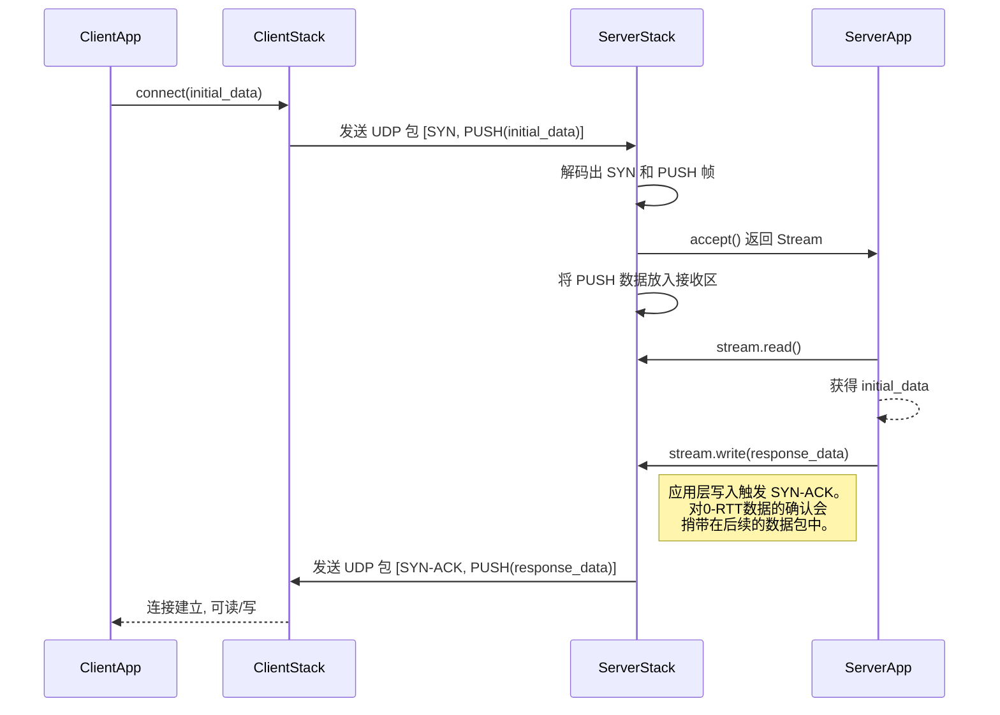
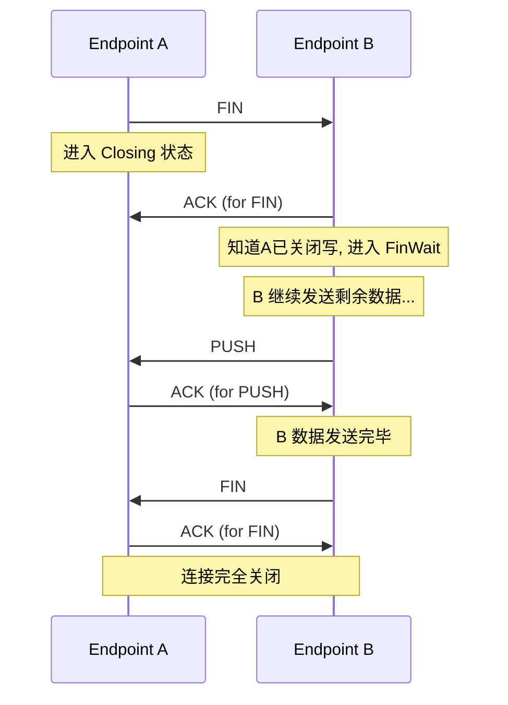

# 4: 0-RTT 连接与四次挥手

**功能描述:**

协议实现了高效的连接生命周期管理，包括支持0-RTT/1-RTT的快速连接建立机制，以及标准的四次挥手来确保连接被优雅、可靠地关闭，防止数据丢失。

**实现位置:**

- **状态机定义**: `src/core/endpoint/state.rs`
- **核心逻辑**: `src/core/endpoint/logic.rs` (主要在 `handle_frame_*` 系列函数和 `handle_stream_command` 中)
- **顶层协调**: `src/socket/actor.rs`

### 1. 0-RTT/1-RTT 连接建立

协议通过**帧聚合 (Packet Coalescing)** 和 **延迟发送 `SYN-ACK`** 的方式，优雅地统一了 0-RTT 和 1-RTT 的连接流程。

- **0-RTT (客户端有初始数据)**:
    1.  **客户端**: 当用户调用 `connect` 并提供初始数据时，客户端协议栈会创建一个**无载荷的`SYN`帧**，并将初始数据打包成一个或多个`PUSH`帧。这些帧会被**聚合（Coalesce）**到同一个UDP数据报中一次性发出。
    2.  **服务端接收与处理**:
        *   `SocketActor` 收到数据报后，会解码出其中所有的帧（一个`SYN`和若干`PUSH`）。
        *   识别到第一个帧是`SYN`后，它会创建一个新的`Endpoint`任务（状态为`SynReceived`）并向上层返回一个`Stream`句柄。
        *   关键地，`SocketActor`会**立即**将`SYN`帧之后的所有`PUSH`帧转发给这个新创建的`Endpoint`。
    3.  **数据立即可用**: `Endpoint`在启动后，其接收队列中已经有了0-RTT数据。这些数据被正常处理并放入接收缓冲区，因此服务器应用几乎可以立刻通过`stream.read()`读到这份数据，真正实现0-RTT。
    4.  **服务端响应**:
        *   为了网络效率，服务器在收到0-RTT的`PUSH`帧后，并**不会**立即回复一个独立的`ACK`。
        *   当服务器应用调用`stream.write()`发送响应数据时，`Endpoint`才会将`SYN-ACK`帧和包含响应数据的`PUSH`帧聚合在一起发送给客户端。对0-RTT数据的确认信息（更新的期望收包序号`recv_next_sequence`）会**捎带**在这些出站数据包的头部中，从而避免了额外的ACK网络开销。

- **1-RTT (客户端无初始数据)**:
    - 流程简化：客户端只发送一个单独的`SYN`帧。服务器收到后，创建`Endpoint`并返回`Stream`。当服务器应用调用`stream.write()`时，会发送`SYN-ACK`（可能聚合了数据），完成握手。

这种设计确保了 `SYN-ACK` 的发送总是与服务器的实际就绪状态同步，提高了效率。

### 2. 四次挥手关闭

协议实现了标准的四次挥手，以确保双方的数据都能被完整发送和确认。

- **发起方 (A)**:
    1.  当用户调用 `stream.close()`，`Endpoint` A 进入 `Closing` 状态。
    2.  它会发送一个 `FIN` 包给B，然后停止接受新的用户数据，但会继续等待已发送数据的ACK。

- **响应方 (B)**:
    1.  `Endpoint` B 收到 `FIN` 后，立即回复一个 `ACK`。
    2.  B 进入 `FinWait` 状态，这意味着它知道A不会再发送任何新数据了。此时，B的应用层在调用 `stream.read()` 时会得到 `Ok(0)` (EOF)。
    3.  B 仍然可以继续发送它缓冲区里尚未发送完毕的数据。

- **完成关闭**:
    1.  当 B 发送完所有数据后，它也会发送一个 `FIN` 包给 A。
    2.  A 收到 B 的 `FIN` 后，回复最后一个 `ACK`。
    3.  此时，双方都确认对方已经关闭，连接被完全拆除，`Endpoint` 任务终止。

这个过程由 `src/core/endpoint/state.rs` 中定义的 `Connecting`, `Established`, `Closing`, `FinWait`, `Closed` 状态机精确驱动。 