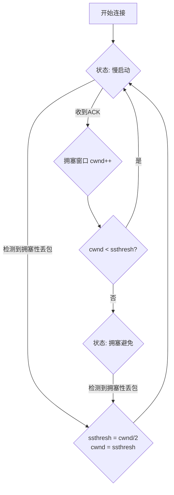

# 9: 拥塞控制之慢启动 (Slow Start)

**功能描述:**

协议采用“慢启动”算法作为拥塞控制的初始阶段。这允许连接在建立之初，快速地、指数级地增加其发送速率，以尽快探测到网络的可用带宽上限，从而在保证网络稳定性的前提下，迅速达到较高的吞吐量。

**实现位置:**

- **核心逻辑**: `src/core/reliability/congestion/vegas.rs` (`Vegas::on_ack`, `Vegas::on_packet_loss`)
- **状态定义**: `src/core/reliability/congestion/vegas.rs` (`State` enum)
- **相关配置**: `src/config.rs` (`Config::initial_cwnd_packets`, `Config::initial_ssthresh`)

### 慢启动工作原理

慢启动是基于拥塞窗口 (`cwnd`) 的一种增长机制。`cwnd` 决定了发送方在收到确认（ACK）之前，最多可以发送多少个数据包。



1.  **初始状态**:
    -   当一个新连接建立时，它会进入 `SlowStart` 状态。
    -   拥塞窗口 (`cwnd`) 被初始化为一个较小的值，由配置中的 `initial_cwnd_packets` 决定（默认为32个包）。
    -   慢启动阈值 (`ssthresh`) 被设置为一个非常大的值 (`u32::MAX`)，确保连接一开始就能执行慢启动。

2.  **窗口增长 (指数增长)**:
    -   在 `SlowStart` 状态下，每当发送方收到一个有效的 `ACK`，它就会将 `cwnd` 的值增加1。
    -   `Vegas::on_ack` 方法实现了这个逻辑。由于发送方在一个 RTT（往返时间）内可能会收到前一个窗口内所有数据包的ACK，这实际上导致 `cwnd` 大约每经过一个 RTT 就会翻倍，实现了发送速率的指数级增长。

3.  **退出慢启动**:
    -   当 `cwnd` 的值增长到等于或超过 `ssthresh` 时，慢启动过程结束。
    -   连接状态从 `SlowStart` 切换到 `CongestionAvoidance`（拥塞避免）。在这个新阶段，`cwnd` 的增长会变得更加平缓和线性，以避免造成网络拥塞。

4.  **因丢包进入慢启动**:
    -   如果在任何时候检测到了**拥塞性丢包**（通过RTT显著增加等启发式方法判断），协议会认为网络发生了拥塞。
    -   `Vegas::on_packet_loss` 会立即采取行动：
        -   将 `ssthresh` 更新为当前 `cwnd` 的一半。
        -   将 `cwnd` 也重置为这个新计算出的 `ssthresh` 值。
        -   将状态强制切换回 `SlowStart`，重新开始增长过程。

这种“乘性减、加性增”（AIMD）的变体策略，结合慢启动，构成了协议拥塞控制的核心，使其能够高效地利用带宽，同时在出现拥塞时能快速避让。

### 测试验证 (Test Validation)

慢启动机制的各个方面都在 `src/congestion/tests.rs` 中得到了全面的单元测试，确保其行为与设计一致。

1.  **验证初始状态**: `test_vegas_initial_state` 确保新创建的控制器处于 `SlowStart` 状态，并具有正确的初始 `cwnd`。

    ```rust
    #[test]
    fn test_vegas_initial_state() {
        let config = test_config();
        let vegas = Vegas::new(config);

        assert_eq!(vegas.congestion_window(), 10);
        assert_eq!(vegas.state, State::SlowStart);
    }
    ```

2.  **验证窗口增长**: `test_vegas_slow_start` 验证了在慢启动期间，每次收到ACK，`cwnd` 都会加1。

    ```rust
    #[test]
    fn test_vegas_slow_start() {
        // ... setup ...
        assert_eq!(vegas.congestion_window(), 10);
        vegas.on_ack(Duration::from_millis(100));
        assert_eq!(vegas.congestion_window(), 11);
    }
    ```

3.  **验证状态转换**: `test_vegas_transition_to_congestion_avoidance` 确保当 `cwnd` 达到 `ssthresh` 时，状态会切换到拥塞避免。

    ```rust
    #[test]
    fn test_vegas_transition_to_congestion_avoidance() {
        let mut vegas = Vegas::new(test_config());
        vegas.congestion_window = 19;
        vegas.slow_start_threshold = 20;

        vegas.on_ack(Duration::from_millis(100)); // cwnd becomes 20
        assert_eq!(vegas.congestion_window(), 20);
        assert_eq!(vegas.state, State::CongestionAvoidance);
    }
    ```

4.  **验证对拥塞丢包的反应**: `test_vegas_congestive_loss_reaction` 验证了发生拥塞丢包后，`ssthresh` 和 `cwnd` 会被正确重置，并重新进入慢启动。

    ```rust
    #[test]
    fn test_vegas_congestive_loss_reaction() {
        // ... setup with cwnd = 20 and congestive RTT ...
        vegas.on_packet_loss(Instant::now());

        // ssthresh should be cwnd / 2 = 10
        assert_eq!(vegas.slow_start_threshold, 10);
        // cwnd should be reset to new ssthresh
        assert_eq!(vegas.congestion_window(), 10);
        // State should revert to SlowStart
        assert_eq!(vegas.state, State::SlowStart);
    }
    ```
