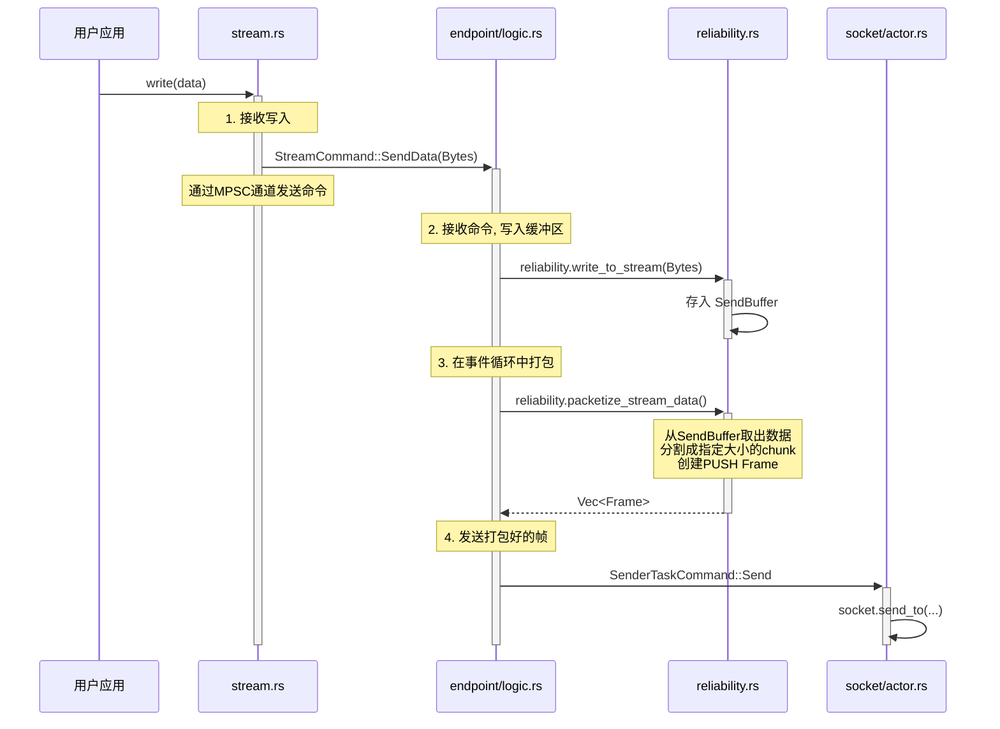
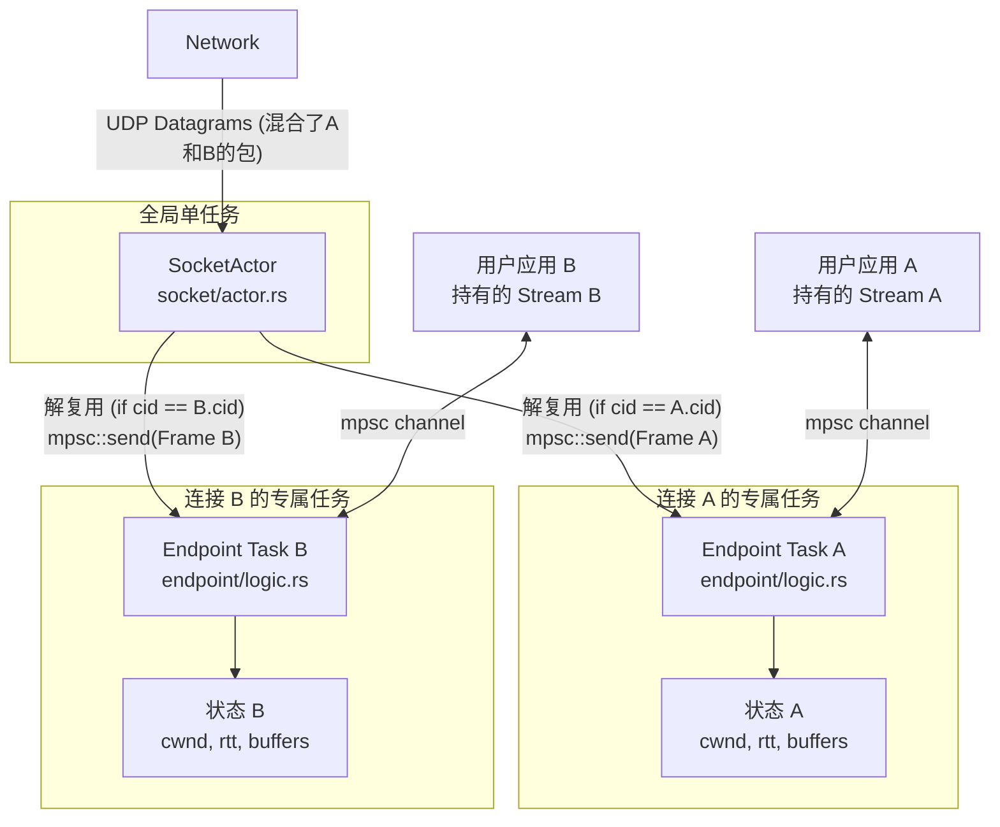

# 10. 数据流到数据包的转换 (Stream-to-Packet)

**功能描述:**

协议将用户通过 `AsyncWrite` trait 写入 `Stream` 的连续字节流，高效地、可靠地转换为一个个离散的、带有协议头的 `PUSH` 数据帧（Frame）。这个过程是实现面向流的API的关键，它将底层的包交换细节完全对用户透明。

该过程涉及多个核心组件的异步协作，遵循 **“接收 -> 缓冲 -> 分割打包 -> 发送”** 的核心流程。

### 核心流程图

### 详细步骤解析

#### 1. 接收写入 (`src/core/stream.rs`)

-   **入口**: 用户调用 `stream.write()` 或其他 `AsyncWrite` 方法。
-   **实现**: `Stream` 结构体实现了 `AsyncWrite` trait。其 `poll_write` 方法接收用户数据。
-   **动作**:
    1.  `poll_write` 将传入的字节切片 (`&[u8]`) 复制到一个 `Bytes` 对象中。
    2.  `Bytes` 对象被包装进 `StreamCommand::SendData` 命令。
    3.  该命令通过一个无锁的MPSC通道 (`tx_to_endpoint`) 发送给对应的 `Endpoint` 任务进行处理。

#### 2. 接收命令，写入缓冲区 (`src/core/endpoint/logic.rs`)

-   **入口**: `Endpoint` 的主事件循环 (`run` 方法) 从其 `rx_from_stream` 通道接收到 `StreamCommand::SendData` 命令。
-   **实现**: `handle_stream_command` 函数处理该命令。
-   **动作**:
    1.  `Endpoint` 调用 `self.reliability.write_to_stream(&data)`。
    2.  `ReliabilityLayer` 进一步将数据写入其内部的 `SendBuffer`。
    3.  至此，用户数据被高效地追加到了连接的发送缓冲区中，等待被打包。

#### 3. 在事件循环中打包 (`src/core/reliability.rs`)

-   **入口**: 在 `Endpoint` 的 `run` 方法中，每次事件处理（如接收到网络包或用户命令）结束后，都会尝试发送数据。
-   **实现**: `Endpoint` 调用 `self.packetize_and_send()`，该方法内部会调用 `self.reliability.packetize_stream_data()`。
-   **动作**: 这是从**流到包**转换的核心步骤。`packetize_stream_data` 函数：
    1.  **检查发送许可**: 首先根据拥塞控制窗口（`cwnd`）和对方的接收窗口，计算出当前可以发送多少个数据包。
    2.  **循环打包**: 在发送许可范围内进行循环。
    3.  **分割数据**: 在每次循环中，从 `SendBuffer` 中取出不超过 `config.max_payload_size` 的数据块（`chunk`）。
    4.  **创建帧**: 使用 `Frame::new_push()` 安全构造函数，将 `chunk` 包装成一个 `PUSH` 帧。此构造函数会自动填充所有头部信息（连接ID、序列号、时间戳、`payload_length`等）。
    5.  **收集帧**: 将创建好的帧添加到一个 `Vec<Frame>` 中。
    6.  **返回结果**: 函数返回一个包含一个或多个 `PUSH` 帧的向量。

#### 4. 发送打包好的帧 (`src/core/endpoint/logic.rs`)

-   **入口**: `Endpoint` 获取到 `packetize_stream_data()` 返回的 `Vec<Frame>`。
-   **实现**: `Endpoint` 的 `send_frames()` (或类似) 方法。
-   **动作**:
    1.  `Endpoint` 将 `Vec<Frame>` 包装进一个 `SenderTaskCommand::Send` 命令。
    2.  该命令通过另一个MPSC通道发送给全局唯一的 `SocketActor`。
    3.  `SocketActor` 接收到命令后，负责将这些帧序列化为字节，并通过底层的UDP套接字发送到网络。

通过这个分层、解耦的设计，协议将用户写入的任意大小的字节流，平滑地转换为符合拥塞控制和流量控制的、大小合适的、带有完整协议头的网络数据包。

---

## 并发环境下的连接隔离

上述流程描述了单个连接的数据流。在真实的服务端场景中，协议需要同时处理成百上千个并发连接。本协议通过 **“每个连接一个独立任务”** 的模式，确保了不同连接之间的状态是完全隔离的。

### 核心隔离模型

`SocketActor` 扮演了“总前台”或“网络交换机”的角色，而每个 `Endpoint` 任务则是一个完全独立的“工作单元”。

### 隔离机制详解

1.  **统一接收与解复用 (`SocketActor`)**:
    -   **职责**: `SocketActor` 是系统中唯一的网络入口，它拥有`UdpSocket`并接收所有传入的数据报。
    -   **隔离点**: `SocketActor` 读取每个帧头部的 `destination_cid`（连接ID），并以此为依据，在一个 `HashMap<u32, ConnectionMeta>` 中查找对应的 `Endpoint` 任务的通道。它只负责将数据包**路由**到正确的任务，不处理任何连接特定的逻辑。

2.  **独立的状态处理 (`Endpoint` Task)**:
    -   **职责**: 每个 `Endpoint` 任务在一个独立的 `tokio::task` 中运行，并拥有该连接**所有**的状态，包括独立的 `ReliabilityLayer`（发送/接收缓冲区）、拥塞控制器、RTT估算器和状态机。
    -   **隔离点**:
        -   **数据隔离**: 连接 A 的数据只会被路由到 `Endpoint A`，因此 `Endpoint B` 永远不会接触到 A 的数据。
        -   **状态隔离**: 连接 A 的丢包只会影响其自身的拥塞窗口和 RTO，与连接 B 无关。
        -   **故障隔离**: 即使连接 A 的用户应用处理缓慢，导致其缓冲区填满，也只会阻塞连接 A。`SocketActor` 依然可以正常分发其他连接的数据包，避免了队头阻塞问题。

这种 **“中央路由 + 独立工作单元”** 的设计，从根本上保证了数据、状态和性能在不同连接间的隔离，是协议能够支撑高并发服务的基础。 