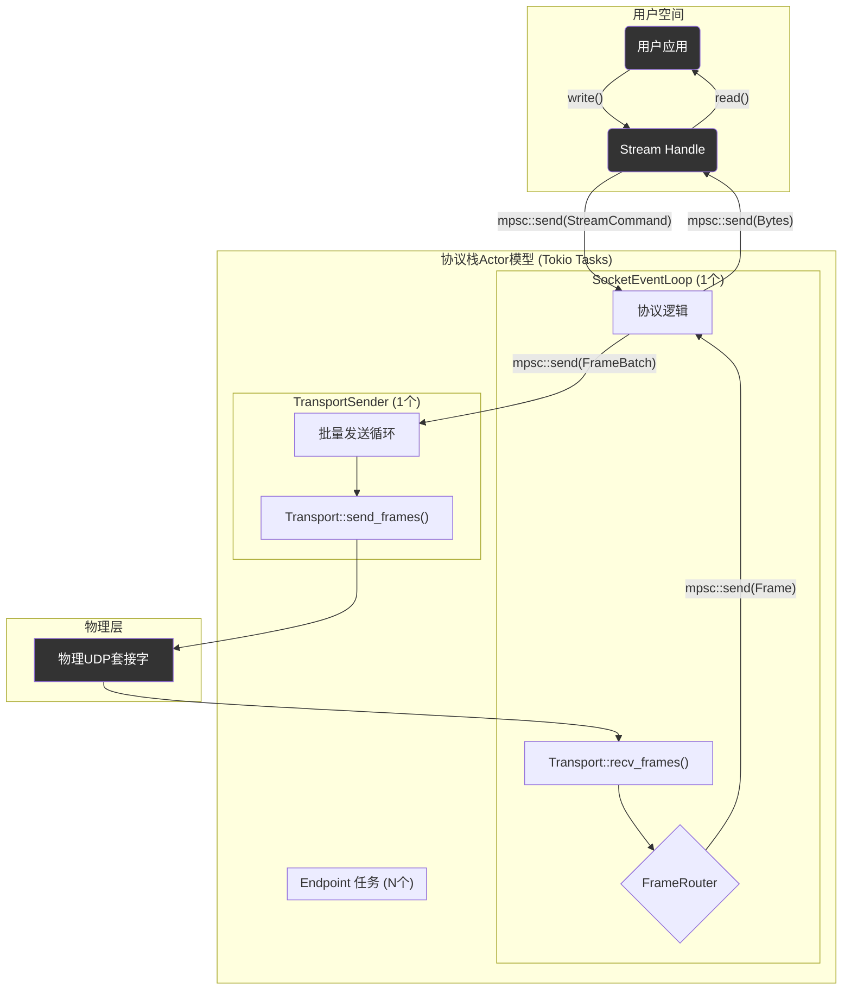

# 1: 基于MPSC的无锁并发模型

**功能描述:**

协议在架构层面遵循了**Actor模型**的核心思想，通过`tokio::sync::mpsc`（多生产者，单消费者）通道进行任务间的异步消息传递，彻底避免了对共享状态的锁定（如`Mutex`）。这套无锁并发模型是协议实现高性能、高并发处理能力的关键。

**实现位置:**

这是一个贯穿整个项目的架构模式，其核心组件包括：

- `src/socket/handle.rs`: 用户API句柄 (`TransportReliableUdpSocket`, `Stream`)，作为消息的**生产者**。
- `src/socket/event_loop.rs`: 中央`SocketEventLoop`任务，作为网络事件和用户命令的**消费者**。
- `src/socket/transport/sender.rs`: 独立的`transport_sender_task`，作为发送命令的**消费者**。
- `src/core/endpoint.rs`: 每个连接的`Endpoint`任务，作为网络帧和流命令的**消费者**。

### 1. 核心Actor与任务划分

系统被划分为几个独立的、由`tokio::spawn`运行的异步任务，实现了清晰的读写路径分离：

1.  **`SocketEventLoop` (主接收与路由任务)**: 这是系统的“大脑”。它拥有底层`Transport`的**接收权**，在一个`select!`循环中统一处理所有事件：
    *   **网络事件**: 从`Transport`接收UDP数据报，解码成`Frame`后，交由`FrameRouter`根据连接ID（CID）智能地路由给对应的`Endpoint`任务。
    *   **API命令**: 接收来自用户API（如`connect`）的命令，并执行相应的操作（如创建新的`Endpoint`任务）。
    *   **内部命令**: 接收来自`Endpoint`的内部通知（如连接关闭）。

2.  **`transport_sender_task` (批量发送任务)**: 这是**唯一**一个有权向底层`Transport`写入数据的任务。所有`Endpoint`任务需要发送数据时，都会将待发送的`FrameBatch`通过一个全局MPSC通道发送给它。`transport_sender_task`会批量聚合这些请求，在一次系统调用中完成发送，以优化性能。

3.  **`Endpoint`任务 (每个连接一个任务)**: 每个独立的连接都由一个专属的`Endpoint`任务管理。这个任务拥有该连接的所有状态（`ReliabilityLayer`、拥塞状态等），它消费来自`SocketEventLoop`（网络帧）和用户`Stream`句柄（用户数据）的消息，在内部驱动协议状态机，并将产生的待发数据提交给`transport_sender_task`。

### 2. 消息流图

- **数据写入 (Write Path)**: `User App` -> `Stream::write()` -> `mpsc::send` -> `Endpoint`任务 -> `mpsc::send(FrameBatch)` -> `transport_sender_task` -> `Transport` -> `UdpSocket`。
- **数据读取 (Read Path)**: `UdpSocket` -> `Transport` -> `SocketEventLoop` -> `FrameRouter` -> `mpsc::send(Frame)` -> `Endpoint`任务 -> `mpsc::send(Bytes)` -> `Stream::read()` -> `User App`。

### 3. 无锁的优势

- **性能**: 避免了锁的开销，尤其是在高争用情况下的上下文切换和系统调用。
- **无死锁**: 由于不存在锁，从根本上消除了死锁的可能性。
- **代码清晰**: 每个任务拥有自己私有的状态（Stateful Actor），逻辑边界清晰，易于理解和推理，极大地降低了并发编程的复杂性。
- **读写分离**: 将I/O的读写操作分离到不同的任务中，避免了相互干扰，进一步提升了吞吐量和响应性。