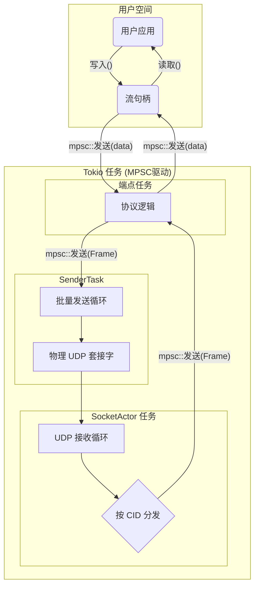

# 3.1: 基于MPSC的无锁并发模型

**功能描述:**

协议在架构层面遵循了**Actor模型**的核心思想，通过`tokio::sync::mpsc`（多生产者，单消费者）通道进行任务间的异步消息传递，彻底避免了对共享状态的锁定（如`Mutex`）。这套无锁并发模型是协议实现高性能、高并发处理能力的关键。

**实现位置:**

这是一个贯穿整个项目的架构模式，其核心组件包括：

- `src/socket/handle.rs`: 用户API句柄 (`ReliableUdpSocket`, `Stream`)，作为消息的**生产者**。
- `src/socket/actor.rs`: 中央`SocketActor`任务，作为消息的**消费者**。
- `src/socket/sender.rs`: 独立的`SenderTask`，作为发送消息的**消费者**。
- `src/core/endpoint.rs`: 每个连接的`Endpoint`任务，作为消息的**消费者**。

### 1. 核心Actor与任务划分

系统被划分为几个独立的、由`tokio::spawn`运行的异步任务：

1.  **`SocketActor` (主接收与分发任务)**: 这是系统的“中枢神经”。它拥有`UdpSocket`的接收权，在一个循环中不断接收UDP数据包，并根据连接ID将包通过MPSC Channel分发给对应的`Endpoint`任务。它还负责处理创建新连接等管理命令。

2.  **`SenderTask` (主发送任务)**: 这是**唯一**一个有权向`UdpSocket`写入数据的任务。所有`Endpoint`任务需要发送数据时，都会将待发送的帧打包成命令，通过一个全局的MPSC Channel发送给`SenderTask`。`SenderTask`会批量处理这些命令，并将数据写入Socket。这种方式将写操作集中化，避免了多任务同时写Socket的竞争。

3.  **`Endpoint`任务 (每个连接一个任务)**: 每个独立的连接都由一个专属的`Endpoint`任务管理。这个任务拥有该连接的所有状态（如可靠性层、拥塞控制状态等），它消费来自`SocketActor`（网络数据）和用户`Stream`句柄（用户数据）的消息，并在内部驱动协议状态机。

### 2. 消息流图

- **数据写入 (Write Path)**: `User App` -> `Stream::write()` -> `mpsc::send` -> `Endpoint`任务 -> `mpsc::send` -> `SenderTask` -> `UdpSocket`。
- **数据读取 (Read Path)**: `UdpSocket` -> `SocketActor` -> `mpsc::send` -> `Endpoint`任务 -> `mpsc::send` -> `Stream::read()` -> `User App`。

### 3. 无锁的优势

- **性能**: 避免了锁的开销，尤其是在高争用情况下的上下文切换和系统调用。
- **无死锁**: 由于不存在锁，从根本上消除了死锁的可能性。
- **代码清晰**: 每个任务拥有自己私有的状态，逻辑边界清晰，易于理解和推理，降低了并发编程的复杂性。 