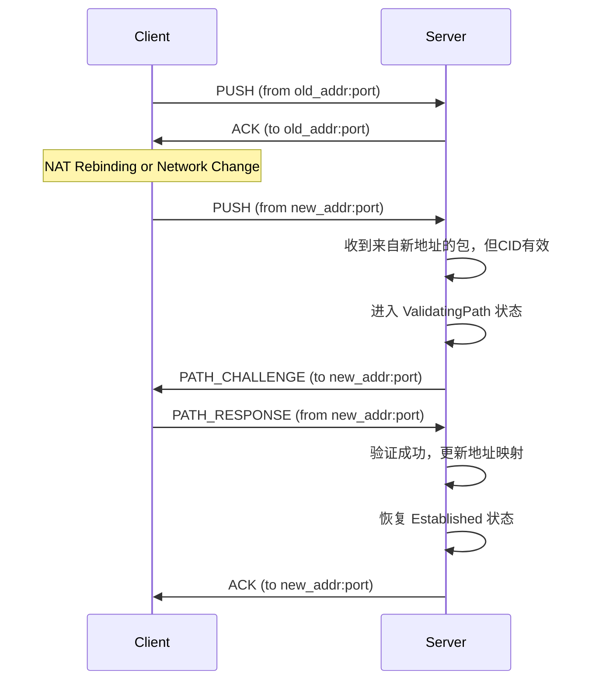

# 3.2: 流迁移与NAT穿透

**功能描述:**

协议完全实现了连接迁移（Connection Migration）机制，以应对客户端因NAT重新绑定（NAT Rebinding）或网络切换（如Wi-Fi切换到4G）而导致的IP地址和端口变化。这显著提升了连接在移动网络和复杂NAT环境下的稳定性。

**实现位置:**

- **状态机**: `src/core/endpoint/state.rs` (`ValidatingPath` 状态)
- **核心逻辑**: `src/core/endpoint/logic.rs` (`handle_frame`, `handle_stream_command`)
- **地址更新协调**: `src/socket/actor.rs` (`UpdateAddr` 命令)
- **API暴露**: `src/core/stream.rs` (提供了`migrate`方法)

### 1. 核心机制：连接与地址解耦

流迁移的基础在于协议不使用IP和端口来标识一个连接，而是使用在握手阶段建立的**双向连接ID (CID)**。`SocketActor` 维护着 `ConnectionId -> Connection` 的主映射，以及 `SocketAddr -> ConnectionId` 的辅助映射。这使得辅助映射可以被动态更新，而主连接状态保持不变。

### 2. 被动迁移 (Passive Migration)

这是最常见的场景，由协议栈自动处理，用户无感知。

1.  **触发**: 当服务器的 `Endpoint` 处于 `Established` 状态时，收到了一个带有有效CID的数据包，但其源 `SocketAddr` 与之前记录的 `remote_addr` **不匹配**。
2.  **路径验证**: `Endpoint` 不会立即更新地址，而是进入 `ValidatingPath` 状态。它会向这个新的地址发送一个 `PATH_CHALLENGE` 包，该包包含一个随机生成的64位质询数据。
3.  **响应**: 客户端收到 `PATH_CHALLENGE` 后，必须立即用一个 `PATH_RESPONSE` 包将该质询数据原样返回。
4.  **确认与更新**: 服务器的 `Endpoint` 只有在从新地址收到了包含正确质询数据的 `PATH_RESPONSE` 后，才会认为该路径有效。此时，它将自己的 `remote_addr` 更新为新地址，并发送一个 `UpdateAddr` 命令通知顶层的 `SocketActor` 更新其地址映射表。

这种质询-响应机制可以有效防止因IP欺骗而导致的连接劫持。

### 3. 主动迁移 (Active Migration)

协议也允许用户通过API主动发起迁移。

- **API**: `Stream` 对象上暴露了 `migrate(new_remote_addr: SocketAddr)` 异步方法。
- **流程**: 当用户调用此方法时，客户端的 `Endpoint` 会立即进入 `ValidatingPath` 状态，并向用户提供的新地址发起与被动迁移完全相同的路径验证流程。`migrate` 方法的 `Future` 会在路径验证成功或超时后完成。

这对于需要精确控制连接路径的应用场景（例如多路径传输的初始实现）非常有用。 