# 可靠UDP传输协议AI开发指南 (AI Development Guide for Reliable UDP Protocol)

## 1. 项目概述 (Project Overview)

**核心目标 (Core Goal):** 基于 Tokio 的异步 `UdpSocket`，从零开始实现一个高性能、支持并发连接的可靠UDP传输协议库。

**指导原则 (Guiding Principles):**
1.  **极致异步与无锁化 (Async-first & Lock-free):**
    *   所有IO操作和内部状态管理必须是完全异步的。
    *   严格禁止使用任何形式的阻塞锁 (`std::sync::Mutex`, `parking_lot::Mutex` 等)。
    *   优先采用消息传递（`tokio::sync::mpsc`）和原子操作 (`std::sync::atomic`) 来管理并发状态，保证数据在不同任务间的安全流转，将共享状态的修改权限定在单一任务内。

2.  **为极差网络环境优化 (Optimized for Unreliable Networks):**
    *   协议设计必须显式地处理高丢包率、高延迟和网络抖动（Jitter）的场景。
    *   拥塞控制算法应保守且能快速适应网络变化，避免传统TCP在这些场景下的激进重传和窗口骤降问题。
    *   优先保证数据的可靠到达，其次才是吞吐量。

3.  **清晰的代码与文档 (Clarity in Code & Documentation):**
    *   所有公开的 API (函数、结构体、枚举等) 必须提供中英双语的文档注释 (`doc comments`)。
    *   协议实现中的关键逻辑、状态转换、复杂算法等部分，必须添加清晰的实现注释。
    *   代码风格遵循官方的 `rustfmt` 标准。

4.  **AI 协作语言 (AI Collaboration Language):**
    *   为确保沟通的清晰和统一，所有与本项目相关的AI助手回复都必须使用 **中文**。

## 2. 协议设计 (Protocol Design)

**核心思想融合 (Integration of Core Ideas):** 我们将以最初的设计为蓝图，并深度融合 AP-KCP 和 QUIC 的优秀特性。
*   **AP-KCP:** 借鉴其精简的头部设计、高效的ACK机制、包粘连和快速连接思想。
*   **QUIC:** 借鉴其长短头分离的概念，用于区分连接管理包和数据传输包，进一步优化开销。

### 2.1. 数据包结构 (Packet Structure)

为了在不同场景下达到最优效率，我们借鉴QUIC，设计两种头部：**长头部 (Long Header)** 用于连接生命周期管理，**短头部 (Short Header)** 用于连接建立后的常规数据传输。

**命令 (Command) / 包类型 (Packet Type):**
所有包的第一个字节为指令字节。我们将AP-KCP的指令集与我们的状态管理需求结合：
*   `0x01`: `SYN` (长头) - 连接请求。
*   `0x02`: `SYN-ACK` (长头) - 连接确认。
*   `0x03`: `FIN` (短头) - 单向关闭连接。
*   `0x10`: `PUSH` (短头) - 数据包。
*   `0x11`: `ACK` (短头) - 确认包，其载荷为SACK信息。
*   `0x12`: `PING` (短头) - 心跳包，用于保活和网络探测。
*   `0x13`: `PATH_CHALLENGE` (短头) - 路径验证请求，用于连接迁移。
*   `0x14`: `PATH_RESPONSE` (短头) - 路径验证响应，用于连接迁移。

**短头部 (Short Header) - 19字节 (参考 AP-KCP)**
*用于 `PUSH`, `ACK`, `PING` 包。这是最常见的包类型，头部必须极致精简。*

| 字段 (Field)              | 字节 (Bytes) | 描述 (Description)                                                               |
| ------------------------- | ------------ | -------------------------------------------------------------------------------- |
| `command`                 | 1            | 指令, `0x10`, `0x11`, `0x12`, `0x13`, `0x14` etc.                                  |
| `connection_id`           | 4            | 连接ID。AP-KCP使用2字节，我们暂定4字节以备将来扩展，但可作为优化点。     |
| `recv_window_size`        | 2            | 接收方当前可用的接收窗口大小（以包为单位）。                                     |
| `timestamp`               | 4            | 发送时的时间戳 (ms)，用于计算RTT。                                                |
| `sequence_number`         | 4            | 包序号。                                                                         |
| `recv_next_sequence`      | 4            | 期望接收的下一个包序号 (用于累积确认)。                                          |

**长头部 (Long Header)**
*用于 `SYN`, `SYN-ACK`。包含版本信息和完整的连接ID。*
格式待定，但至少应包含 `command`, `protocol_version`, `connection_id`。

### 2.2. 连接生命周期 (Connection Lifecycle)

*   **快速连接建立 (Fast Connection Establishment):** 借鉴AP-KCP和QUIC的0-RTT思想。
    *   **客户端 (Client):** 客户端发出的第一个 `SYN` 包可以直接携带业务数据。
    *   **服务端 (Server):** 服务器若同意连接，会先返回一个 `Stream` 句柄给应用层。连接此时处于“半开”状态。当应用层首次调用 `write()` 准备发送数据时，协议栈会将一个无载荷的 `SYN-ACK` 帧和携带业务数据的 `PUSH` 帧聚合（Coalesce）到同一个UDP数据报中，一并发送给客户端。这确保了 `SYN-ACK` 的发送与服务器的实际就绪状态同步，构成了完整的0-RTT交互。客户端收到 `SYN-ACK` 后，连接即进入 `Established` 状态。
*   **可靠连接断开 (Reliable Disconnection):** 保持标准的四次挥手 (`FIN` -> `ACK` -> `FIN` -> `ACK`)，确保双方数据都已完整传输和确认，防止数据丢失。
*   **状态机 (State Machine):** 每个连接必须维护一个明确的状态机 (e.g., `SynSent`, `Established`, `FinWait`, `Closed`)。

### 2.3. 可靠性与传输优化 (Reliability & Transmission Optimizations)

*   **ARQ 与 快速重传 (ARQ & Fast Retransmission):**
    *   **超时重传 (RTO):** 基于动态计算的RTT来决定超时重传。
    *   **快速重传:** 当收到某个包的ACK，但其序号之前的包ACK丢失，并且后续有N个包（例如3个）都已确认时，立即重传该丢失的包，无需等待RTO超时。

*   **选择性确认与ACK批处理 (SACK & ACK Batching):**
    *   **核心机制:** `ACK` 包的Payload不再是确认单个包，而是携带一个或多个**SACK段 (SACK Ranges)**，例如 `[[seq_start_1, seq_end_1], [seq_start_2, seq_end_2]]`。
    *   **效率:** 这种方式极大提高了ACK信息的承载效率，一个ACK包就能清晰描述接收窗口中所有“空洞”，完美替代了原版KCP中发送大量独立ACK包的低效行为。

*   **包粘连/聚合 (Packet Coalescing):**
    *   在发送数据时，如果队列中有多个小包（如一个`PUSH`和一个`ACK`），应将它们打包进同一个UDP数据报中发送。这能显著降低网络包头的开销，提升有效载荷比。

*   **快速应答 (Immediate ACK Response):**
    *   当接收方在短时间内收到了大量数据包，导致待发送的ACK信息（无论是新的ACK还是重复的ACK）积累到一定数量时，应立即发送一个ACK包，而不是等待下一个心跳周期。这能让发送方更快地更新RTT和拥塞窗口。

### 2.4. 流量与拥塞控制 (Flow & Congestion Control)

*   **流量控制 (Flow Control):**
    *   使用滑动窗口协议 (Sliding Window Protocol)。接收方通过每个包头中的 `recv_window_size` 字段动态地告知发送方自己还有多少可用的缓冲区空间。

*   **拥塞控制 (Congestion Control):**
    *   **决策:** AP-KCP采用激进的、基于丢包的策略。虽然这在某些网络下能获得高吞吐，但与我们**“为极差网络环境优化”**的核心目标相悖。在丢包不等于拥塞（如无线干扰）的网络中，这种策略会导致错误的窗口收缩。
    *   **我们的选择:** 我们将**坚持采用基于延迟的拥塞控制算法** (如 Vegas-like 或简化的 BBR)。当检测到RTT开始增加时，就认为网络出现拥塞迹象并主动降低发送速率。这比等到丢包再反应要更加敏感和稳定，更适合不稳定的网络环境。

## 3. 实现架构指南 (Implementation Architecture)

### 3.1. 核心组件 (Core Components)

*   `ReliableUdpSocket`: 对外的主要接口。它内部持有一个UDP套接字，并负责接收所有传入的数据包。它像一个路由器，根据远端 `SocketAddr` 将包分发给对应的 `Endpoint` 实例。
*   `Endpoint`: 代表一个独立的、可靠的连接端点。这是实现协议核心逻辑的地方。**每个 `Endpoint` 实例及其所有状态都应由一个独立的Tokio任务 (`tokio::task`)拥有和管理。** `Endpoint` 内部需要实现完整的协议状态机、可靠性机制和拥塞控制算法。
*   `SendBuffer` / `ReceiveBuffer`: `Endpoint` 内部用于管理待发送、待确认、乱序到达等数据包的缓冲区。

### 3.2. 无锁并发模型 (Lock-free Concurrency Model)

1.  **主接收循环 (Main Receive Loop):** `ReliableUdpSocket` 在一个专用任务中循环调用 `socket.recv_from()`。
2.  **包分发 (Packet Demultiplexing):** 收到包后，根据远端 `SocketAddr` 从一个 `DashMap<SocketAddr, mpsc::Sender<Frame>>` 中找到对应 `Endpoint` 任务的发送端。
3.  **消息传递 (Message Passing):** 将数据包通过 `mpsc` channel 发送给对应的 `Endpoint` 任务。
4.  **连接隔离 (Connection Isolation):** 每个 `Endpoint` 任务在一个循环中处理来自 `ReliableUdpSocket` 的入站包和来自用户API的出站数据。由于所有状态（如发送/接收缓冲区、RTO计时器、拥塞窗口等）都归此任务私有，因此完全不需要任何锁。
5.  **用户API (`read`/`write`):** 用户调用 `stream.write(data)` 时，数据也是通过一个 `mpsc` channel 发送给 `Endpoint` 任务进行处理。`read` 则从一个出站 `mpsc` channel 中接收已排序好的数据。

```mermaid
graph TD
    subgraph "AI 实现的库"
        subgraph "端点任务 1"
            direction LR
            C1_State[连接状态]
            C1_Buf[缓冲区]
            C1_Logic[协议逻辑]
        end

        subgraph "端点任务 2"
            direction LR
            C2_State[连接状态]
            C2_Buf[缓冲区]
            C2_Logic[协议逻辑]
        end

        subgraph "主套接字任务"
            A[UdpSocket] -- "接收自" --> B{包解复用器}
        end

        B -- "mpsc::send to 端点1" --> C1_Logic
        B -- "mpsc::send to 端点2" --> C2_Logic
    end

    UserApp[用户应用] -- "write()" --> UserToConn1["mpsc::send"]
    UserToConn1 --> C1_Logic

    C1_Logic --> Conn1ToUser["mpsc::recv"]
    Conn1ToUser -- "read()" --> UserApp

```



### 3.3. 用户接口：流式传输 (User-Facing API: Stream Interface)

最终目标是提供一个抽象的、类似 `tokio::net::TcpStream` 的流式接口。用户不应感知到底层的包、ACK或重传逻辑。他们将通过 `Stream` 对象上的 `AsyncRead` 和 `AsyncWrite` trait 实现的方法进行连续字节流的读写。库的内部负责将字节流分割成 `PUSH` 包，并在接收端重新组装成有序的字节流。

### 3.4. 模块结构风格 (Module Structure Style)

为保持项目结构的清晰和现代化，本项目遵循 Rust 2018 Edition 的模块路径风格：
*   **禁止使用 `mod.rs` 文件。**
*   对于一个目录模块（例如 `packet` 目录），应创建一个同名的 `packet.rs` 文件来声明其子模块。

**示例:**
```
src/
├── lib.rs
└── packet/
    ├── command.rs
    └── header.rs
└── packet.rs       # 内容为: pub mod command; pub mod header;
```

## 4. 其他要求 (Miscellaneous)

*   **加密 (Cryptography):** 根据明确要求，**本项目不包含加密层**。所有数据均以明文形式传输。这简化了协议实现、提升了性能，但牺牲了数据机密性和完整性。
*   **错误处理:** 使用 `thiserror` crate 定义详细、有意义的错误类型。
*   **依赖管理:** 保持最小化的依赖。
*   **性能分析:** 在后期阶段，使用 `tokio-console` 或其他工具分析性能瓶颈。 